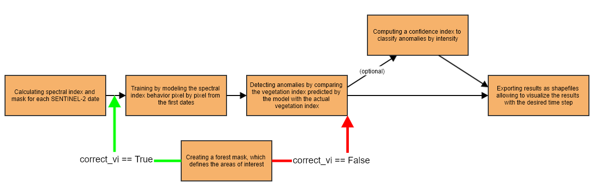
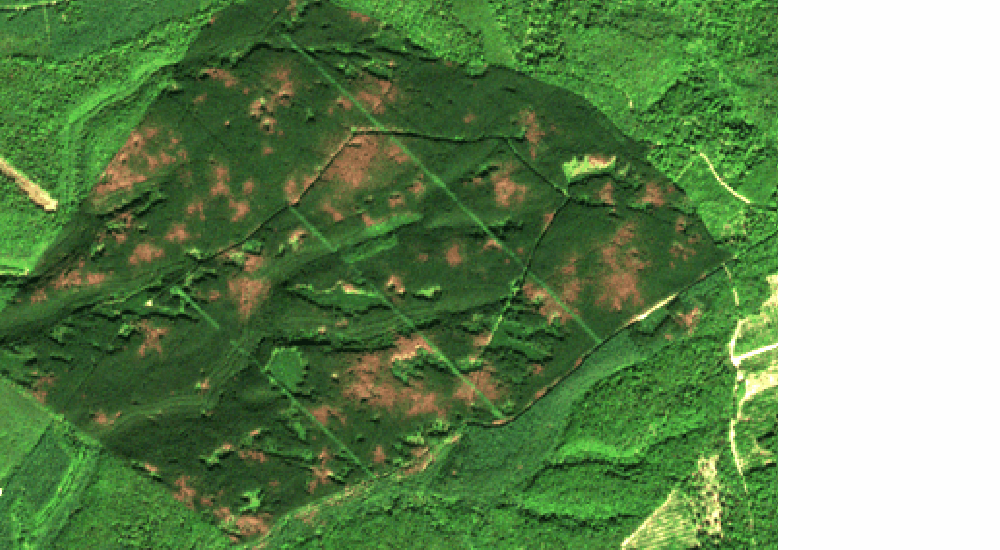
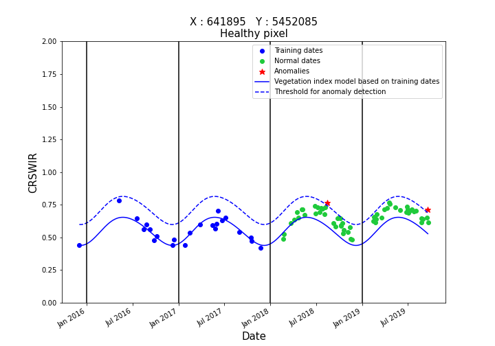
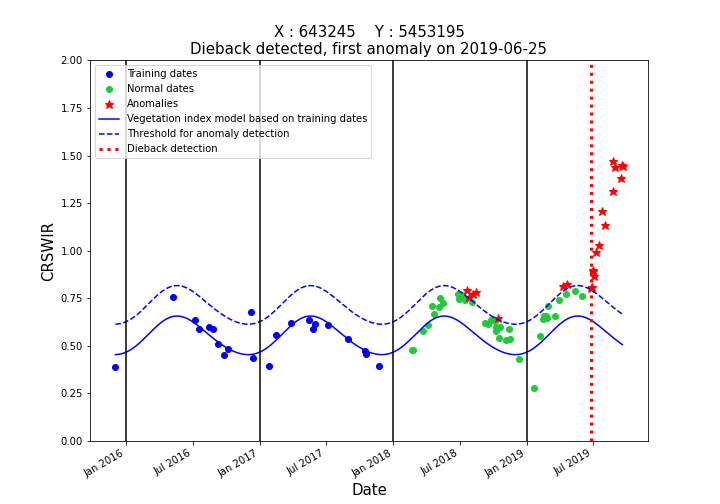

# fordead : a python package for vegetation anomalies detection from SENTINEL-2 images

[__Full Documention__](https://fordead.gitlab.io/fordead_package)

Read in french [here](https://gitlab.com/fordead/fordead_package/-/blob/master/README_fr.md).

The `fordead` package, developed for the detection of vegetation anomalies from SENTINEL-2 time series, provides monitoring tools to address the bark beetle health crisis on spruce trees in France. It includes several tools that make use of SENTINEL-2 satellite data easier, and allow potential anomaly detection in other contexts. The proposed method takes advantage of complete SENTINEL-2 time series, from the launch of the first satellite in 2015. It detects anomalies at the pixel level in order to analyze archive data or to carry out continuous monitoring. The detections are then updated for each new SENTINEL-2 acquisition.

## Dieback detection

The detection of dieback is done in five or six steps.
1. [The calculation of vegetation indices and masks for each SENTINEL-2 date](https://fordead.gitlab.io/fordead_package/docs/user_guides/english/01_compute_masked_vegetationindex/)
2. [The training by modeling the vegetation index pixel by pixel from the first dates](https://fordead.gitlab.io/fordead_package/docs/user_guides/english/02_train_model/)
3. [Detecting anomalies by comparing the vegetation index predicted by the model with the actual vegetation index](https://fordead.gitlab.io/fordead_package/docs/user_guides/english/03_dieback_detection/)
4. [Creating a forest mask, which defines the areas of interest](https://fordead.gitlab.io/fordead_package/docs/user_guides/english/04_compute_forest_mask/)
5. [The export of results as shapefiles allowing to visualize the results with the desired time step](https://fordead.gitlab.io/fordead_package/docs/user_guides/english/05_export_results/)

> **N.B.** It is possible to correct the vegetation index using a correction factor calculated from the median of the vegetation index of the large-scale stands of interest, in which case the mask creation step must be performed before the model training step.

All the documentation and user guides for these steps are available in the [documentation website](https://fordead.gitlab.io/fordead_package/).

Here is an example of the result of these steps on a small area :

Period of detection | Confidence class
:-------------------------:|:-------------------------:
 | 

## Visualisation tools

The package also contains built-in visualisation tools. 
The first one plots the time series of the vegetation index for a particular pixel, along with the associated model, the anomaly detection threshold and the associated detection.

Healthy pixel | Attacked pixel
:-------------------------:|:-------------------------:
 | 

The second one makes a "timelapse" on a small area for visualizing the results at each used Sentinel-2 date, with SENTINEL-2 natural color composites in background. A slider also allows you to navigate between the different dates.

## Installation

The installation guide can be found [here](https://fordead.gitlab.io/fordead_package/docs/Installation/).

## Tutorial

A tutorial for getting started, and testing the package on a small dataset, can be found [here](https://fordead.gitlab.io/fordead_package/docs/Tutorials/Dieback_Detection/00_Intro/).

## Citation

Dutrieux, R., Ose, K., de Boissieu, F., Féret, J.-B., 2024. fordead: a python package for vegetation anomalies detection from SENTINEL-2 images. https://doi.org/10.5281/zenodo.12802456

## Associated publications

The method and its application to monitor the bark beetle health crisis on spruce trees in France has been described in a technical article in "Les Rendez-Vous Techniques de l'ONF" during the package's developpement and can be found [here](https://www.onf.fr/onf/+/cec::les-rendez-vous-techniques-de-lonf-no69-70.html), page 39 to 46.
