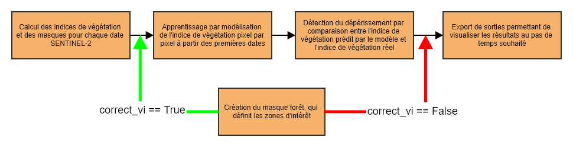

# fordead : un package python pour la détection de changement en forêt à partir d'images SENTINEL-2

Le package `fordead` a été développé pour la détection de changements en forêt à partir de série temporelles SENTINEL-2, en particulier dans un contexte de crise sanitaire du scolyte sur les épicéas. A partir de fonctions simplifiant l'utilisation de données satellites SENTINEL-2, il permet la cartographie des déperissements liés aux scolytes depuis 2018. Cependant, excepté les masques utilisés qui sont certainement trop spécifiques à l'étude de peuplements résineux, le reste des étapes du processus peuvent également être utilisées pour d'autres contextes. 

## Installation
### Installation conda

Depuis l'invite de commande, placer vous dans le répertoire de votre choix et lancez les commandes suivantes :
```bash
git clone https://gitlab.com/fordead/fordead_package.git
cd fordead_package
conda env create --name fordead_env
conda activate fordead_env
pip install .
```

## Tutoriel
Un tutoriel pour bien commencer et essayer le package sur un jeu de données réduit est disponible [ici](https://fordead.gitlab.io/fordead_package/docs/Tutorial/00_Intro/).

## Utilisation pour la détection de déperissement



La détection du déperissement se fait en cinq étapes.
- [Le calcul des indices de végétation et des masques pour chaque date SENTINEL-2](https://fordead.gitlab.io/fordead_package/docs/user_guides/french/01_compute_masked_vegetationindex/)
- [L'apprentissage par modélisation de l'indice de végétation pixel par pixel à partir des premières dates](https://fordead.gitlab.io/fordead_package/docs/user_guides/french/02_train_model/)
- [La détection du déperissement par comparaison entre l'indice de végétation prédit par le modèle et l'indice de végétation réel](https://fordead.gitlab.io/fordead_package/docs/user_guides/french/03_decline_detection/)
- [La création du masque forêt, qui définit les zones d'intérêt](https://fordead.gitlab.io/fordead_package/docs/user_guides/french/04_compute_forest_mask/)
- (FACULTATIF) [Calcul d'un indice de confiance pour classifier selon l'intensité des anomalies](https://fordead.gitlab.io/fordead_package/docs/user_guides/french/05_compute_confidence/)
- [L'export de sorties permettant de visualiser les résultats au pas de temps souhaité](https://fordead.gitlab.io/fordead_package/docs/user_guides/french/06_export_results/)

Il est possible de corriger l'indice de végétation à l'aide d'un facteur de correction calculé à partir de la médiane de l'indice de végétation des peuplements d'intérêt à large échelle, auquel cas l'étape de création du masque doit être réalisée avant l'étape d'apprentissage du modèle.

L'ensemble de la documentation ainsi que les guides utilisateurs de ces étapes sont disponibles sur le [site](https://fordead.gitlab.io/fordead_package/).