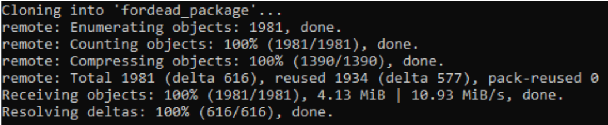
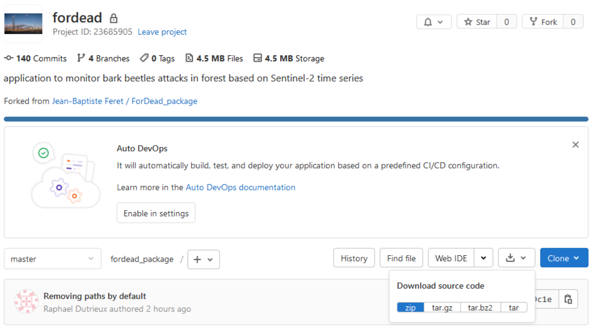
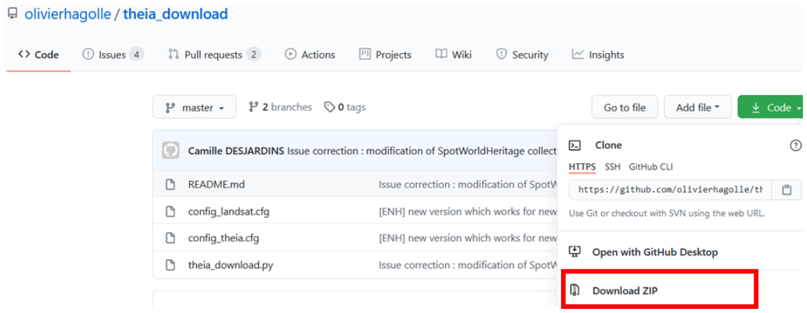
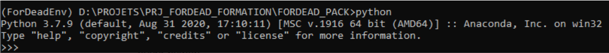

## <div align="center"> TP-02 : Prérequis pour la formation "Détecter le changement en forêt avec des images satellitaires" </div>

* [2. Fiche A : Prérequis](#2-fiche-a-prérequis)
    * [2.1. Organisation du répertoire de travail](#21-organisation-du-répertoire-de-travail)
    * [2.2. Inscriptions requises](#22-inscriptions-requises)
    * [2.3. Logiciels utilisés](#23-logiciels-utilisés)
* [3. Fiche B : Installation du paquet Fordead](#3-fiche-b-installation-du-paquet-fordead)
    * [3.1. Mise en place d’un environnement virtuel Python](#31-mise-en-place-dun-environnement-virtuel-python)
* [4. Fiche C : Téléchargement des données Sentinel-2](#4-fiche-c-téléchargement-des-données-sentinel-2)
    * [4.1. Exploration des données disponibles](#41-exploration-des-données-disponibles)
    * [4.2. Installation des outils de téléchargement Sentinel-2](#42-installation-des-outils-de-téléchargement-sentinel-2)
    * [4.3. Utilisation des scripts de téléchargement automatisé](#43-utilisation-des-scripts-de-téléchargement-automatisé)
    * [4.4. Données THEIA](#44-données-theia)
    * [4.5. Données PEPS](#45-données-peps)

# 2. Fiche A : Prérequis
## 2.1. Organisation du répertoire de travail
Afin de faciliter la mise en application des méthodes qui seront étudiées et l’assistance si nécessaire, nous proposons de nous appuyer sur une arborescence commune permettant d’identifier facilement l’emplacement relatif aux données, aux codes utilisés ou développés, et aux résultats des différents traitements.
### 2.1.1. Identification du répertoire de travail
Les images Sentinel-2 et les produits issus de leur traitement étant relativement volumineux, il est nécessaire de s’assurer d’un **espace disque disponible supérieur à 10 Go**. 
Nous recommandons de **travailler sur votre disque dur local** (C:) ou **une partition de ce disque dur local**. Nous déconseillons l’utilisation d’un outil de stockage externe (clé USB, disque dur externe) ou d’un espace disque situé sur un réseau partagé, pour des raisons de performances. 
### 2.1.2. Définition du répertoire de travail
Une fois défini l’emplacement du répertoire de travail que vous utiliserez durant la formation, identifiez le chemin absolu à l'aide d’un explorateur (clic-droit sur la barre de chemin, et ‘copier l’adresse en tant que texte’). 


*Figure 1. Définition du répertoire de travail.*

Le chemin absolu correspondant (`C:\Users\Feret` dans l’exemple ci-dessus) sera alors identifié comme `<MyWorkingDirectory>` dans la suite du document. 

### 2.1.3. Récupération de l’arborescence et des données

Afin de simplifier l’organisation des données et de faciliter l’assistance si nécessaire, une arborescence de répertoires comprenant les données initiales, les programmes et les résultats des traitements, a été définie. 

> - Cette arborescence est contenue dans une archive à télécharger ici : 
>
> https://filesender.renater.fr/?s=download&token=881484a1-d260-43ad-a15a-cbe612c96edf (expiration : 05/02/2021)
>
> - Une fois l’archive copiée dans `<MyWorkingDirectory>`, la décompresser.
>
>L’arborescence des répertoires est organisée de la façon suivante: 
>
>
>
>*Figure 2. Arborescence de fichiers utilisée lors de la formation.*
>

Le travail à réaliser s’appuie sur des données Sentinel-2 dont le téléchargement est abordé dans la section dédiée, mais aussi d’un certain nombre d’informations thématiques sous forme vectorielle, disponibles par défaut dans le répertoire suivant :

```FORMATION_SANTE_FORETS/A_DATA/VECTOR```

Afin de permettre une manipulation plus facile des données et d'éviter les contraintes associées aux performances limitées des machines, l’exercice se focalise sur deux zones d’étude restreintes.

## 2.2. Inscriptions requises
### 2.2.1. Inscription aux portails de distribution des données Sentinel-2
Il existe plusieurs portails de distribution des données Sentinel-2. Parmi ces portails, nous allons décrire l'accès aux deux portails : 

- [THEIA](https://theia.cnes.fr/atdistrib/rocket/#/search?collection=SENTINEL2), qui donne accès aux données Sentinel-2 individuelles après correction des effets atmosphériques et topographiques à l'aide de la chaîne de traitement MAJA développée par le CESBIO 
- [PEPS](https://peps.cnes.fr/rocket/#/home), qui est un miroir français mis en place par le CNES du portail officiel d'accès au données de l’ESA ([scihub](https://scihub.copernicus.eu/))

**Le téléchargement des données nécessite une inscription préalable qui permet d’obtenir un ++identifiant++ et un ++mot de passe++, qui seront requis lors de l’application des scripts de téléchargement automatiques.** 

### 2.2.2. Inscription à gitlab

Un compte gitlab est nécessaire pour avoir accès aux développements en cours, en attendant la mise en place d’un package finalisé qui sera alors ouvert au public. 
Après inscription sur le site de [gitlab](https://gitlab.com/), contactez [Raphaël Dutrieux](mailto:raphael.dutrieux@inrae.fr) afin de donner votre identifiant gitlab et avoir accès aux différents développements actuellement en accès privé. 

## 2.3. Logiciels utilisés

Dans un premier temps, les traitements seront réalisés à l’aide du logiciel QGis, logiciel adapté pour traiter un jeu de données satellitaires réduit. La seconde partie de cette session exploite les outils développés en Python par l’UMR TETIS. Ces codes nécessitent d’installer un environnement dédié.

la plateforme de développement [Anaconda](https://www.anaconda.com/products/individual) qui permettra de mettre en place un environnement virtuel python 3 dédié aux applications vues lors de la formation et comprenant l’ensemble des librairies et dépendances nécessaires. 

le logiciel SIG QGIS (minimum version 3.10.13 LTR). Si QGIS n’est pas installé sur votre machine, les instructions sont fournies dans la suite du TD pour installer la version la plus récente dans l’environnement virtuel anaconda qui sera créé.

### 2.3.1. Installation d’Anaconda

- Télécharger Anaconda (choisir la version en fonction de votre système) sur la page web suivante :

https://www.anaconda.com/products/individual 

- Suivre les instructions d’installation décrites sur la page web suivante :
    - pour Windows : https://docs.anaconda.com/anaconda/install/windows/
    - pour Linux : https://docs.anaconda.com/anaconda/install/linux/

### 2.3.2. Installation de git

[Git](https://git-scm.com/) est un outil libre et open source permettant la gestion des versions des codes disponibles sur un dépôt. Dans le cadre de cette formation, un certain nombre d’outils ont été mis à disposition sur gitlab, et l’installation de git vous permettra de récupérer les dernières versions de ces codes, ainsi que d’effectuer les mises à jour au fur et à mesure des développements. Une fois anaconda installé, vous pouvez installer git simplement en suivant la procédure suivante : 

>- Ouvrez une invite de commande Anaconda (Anaconda Prompt) en appuyant sur la touche ‘Windows’ de votre clavier (on suppose que les utilisateurs de Linux sont familiers avec les terminaux), et commencez à taper ‘anaconda’ pour sélectionner ‘Anaconda Prompt’
> 
>*Figure 3. Ouvrir une invite de commande Anaconda.*
>
>L’invite de commande s’ouvre alors en pointant sur le répertoire qui se trouve être `<MyWorkingDirectory>`. C’est quand même bien fait, mais n’allez pas croire, c’est un hasard… C’est le répertoire par défaut de l’utilisateur de la machine.
>
>*Figure 4. Anaconda Prompt.*
>
>- Vous pouvez alors taper (ou copier / coller) l’instruction suivante dans l’invite de commande: 
>```bash=
>conda install -c anaconda git
>````
---

# 3. Fiche B : Installation du paquet Fordead
## 3.1. Mise en place d’un environnement virtuel Python
La plateforme de développement Anaconda permet de créer des ‘environnements virtuels’ de développement python spécifiques et indépendants d’autres environnements python cohabitant sur une même machine. Ces environnements virtuels sont particulièrement intéressants pour s’assurer de la stabilité des applications utilisées dans différents projets et pouvant aboutir à des incompatibilités de dépendance si le même environnement python était utilisé.
Dans le cadre de la formation, nous avons initié le développement du package python ‘[fordead]( https://gitlab.com/raphael.dutrieux/fordead_package)’, qui sera principalement utilisé pour appliquer la méthode de détection des foyers de scolytes par analyse de séries temporelles Sentinel-2. La page de présentation de fordead décrit les différentes étapes pour la mise en place de cet environnement virtuel, rappelées ici :
> - Rechercher le chemin absolu d’accès au répertoire suivant :
>
> `<MyWorkingDirectory>\FORMATION_SANTE_FORETS\B_PROGRAMS\Libraries`
>
>- Depuis un terminal anaconda (Menu Démarrer → Anaconda prompt), si votre répertoire de travail est situé sur une partition différente de ‘C:’, par exemple ‘D:’ commencez par taper : 
>```bash=
>D:
>```
>- Saisir alors l’instruction suivante pour se rendre sur le répertoire suivant :
>```bash=
>cd <MyWorkingDirectory>\FORMATION_SANTE_FORETS\B_PROGRAMS\Libraries
>```
>- Cloner en local le dépôt Git du projet fordead_package de l’UMR Tetis. Deux solutions sont possibles, au choix :
>
>	- Option 1. Depuis le terminal en saisissant la commande suivante :
>```bash=
>git clone https://gitlab.com/raphael.dutrieux/fordead_package.git
>```
>Suite au lancement de cette commande, les informations suivantes devraient apparaître sur le terminal :
>
>*Figure 5. Retours de la commande git clone.*
>
>	- Option 2. Depuis le site web de gitlab :
>
> -  Accéder au projet gitlab :
>
> https://gitlab.com/raphael.dutrieux/fordead_package
>
> - Télécharger l’ensemble des codes dans une archive zip en cliquant sur le bouton 
>
>*Figure 6. Téléchargement manuelle depuis le site Gitlab.*
>
> - Décompresser l’archive zip téléchargée dans le répertoire des programmes :
>
>`<MyWorkingDirectory>\FORMATION_SANTE_FORETS\B_PROGRAMS\Libraries`
>
>Quelle que soit la solution choisie pour télécharger les outils Fordead, l’organisation des fichiers doit respecter le schéma suivant :
>
>```
>..\FORMATION_SANTE_FORETS\B_PROGRAMS
>└───Libraries
>    └───fordead_package
>            ├───docs
>            │    └───user_guides
>            │          └───Diagrams
>            ├───examples
>            └───fordead
>                 ├───steps
>                 └───visualisation
>```
>- Toujours dans le terminal Anaconda, accéder au répertoire fordead_package
>```bash=
>cd fordead_package
>```
> - le fichier permettant de paramétrer l’environnement virtuel est directement intégré dans créer un nouvel environnement avec la commande suivante (la création et le paramétrage du nouvel environnement peut demander quelques minutes et nécessite le téléchargement d’un certain nombre de packages): 
>```bash=
>conda env create --name ForDeadEnv
>conda activate ForDeadEnv
>pip install .
>```
>- Si QGIS n’est pas installé sur votre poste de travail, ou si vous devez le mettre à jour, il est possible d‘installer QGIS 3.16 dans l’environnement conda à l'aide de la commande suivante: 
>```bash=
>conda install -c conda-forge >qgis=3.16
>```
>- Enfin, pour la production de figures avec python au cours de la formation, la librairie matplotlib pourra être utilisée : 
>```bash=
>conda install matplotlib
>```
---
# 4. Fiche C : Téléchargement des données Sentinel-2
## 4.1. Exploration des données disponibles
La plateforme de visualisation [Sentinel-Hub](https://www.sentinel-hub.com/explore/sentinelplayground/) permet d’explorer les données Sentinel-2 disponibles de manière rapide et intuitive. Ses fonctionnalités de base permettent des requêtes spatiales et temporelles, et la visualisation des différentes acquisitions disponibles pour un niveau d'enneigement des tuiles Sentinel-2. 

Dans le cadre de ce TD, nous allons utiliser deux images acquises à un an d’intervalle et comprenant un massif forestier situé à proximité de La **Longine (Haute-Saône, France)** et compris dans la zone d'étude définie dans le fichier vectoriel suivant: 

`<MyWorkingDirectory>\FORMATION_SANTE_FORETS\A_DATA\VECTOR\
ZONE_ETUDE\ZoneEtude.shp`

Sentinel-Hub permet d’effectuer des requêtes en prenant en compte une localité géographique, une limite supérieure de date, et un niveau d’ennuagement. Plusieurs types de visualisation (RGB, indices spectraux...) et autres réglages sont aussi disponibles via l’interface. 
Les images correspondent à la tuile **T31UGP** et les dates d’acquisition sont le **23 Août 2017** et le **23 Août 2018**. 

## 4.2. Installation des outils de téléchargement Sentinel-2
### 4.2.1. Script de téléchargement sur la plateforme Theia
Le téléchargement des données disponibles sur le portail THEIA s’appuie sur l’application du script python ‘theia_download’ développé par Olivier Hagolle (CESBIO) et disponible librement sur son dépôt [git](https://github.com/olivierhagolle/theia_download). Le script permet d'accéder aux données THEIA proposées pour plusieurs capteurs, mais nous nous focaliserons ici sur les données Sentinel-2. 

> - Télécharger l’archive associée à theia_download et placer les fichiers décompressés dans l'arborescence :
>
>`FORMATION_SANTE_FORETS/B_PROGRAMS/Libraries/theia_download`
>
>
>*Figure 7. Téléchargement du theia_download depuis https://github.com/olivierhagolle/theia_download*
>
>La page github permet de prendre connaissance des lignes de commandes utiles pour télécharger les données THEIA. Nous détaillerons la procédure de téléchargement dans la section dédiée.
    
### 4.2.2. Script de téléchargement sur la plateforme PEPS
Le téléchargement des données disponibles sur le portail PEPS s’appuie sur l’application du script python ‘peps_download’ développé par Olivier Hagolle (CESBIO), modifiée et intégrée dans un package développé par Florian de Boissieu. Les sources du package sont disponibles sur [gitlab](https://github.com/floriandeboissieu/peps_download/tree/shapefile), et le package intègre en plus des fonctionnalités initiales, la possibilité de télécharger les données Sentinel-2 en définissant l’emprise géographique directement à partir d’un polygone défini par un shapefile. 

> Le développement sous forme de package permet d’installer directement les fonctions associées dans l'environnement virtuel python, avec l’instruction suivante: 
>```bash=
>pip install git+https://github.com/floriandeboissieu/peps_download.git@shapefile
>```
La page [gitlab](https://github.com/floriandeboissieu/peps_download/tree/shapefile) permet de prendre connaissance des instructions python utiles pour télécharger les données PEPS. Nous détaillerons la procédure de téléchargement dans la section dédiée (cf. section 4.5).
    
## 4.3. Utilisation des scripts de téléchargement automatisé

La détection de changements repose sur l’utilisation conjointe d’au moins deux images satellitaires acquises à des dates différentes. Les images optiques acquises par les satellites Sentinel-2 (S2), opérés dans le cadre du programme Copernicus de l’Agence Spatiale Européenne (ESA), sont à ce jour les mieux adaptées pour effectuer ce type d’analyse.
Pour cette première approche, deux images S2 acquises sur une même zone à deux dates différentes seront téléchargées. Les prétraitements ainsi que la classification des changements reposent sur les outils proposés par défaut dans le logiciel QGis.

## 4.4. Données THEIA

Les données Sentinel-2 peuvent être téléchargées depuis le portail web THEIA, une fois identifiées. Il est aussi possible d’utiliser l’outil de téléchargement automatique theia_download s'appuyant sur python et l'utilitaire Curl. Il marche aussi bien sur Linux que sur Windows. L'utilisation de theia_download est présentée dans le fichier `README.md`. 

Dans le cadre de notre étude, nous allons lancer le téléchargement des images en appliquant le paramétrage correspondant aux acquisitions identifiées précédemment. 

### 4.4.1. Paramétrage de theia_download

> - Ouvrez le fichier ‘config_theia.cfg’ situé à cet emplacement : 
>
>`FORMATION_SANTE_FORETS/B_PROGRAMS/theia_download-master`
>
>- Entrez votre adresse mail et votre mot de passe THEIA dans les emplacements dédiés.

### 4.4.2. Requête pour téléchargement

> - Depuis un terminal anaconda (avec environnement virtuel activée), 
>     - placez-vous dans le répertoire theia_download-master
>     - lancez la commande suivante : 
>```bash=
>python ./theia_download.py -t T31UGP -c SENTINEL2 -a config_theia.cfg -d 2017-08-23 -f 2017-08-24 --write_dir ../../A_DATA/RASTER/THEIA
>```
>
>les paramètres de la commande sont :
>
>*`-t` : numéro de la tuile Sentinel-2 (la grille de tuiles Sentinel-2 est disponible sur le [site de l'ESA](https://sentinel.esa.int/documents/247904/1955685/S2A_OPER_GIP_TILPAR_MPC__20151209T095117_V20150622T000000_21000101T000000_B00.kml), et peut se visualiser avec Google Earth Engine par exemple)*
>
>*`-c` : nom du capteur*
>
>*`-a` : chemin d'accès au fichier de configuration (contient les identifiant et mot de passe)*
>
>*`-d` : date de début*
>
>*`-f` : date de fin (définir J+1 si la requête porte sur un jour précis)*
>
>*`--level` : niveau de pré-traitement*
>
>*`--write_dir`: chemin (absolu ou relatif) du répertoire dans lequel seront écrites les données.*
>
> - Adapter la commande de manière à télécharger l’image acquise le 23 Août 2018.
>
>A L'issue du téléchargement, deux fichiers Zip sont téléchargés : 
>
>- `SENTINEL2A_20180823-103535-335_L2A_T31UGP_D.zip`
>- `SENTINEL2B_20170823-103018-461_L2A_T31UGP_D.zip`
>
>En cas de problème dans l’utilisation des scripts de téléchargement automatique, les archives ZIP des images sont disponibles en téléchargement durant la formation aux liens suivants : 
>
>- http://filez.teledetection.fr/sacz5lw (expiration : 01/02/2021)
>- http://filez.teledetection.fr/huq3d (expiration : 01/02/2021)

## 4.5. Données PEPS

Les données PEPS peuvent être téléchargées en appliquant le même type de requête depuis un terminal Anaconda, en lançant le script peps_download.py téléchargeable en ligne (après configuration du fichier d’identification), ou bien à partir d’un script python directement après avoir importé la librairie peps_download.

>- Dans le terminal Anaconda, activer l’environnement de travail :
>
>`conda activate ForDeadEnv`
>
>- Démarrer une console Python en tapant sur l’invite de commande :
>
>`Python`
>
>Lorsque Python est lancé, l’invite de commande débute désormais avec les symboles suivants : 
>
>`>>>`
>
>
>*Figure 8. Activation de la console Python.*
>Importer le module peps_download en saisissant l’instruction suivante :
>
>```python=
>from peps_download import peps_download
>```
>Si aucun message d’erreur apparaît, le module est chargé correctement.
>
>La fonction peps_download permet de lister et de télécharger automatiquement les données Sentinel-2 sur la plateforme PEPS. 
>
>- Pour connaître ses paramètres de configuration, il est possible de saisir l’instruction suivante :
>
>```python=
>print(peps_download.__doc__)
>```
>
>Ici, nous souhaitons télécharger deux images Sentinel-2 acquises le 23/08/2017 et le 23/08/2018 sur une emprise définie par le fichier vectoriel de la zone d’étude.
>
>- Pour lister les produits disponibles, saisir l’instruction suivante (exemple pour l’image de 2017) :
>```python=
>peps_download(
>'A_DATA/RASTER/THEIA',
>auth='./config.txt',
>collection='S2ST',
>start_date='2017-08-23',
>end_date='2017-08-24',
>shape='./A_DATA/VECTOR/ZONE_ETUDE>/ZoneEtude.shp',
>product_type='S2MSI2A',
>no_download=True
>)
>```
>- Pour télécharger les produits, saisir l’instruction suivante :
>```python=
>peps_download(
>'A_DATA/RASTER/THEIA',
>auth='./config.txt',
>collection='S2ST',
>start_date='2017-08-23',
>end_date='2018-08-24',
>shape='./A_DATA/VECTOR/ZONE_ETUDE/ZoneEtude.shp',
>product_type='S2MSI2A', 
>max_trials=10, 
>wait=1, 
>no_download=False, 
>extract=True
>)
>```
>Si la zone d’étude est à cheval sur au moins deux tuiles, il est possible d’ajouter le paramètre `tile=<code_tuile>` pour filtrer les résultats.
>
>Pour information, les paramètres max_trials et wait permettent de relancer à pas de temps régulier les requêtes de téléchargement. En effet, les archives Sentinel-2 peuvent être stockées sur bande. Lorsque ces images sont appelées, elles doivent être transférées sur disque avant d’être téléchargeables. Cette procédure, transparente pour l’utilisateur, nécessite un peu de temps, une dizaine de minutes environ.
