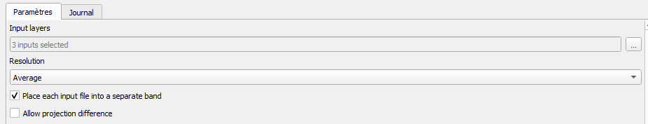

# <div align="center"> Détection des foyers de mortalité dans les massifs de conifères par imagerie satellite Sentinel-2 </div>

<div align="center"> Equipe de formation INRAE : Raphaël Dutrieux, Forian de Boissieu, Jean-Baptiste Feret, Kenji Ose </div>

## <div align="center">TP-02 : Utilisation du package `fordead` : détection de déperissement en forêt à partir de séries temporelles SENTINEL-2</div>

* [Introduction](#introduction)
    * [Préambule](#préambule)
    * [Objectifs](#objectifs)
    * [Pré-requis](#pré-requis)
* [Création d'un script pour détecter le dépérissement lié au scolyte sur une zone donnée à l'aide du package fordead](#utilisation-du-package-fordead)
    * [Étape 1 : Calcul de l'indice de végétation et du masque pour chaque date SENTINEL](#étape-1-calcul-de-lindice-de-végétation-et-du-masque-pour-chaque-date-sentinel)
    * [Étape 2 : Modélisation du comportement périodique de l'indice de végétation](#étape-2-modélisation-du-comportement-périodique-de-lindice-de-végétation)
    * [Étape 3 : Détection du déperissement](#étape-3-détection-du-déperissement)
    * [Étape 4 : Calcul du masque forêt](#étape-4-calcul-du-masque-forêt)
* [Visualisation des résultats](#visualisation-des-résultats)
    * [Visualisation d'un timelapse](#création-dun-timelapse)
    * [Visualisation de la série temporelle de pixels en particulier](#visualisation-de-la-série-temporelle-de-pixels-en-particulier)
* [Rajouter des dates SENTINEL et mettre à jour la détection](#rajouter-des-dates-sentinel-et-mettre-à-jour-la-détection)
* [Changer les paramètres de la détection](#changer-les-paramètres-de-la-détection)
    * [Changer l'indice de végétation](#utiliser-un-indice-de-végétation-non-prévu-dans-le-package)
    * [Changer le seuil de détection d'anomalies](#changer-le-seuil-de-détection-danomalies)
    * [Changer de zone d'étude](#changer-de-zone-détude)
* [Exporter des résultats adaptés à ses besoins](#exporter-des-résultats-adaptés-à-ses-besoins)

## Introduction
### Préambule

Le monde forestier fait face à une accélération sans précedent des déperissements à large échelle, notamment en lien avec le changement climatique et l'apparition de ravageurs. En particulier, la crise sanitaire du scolyte met en péril la santé des forêts ainsi que la filière bois dans le Nord-Est de la France. Pour répondre à cet enjeu, des travaux R&D ont été menés par l’UMR TETIS (INRAE, anciennement IRSTEA) à la demande du Ministère de l’Agriculture et de l’Alimentation pour mettre au point un outil d’identification des foyers de scolytes par télédétection de manière précoce et en continu. Cet outil prend aujourd'hui la forme du package python `fordead` permettant une cartographie des déperissements à partir d'images SENTINEL-2, potentiellement mise à jour à chaque revisite des satellites SENTINEL-2.

### Objectifs
Les objectifs de ce TD sont les suivants :
- être capable de faire fonctionner l'ensemble des étapes permettant la cartographie des déperissements sur une zone donnée, ainsi que comprendre l'articulation de ces différentes étapes
- Savoir modifier les paramètres de l'outil afin de pouvoir s'adapter selon la problématique  
- Appréhender le potentiel et les limites de l'outil présenté
- Savoir sortir des résultats sous la forme souhaitée
- Visualiser les résultats et savoir les interpréter

### Pré-requis
Si le package n'est pas encore installé, suivre le [guide d'installation](https://gitlab.com/raphael.dutrieux/fordead_package/-/blob/master/docs/user_guides/00_installation.md).

Sinon, lancer l'invité de commande _anaconda prompt_, puis activer l'environnement par la commande : 
```bash
conda activate fordead_env
```

## Création d'un script pour détecter le dépérissement lié au scolyte sur une zone donnée à l'aide du package fordead

La détection du déperissement permet d'utiliser l'ensemble des données SENTINEL-2 depuis le lancement du premier satellite. Même en prenant une seule tuile, un tel jeu de données pèse plusieurs centaines de gigaoctets et prend plusieurs heures de temps de calcul pour réaliser l'ensemble des étapes de détection du déperissement. Pour cette raison, un jeu de données plus réduit a été préparé pour cette formation. Il contient l'ensemble des données SENTINEL-2 disponible sur une zone d'étude restreinte, en croppant à partir des données de la tuile. Cette zone est touchée par les scolytes, et contient plusieurs polygones de données de validation, ce qui en fait un bon exemple pour l'application de la détection de déperissement et la visualisation des résultats. 

- Créer un script python en créant un nouveau fichier de texte dans le dossier <MyWorkingDirectory>/B_PROGRAMS, et en le nommant _detection_scolytes.py_ (ou le nom de votre choix, mais avec l'extension .py)
- Ouvrez ce script avec l'éditeur de votre choix

#### Étape 1 : Calcul de l'indice de végétation et du masque pour chaque date SENTINEL
La première étape consiste à calculer pour chaque date l'indice de végétation, et le masque. Le masque correspond à l'ensemble des données invalides, car ennuagées, enneigées, dans l'ombre, hors de la fauchée du satellite, peuplement déjà coupé...
Vous pouvez retrouver le [guide d'utilisation de cette étape](https://gitlab.com/raphael.dutrieux/fordead_package/-/blob/master/docs/user_guides/01_compute_masked_vegetationindex.md).
##### Faire tourner l'étape à partir du script
Pour effectuer cette étape, ajoutez dans le script :
- Pour importer la fonction
```bash
from fordead.steps.step1_compute_masked_vegetationindex import compute_masked_vegetationindex
```
- Pour choisir les paramètres en entrée :
```bash
input_directory = "<MyWorkingDirectory>/A_DATA/RASTER/SERIES_SENTINEL/ZoneEtude"
data_directory = "<MyWorkingDirectory>/C_RESULTS/ZoneEtude"
```
> **_NOTE :_** Il est préférable d'utiliser "/" plutôt que "\" à l'écriture des chemins afin d'éviter les soucis.

- Pour lancer la fonction
```bash
compute_masked_vegetationindex(input_directory = input_directory, data_directory = data_directory)
```
Puis lancer le script python depuis l'invité de commande en vous plaçant dans le répertoire du script en utilisant la commande suivante :
```bash
cd <MyWorkingDirectory>/B_PROGRAMS
```
Puis lancer le script :
```bash
python detection_scolytes.py
```
##### Faire tourner l'étape en lançant la fonction depuis l'invité de commande
Il est également possible d'appliquer la même étape en passant par l'invité de commande.
Depuis l'invité de commande, placez vous dans le dossier du package fordead_package/fordead/steps par la commande : 
```bash
cd <MyWorkingDirectory>/B_PROGRAMS/Libraries/fordead_package/fordead/steps
```
Puis, la commande suivante permet d'afficher l'aide :
```bash
python step1_compute_masked_vegetationindex.py -h
```
A partir de l'aide, lancez la fonction en appliquant vos paramètres. Exemple :
```bash
python step1_compute_masked_vegetationindex.py -i <MyWorkingDirectory>/A_DATA/RASTER/SERIES_SENTINEL/ZoneEtude -o <MyWorkingDirectory>/C_RESULTS/ZoneEtude
```
**-i** permet de définir le paramètre **input_directory** et **-o** le paramètre **data_directory**, ainsi exactement la même fonction est lancée.
---------

Vous remarquerez que si vous avez utilisé les même paramètres dans les deux cas, il s'affiche "0 new SENTINEL dates" et le programme tourne plus rapidement la deuxième fois, car les indices de végétation déjà calculés ne sont pas recalculés. En revanche, si vous changez les paramètres, les résultats précédants seront supprimés et remplacés.
Les paramètres input_directory et data_directory sont les deux seuls à ne pas connaître de valeur par défaut puisqu'elles dépendent de l'emplacement de vos fichiers. Ce sont donc les deux seuls paramètres à renseigner obligatoirement, mais il est tout de même possible de modifier les autres paramètres. A l'aide du guide d'utilisateur, vérifiez que vous comprenez le sens des différents paramètres et n'hésitez pas à poser des questions si ce n'est pas le cas !

L'ensemble des étapes de la détection peuvent se réaliser de manière identique depuis l'invité de commande, ou par import des différentes fonctions dans un script. Dans la suite de ce TD, nous nous focaliseront sur le script en le complétant au fur et à mesure.

##### Observation des sorties
Pour mieux vous représenter les sorties de cette étape, lancez QGIS et ajoutez les rasters **VegetationIndex/VegetationIndex_2018-07-27.tif** et **Mask/Mask_2018-07-27.tif**.

Nous allons également comparer ces exports avec les rasters des données SENTINEL-2 dont ils sont issus. Pour cela, allez dans le dossier **<MyWorkingDirectory>/A_DATA/RASTER/SERIES_SENTINEL/ZoneEtude/SENTINEL2A_20180727-104023-458_L2A_T31UGP_D_V1-8**, puis rajoutez les bandes B2, B3, B4 à QGIS, soit respectivement les bandes rouge, vert et bleu. Ensuite, nous allons créer un raster virtuelle à partir de ces trois bandes pour visualiser une image en couleur.
- Aller dans Raster/Divers/Construire un raster virtuel

-  Sélectionner les bandes ajoutées


- Cocher pour que chaque fichier de bande aille dans une bande différente

- Executer
- Aller dans les propriétés du raster crée

- Les bandes devraient ne pas être dans le bon ordre, mettre la bande 3 en rouge et la bande 1 en bleu. Modifiez l'échelle pour aller de 0 à 600 pour chaque bande.


Observez les résultats.

Les rasters dans le dossier DataSoil contiennent les informations relatives à la détection du sol nu. Ce sol détecté peut correspondre à des zones non forestières, à des peuplements feuillus dont le sol est détecté en hiver, ou des coupes rases. Il y a trois rasters, qui, ensemble, permettent de reconstituer l'ensemble de l'information, et de la mettre à jour avec l'arrivée de nouvelles dates SENTINEL :
- Le raster count_soil.tif compte le nombre d'anomalies de sol successives.
- Lorsque count_soil atteint 3, pour trois anomalies successives, le raster state_soil.tif passe de 0 à 1. Les pixels avec la valeur 1 correspondent donc à ceux détectés comme sol nu / coupe au bout de l'analyse de l'ensemble des dates.
- Le raster first_date_soil.tif contient l'index de la date de première anomalie de sol. Si state_soil vaut 1, il s'agit alors de la date à partir de laquelle le sol est détectée. 
Ces rasters peuvent être difficiles à analyser puisque, n'étant pas possible de mettre une date dans un raster, le raster first_date_soil contient **l'index** de la date qui peut être interprété par le package dans les étapes suivantes.

#### Étape 2 : Modélisation du comportement périodique de l'indice de végétation 
Pour modéliser le comportement normal de l'indice de végétation, on utilise seulement les dates SENTINEL les plus anciennes, en faisant l'hypothèse qu'elles sont antérieures à un possible déperissement. La fonction harmonique suivante est ajustée à ces données :
𝒇(𝒕)=𝒂𝟏+𝒃𝟏.𝐬𝐢𝐧⁡(𝟐𝝅𝒕/𝑇)+𝒃𝟐.𝐜𝐨𝐬⁡(𝟐𝝅𝒕/𝑇)+𝒃𝟑.𝐬𝐢𝐧⁡(𝟒𝝅𝒕/𝑇)+𝒃𝟒.𝐜𝐨𝐬⁡(𝟒𝝅𝒕/𝑇) où T = 365,25.
Vous pouvez retrouver le [guide d'utilisation de cette étape](https://gitlab.com/raphael.dutrieux/fordead_package/-/blob/master/docs/user_guides/02_train_model.md).

Pour effectuer cette étape, ajoutez dans le script :
- Pour importer la fonction
```bash
from fordead.steps.step2_train_model import train_model
```
- Pour lancer la fonction
```bash
train_model(data_directory = data_directory)
```
Puis, comme pour l'étape 1, relancez le script depuis l'invité de commande :
```bash
python detection_scolytes.py
```

Le reste des paramètres connaissent une valeur par défaut dans la fonction et n'ont pas besoin d'être renseignées. Ces valeurs par défaut ont été déterminées de manière empirique pour la problématique du scolyte et peuvent ne pas être optimales selon la localisation ou la problématique donnée. Le [guide d'utilisation](https://gitlab.com/raphael.dutrieux/fordead_package/-/blob/master/docs/user_guides/02_train_model.md) donne des détails sur les différents paramètres, lisez le et vérifiez que vous comprenez bien leur sens.

> **_NOTE :_** Si l'utilisateur ne souhaite pas utiliser la première étape et choisit de calculer ses propres indices de végétations et masques. Il peut sauter l'étape 1 et simplement donner le chemin de son dossier d'indices de végétation avec le paramètre **path_vi** et son dossier de masques avec **path_masks**. Il suffit simplement que le nom des rasters contiennent la date sous un des formats suivants : AAAA-MM-JJ, AAAA_MM_JJ, AAAAMMJJ, JJ-MM-AAAA, JJ_MM_AAAA ou JJMMAAAA.

##### Observation des sorties
Dans le dossier DataModel :
- Ouvrez le raster coeff_model.tif dans QGIS. Faites un clique droit sur un des pixels, vous pouvez constater qu'il s'agit d'un raster à cinq bandes. QGIS affiche une image en RGB à partir des trois premières bandes. Chacune des bandes correspond à un des coefficients (a1, b1, b2, b3, b4) du modèle (voir équation). On a bien un modèle différent par pixel ce qui permet qu'il soit adapté aux conditions de ce pixel. On peut en effet imaginer que la composition du peuplement, sa surface terrière, sa pente, son exposition ont probablement un rôle à jouer dans la valeur donnée des indices de végétation. A partir de ces coefficients, il est possible de prédire l'indice de végétation à n'importe quelle date, pour un peuplement sain.

- Ouvrez maintenant le raster first_detection_date_index.tif. Il permet de connaître pour chaque pixel les dates utilisées pour l'apprentissage du modèle, et celles utilisées pour la détection de déperissement. Il contient l'index de la première date à partir de laquelle le déperissement est détecté. Sur cette zone, il y a assez de dates valides pour que l'ensemble des pixels terminent leur apprentissage avant la première date de 2018 (le paramètre **min_last_date_training** est fixé à 2018-01-01 par défaut ce qui permet d'avoir un recul de deux ans d'images satellites SENTINEL-2), ils ont donc tous la même valeur sauf les zones "sans données" qui correspondent aux zones détectées comme "sol nu / coupe" très tôt, qui sont donc masquées sur la quasi-totalité des dates et qui n'ont donc pas le nombre de dates valides minimum pour le calcul du modèle. 

Dans le dossier ForestMask, ouvrez également le raster valid_area_mask.tif. Il s'agit d'un raster binaire qui vaut 1 là où il y avait suffisamment de dates valides pour le calcul du modèle et 0 ailleurs.

#### Étape 3 : Détection du déperissement
Lors de cette étape, pour chaque date SENTINEL non utilisée pour l'apprentissage, l'indice de végétation réel est comparé à l'indice de végétation prédit à partir des modèles calculés dans l'étape précèdente. Si la différence dépasse un seuil, une anomalie est détectée. Si trois anomalies successives sont détectées, le pixel est considéré comme dépérissant. Si après avoir été détecté comme déperissant, le pixel a trois dates successives sans anomalies, il n'est plus considéré comme dépérissant. N'hésitez pas à consulter le [guide d'utilisation](https://gitlab.com/raphael.dutrieux/fordead_package/-/blob/master/docs/user_guides/03_decline_detection.md) de cette étape.

Pour effectuer cette étape, ajouter au script :
- Pour importer la fonction
```bash
from fordead.steps.step3_decline_detection import decline_detection
```
- Pour lancer la fonction
```bash
decline_detection(data_directory = data_directory)
```
Puis, relancez le script depuis l'invité de commande :
```bash
python detection_scolytes.py
```

##### Observation des sorties
Pour chaque date postérieure à la date renseignée par le paramètre **min_last_date_training**, un raster Anomalies_<date>.tif est exporté dans le dossier **DataAnomalies**. 
- Ouvrez dans QGIS le raster __Anomalies_2018-07-27.tif__.
- Mettez en regard ces résultats avec l'indice de végétation et le masque calculé pour la date et ouvert précédemment, ainsi que l'image en RGB.
On peut voir que des anomalies sont détectées même là où les données sont masquées, comme pour les nuages sur la gauche de l'image, où les zones détectées comme sol nu. Ces anomalies ne sont bien entendu pas prises en compte. Les anomalies pouvant correspondre à des dégats de scolytes sont celles qui ne sont pas masquées.

Un autre dossier a été crée, DataDecline. Les rasters de ce dossier contiennent les informations relatives à la détection de dépérissement à partir des anomalies observées précédemment. Ces rasters sont exactement sous la même forme que les rasters dans DataSoil observés lors de l'étape 1. La seule différence est que un "retour à la normale" est possible. Une fois que le sol est détecté, l'état "sol nu" est permanent, tandis que pour le dépérissement, un pixel détecté comme dépérissant peut retourner à l'état non-dépérissant s'il y a trois dates successives sans anomalies. Cela permet d'éviter des faux positifs causés par des stress hydriques importants mais temporaires et ne causant pas de dépérissement.
Les informations de ces rasters sont les suivantes :
- le raster state_decline.tif, un raster binaire qui vaut 1 pour les pixels dépérissants, 0 pour les pixels sains
- Le raster count_decline.tif compte le nombre d'anomalies successives pour les pixels sains dans state_decline, ou le nombre de dates sans anomalies successives pour les pixels dépérissants dans state_decline. Quand count_decline atteint trois, le pixel change d'état, de sain à dépérissant ou inversement.
- Le raster first_date_decline.tif contient l'index de la date de première anomalie. Si state_decline vaut 1, il s'agit alors de la date à partir de laquelle le dépérissement est détécté.

#### Étape 4 : Calcul du masque forêt
L'ensemble des calculs précedents sont réalisés sur l'ensemble des pixels de la zone d'étude. Cependant, en particulier lorsqu'on travaille sur de larges zones, il est nécessaire de définir les zones d'intérêts pour ne pas interpréter des résultats sur des zones urbaines, des cultures, etc...
Dans le cas du scolyte, on s'intéresse uniquement aux peuplements forestiers résineux. Cette étape permet de créer le masque forêt correspondant à notre zone d'intérêt. Vous pouvez consulter son [guide d'utilisation](https://gitlab.com/raphael.dutrieux/fordead_package/-/blob/master/docs/user_guides/04_compute_forest_mask.md).

Pour effectuer cette étape, ajouter au script :
- Pour importer la fonction
```bash
from fordead.steps.step4_compute_forest_mask import compute_forest_mask
```
- Pour lancer la fonction
```bash
compute_forest_mask(data_directory, forest_mask_source = 'BDFORET', 
                    dep_path = "<MyWorkingDirectory>/A_DATA/VECTOR/BD_ADMIN/departements-20140306-100m.shp",
                    bdforet_dirpath = "<MyWorkingDirectory>/A_DATA/VECTOR/BD_FORET")
```
Puis, relancez le script depuis l'invité de commande :
```bash
python detection_scolytes.py
```

> **_NOTE :_** Il est possible d'utiliser cette étape déconnectée des autres en précisant le paramètre **path_example_raster** avec le chemin d'un raster "exemple" qui donnera son système de projection, sa résolution, son extent au masque produit. Ne pas renseigner ce paramètre ne pose pas de soucis puisque le chemin d'un raster exemple peut être récupéré depuis les étapes précédentes par le biais du fichier TileInfo.

##### Observation des sorties
Cette étape permet d'écrire un uniquement raster, Forest_Mask.tif dans le dossier ForestMask. Ouvrez ce raster. Il s'agit d'un raster binaire qui vaut 1 dans la zone d'intérêt, 0 ailleurs. Avec les paramètres renseignés ici, il est crée à partir de la rasterisation de la BD Forêt de l'IGN en gardant uniquement les peuplements résineux. 

## Visualisation des résultats

Les étapes réalisées précédemment ont permis d'obtenir l'ensemble des résultats relatifs à la détection de scolytes, mais sous une forme difficile à analyser. Le package contient certains outils permettant de visualiser les résultats sous une forme plus digeste.

### Création d'un timelapse

Pour commencer, nous allons créer un timelapse de la détection sur la zone analysée. Pour ce faire, ajouter dans le script :
- Pour importer la fonction
```bash
from fordead.visualisation.create_timelapse import create_timelapse
```
- Pour ajouter les paramètres nécéssaires :
```bash
shape_path = "<MyWorkingDirectory>/A_DATA/VECTOR/ZONE_ETUDE/ZoneEtude.shp"
obs_terrain_path = "<MyWorkingDirectory>/A_DATA/VECTOR/BD_SCOLYTE/ValidatedScolytes.shp"
```
- Pour lancer la fonction :
```bash
create_timelapse(data_directory = data_directory,shape_path = shape_path, obs_terrain_path = obs_terrain_path)
```
- Enfin, relancez le script.

Cette fonction prend en entrée un shapefile avec un champ "Id" dans lequel il peut y avoir un ou plusieurs polygones et écrit pour chaque polygone un fichier <Id>.html dans le dossier "Timelapses". Elle est plutôt pensée pour visualiser les résultats sur une zone réduite à partir des résultats d'une tuile entière, il est recommandé d'éviter de lancer cette opération avec des polygones de plus d'une vingtaine de km². Cependant, on travaille ici déjà sur une zone réduite, en utilisant un shapefile d'un seul polygone couvrant l'ensemble de la zone. Le timelapse devrait se lancer automatiquement, sinon ouvrez le fichier <id>.html (il est possible que sa lecture fonctionne mieux sous Chrome).

Une fois le timelapse ouvert, faites glisser le slider en bas de l'image pour vous déplacer temporellement dans l'animation. Les polygones noirs correspondent aux zones détectées comme sol nu, les polygones jaunes correspondent aux zones détectées comme dépérissantes et les polygones bleus correspondent aux coupes sanitaires, c'est à dire les zones détectées comme sol-nu/coupe après avoir été détectées comme atteintes.

Les données d'observation sur le terrain sont également affichées, passez la souris sur ces polygones pour obtenir leurs informations : <stade de scolyte> | <organisme à l'origine de la donnée> : <date d'observation>. Sur cette zone, on peut observer des zones saines en vert foncé et des zones scolytées au stade rouge en rouge.

Vous pouvez également zoomer sur la zone souhaitée en maintenant le clique appuyé tout en délimitant une zone. Vous pouvez ensuite dézoomer en double cliquant sur l'image. Passer la souris sur un pixel permet également d'obtenir ses informations :
- x : coordonnées en x
- y : coordonnées en y
- z : [<réflectance dans le rouge>,<réflectance dans le vert>,<réflectance dans le bleu>], c'est à dire la valeur de la bande SENTINEL correspondante à la date donnée.

Les résultats apparaissent à la date de la première anomalie, confirmée par la suite. Les fausses détections liées à un stress hydrique temporaire et corrigées par la suite n'apparaissent pas. De même, pour les dernières dates, il peut y avoir des anomalies n'apparaissant pas encore par manque de dates valides pour confirmer la détection.

Prenez le temps d'explorer cet outil et les résultats de la détection. Vous pouvez remarquer que les polygones observés comme atteints sur le terrain sont détectés comme atteints avant la date d'observation, tandis que les polygones observés comme sains sont encore sains à la date d'observation, mais pas forcément par la suite.

### Visualisation de la série temporelle de pixels en particulier
Lors de la visualisation du timelapse, vous avez pu vous poser des questions sur les résultats de pixels en particulier. L'outil suivant va permettre d'afficher l'ensemble de la série temporelle utilisée pour un pixel en particulier, mis en relation avec les résultats de l'algorithme.
Pour utiliser cet outil, ajouter dans le script :

- Pour importer la fonction
```bash
from fordead.visualisation.vi_series_visualisation import vi_series_visualisation
```
- Pour lancer la fonction :
```bash
vi_series_visualisation(data_directory = data_directory)
```
De plus, pour éviter que le timelapse soit recalculé, mettez en commentaire la fonction à l'origine du timelapse en ajoutant "#" en début de ligne. Toute ligne commentée est ignorée au lancement du script :
```bash
#create_timelapse(data_directory = data_directory,shape_path = shape_path, obs_terrain_path = obs_terrain_path)
```
- Enfin, relancez le script

Cette fonction permet de donner les coordonnées en X,Y du pixel souhaité afin d'en visualiser les résultats. A l'aide du timelapse réalisé précédemment, choisissez un pixel, récupérez ses coordonnées en passant votre souris sur celui ci, puis renseignez ces coordonnées dans l'invité de commande qui devrait indiquer :
```bash
X ?
```
Puis
```bash
Y ?
```
Un graphique doit alors s'afficher, avec la légende associée. Chaque point correspond à une date SENTINEL valide, avec la valeur de l'indice de végétation calculé. Vérifiez que vous comprenez chaque élément du graphique, et n'hésitez pas à poser la question s'il y a des points de doute.

Après avoir fermé le graphique, vous pourrez renseigner d'autres coordonnées. Répétez cette opération pour au moins cinq pixels :
- Un pixel qui reste sain jusqu'à la dernière date SENTINEL disponible
- Un pixel manifestement atteint à la dernière date SENTINEL disponible
- Un pixel atteint puis coupé
- Un pixel coupé sans avoir été détecté comme atteint
- Un pixel hors du masque forêt. Ce masque n'est pas renseigné sur le timelapse, mais vous pouvez deviner que certaines zones auraient dû être détectées comme "sol nu" à certaines parties de l'année. Ou vous pouvez vous aider du masque forêt ouvert dans QGIS. 

Vous pouvez aussi appuyer sur Entrée sans renseigner de coordonnée X, dans ce cas, la fonction affiche la série temporelle d'un pixel au hasard au sein du masque forêt.
Prenez le temps d'observer les pixels qui vous intéressent.

Une fois que vous avez terminé vos observations, renseignez -1 comme coordonnée X pour terminer le programme.
L'ensemble des graphiques ayant été crées sont disponibles dans le dossier "SeriesTemporelles".

> **_NOTE :_** Il est également possible d'utiliser la fonction `vi_series_visualisation` en ajoutant le paramètre _shape_path = <chemin d'un shapefile de points>_. Ce shapefile de points doit contenir un champ "id" avec un identifiant numérique pour chaque point. Les pixels correspondants à chaque point sont alors identifiés et leurs graphiques sont sauvegardés dans le dossier "SeriesTemporelles". Cela permet de réaliser ces graphiques sans passer par la création du timelapse pour récupérer les coordonnées X,Y qui ne sont pas associées à un système de projection.

## Rajouter des dates SENTINEL et mettre à jour la détection
L'algorithme permet également de mettre à jour la détection avec de nouvelles images SENTINEL. Nous utilisions auparavant les dates SENTINEL depuis les premières images jusqu'au 01/06/2020. Dans le dossier <MyWorkingDirectory>/A_DATA/RASTER/SERIES_SENTINEL/MAJ_ZoneEtude sont disponibles les dates SENTINEL allant jusqu'à la fin de 2020. Nous allons mettre à jour la détection à partir de ces données. Pour ce faire :

- Copiez ou coupez ces données dans le dossier <MyWorkingDirectory>/A_DATA/RASTER/SERIES_SENTINEL/ZoneEtude
- Décommentez la fonction permettant de créer le timelapse en retirant le "#"
- Coupez-collez le dossier "Timelapses" et "SeriesTemporelles" dans un autre dossier, par exemple en créant un dossier <MyWorkingDirectory>/C_RESULTS/Save_ZoneEtude. Cela permettra de comparer avant et après mise à jour, puisque les nouveaux timelapses et graphiques crées remplaceront les anciens. C'est optionnel mais permettra de ne rien écraser.
- relancez le script 

On peut voir que l'algorithme ne réalise les calculs que sur les nouvelles dates, à partir du modèle déjà établi.
Prenez le temps d'examiner les nouveaux résultats, et éventuellement de les comparer avec les anciens.

## Changer les paramètres de la détection

Depuis le début de ce TD, nous avons laissé tous les paramètres à leur valeur par défaut. Ces valeurs ont été déterminées de manière empirique pour la détection de scolytes. Il est intéressant de savoir modifier ces paramètres afin de s'adapter à des situations locales, ou d'autres problématiques. Pour commencer, supprimez l'ensemble des couches rajoutées à QGIS liées aux résultats précédents (pas besoin de retirer le raster virtuel en RGB). Le changement des paramètres entraînera la suppression des résultats précédents, si ils sont ouverts dans QGIS, ils ne pourront pas être supprimés et cela occasionnera des bugs. 

### Changer l'indice de végétation

L'indice de végétation utilisé jusqu'ici est le CRSWIR, sensible à la teneur en eau. La teneur en eau étant la première caractéristique de la végétation affectée lors d'attaques de scolytes, il donne de bons résultats pour la détection de scolytes. Cependant, il existe d'autres indices de végétation, dont le plus connu est probablement le NDVI, plutôt sensible à l'activité photo-synthétique, les pigments chlorophylliens... 
- L'utilisation du NDVI est déjà prévue dans le package, pour l'utiliser il suffit donc simplement de rajouter le paramètre `vi = "NDVI"` dans la fonction _compute_masked_vegetationindex_ :
```bash
compute_masked_vegetationindex(input_directory = input_directory, data_directory = data_directory, vi = "NDVI")
```
- Rajouter les paramètres `ymin = 0, ymax = 1.1` à la fonction `vi_series_visualisation(data_directory = data_directory)`. Ces paramètres permettent de donner les limites en ordonnée des graphiques de séries temporelles, car le NDVI n'a pas la même échelle que le CRSWIR.
```bash
vi_series_visualisation(data_directory = data_directory,ymin = 0, ymax = 1.1)
```
- Sauvegardez vos visualisations si vous souhaitez effectuer une comparaison (optionnel)
- Relancez le script.

Prenez le temps de visualiser les résultats.

#### Utiliser un indice de végétation non prévu dans le package
La version actuelle du package ne prévoit que les indices de végétation "CRSWIR" et "NDVI". Nous allons donc maintenant apprendre comment rajouter n'importe quel indice de végétation pour l'utiliser dans la détection. Par exemple, prenons le NDWI (Normalized Difference Water Index), un indice de végétation lié à la teneur en eau de la végétation qui suit la formule suivante : 
```math
\frac{B8A-B11}{B8A+B11}
```

- Créer un fichier texte `dict_vi.txt` dans le dossier <MyWorkingDirectory>/B_PROGRAMS (Vous pouvez en réalité utiliser le nom et dossier de votre choix)
- Dans ce fichier texte, ajoutez la ligne suivante, avant de sauvegarder :
```bash
NDWI (B8A-B11)/(B8A+B11) -
```
où "NDWI" est le nom de l'indice, "(B8A-B11)/(B8A+B11)" est sa formule, et "-" est la direction vers laquelle l'indice de végétation tend lorsqu'il y a déperissement. L'algorithme accepte "-" ou "+", on a déjà pu voir que le CRSWIR augmente en cas de déperissement, tandis que le NDVI diminue.
- Ajouter dans le script le paramètre `path_dict_vi = "<MyWorkingDirectory>/B_PROGRAMS/dict_vi.txt"` à la fonction `compute_masked_vegetationindex`, et changer le nom de l'indice de végétation pour "NDWI" :
```bash
compute_masked_vegetationindex(input_directory = input_directory, data_directory = data_directory, vi = "NDWI", path_dict_vi = "<MyWorkingDirectory>/B_PROGRAMS/dict_vi.txt")
```
- Relancez le script
- Observez les résultats

### Changer le seuil de détection d'anomalies
Le seuil de détection des anomalies est réglé par défaut à 0.16, c'est à dire que la différence entre la courbe "Modélisation de l'indice de végétation sur les dates d'apprentissage" et la courbe "Seuil de détection des anomalies" est de 0.16. Il n'y a pas de raisons que ce seuil soit identique entre les différents indices de végétations. Modifiez ce seuil en rajoutant le paramètre `threshold_anomaly = 0.12` à la fonction `decline_detection` :
```bash
decline_detection(data_directory = data_directory, threshold_anomaly = 0.12)
```
Essayez différents seuils, observez les résultats. Plus ce seuil est élevé, moins la détection est sensible. Il y a un juste milieu à trouver afin de détecter les déperissements le plus précocement possible, en évitant les faux positifs.

### Changer de zone d'étude
A partir du même script, nous allons maintenant faire tourner l'algorithme sur une deuxième zone d'étude, celle-ci située en Meuse et dont les premières attaques de scolytes sont déjà anciennes.

- Pour ce faire, modifiez "ZoneEtude" dans les paramètres **input_directory**, **data_directory** et **shape_path** en "ZoneEtude2", afin de donner le chemin des données liées à cette zone :
```bash
input_directory = "D:/Documents/Deperissement/FORMATION_SANTE_FORETS/A_DATA/RASTER/SERIES_SENTINEL/ZoneEtude2"
data_directory = "D:/Documents/Deperissement/FORMATION_SANTE_FORETS/C_RESULTS/ZoneEtude2"
shape_path = "D:/Documents/Deperissement/FORMATION_SANTE_FORETS/A_DATA/VECTOR/ZONE_ETUDE/ZoneEtude2.shp"
```
- Utilisez les paramètres de votre choix parmi ceux modifiés précedemment
- Relancez le script

Prenez le temps d'observer les résultats du timelapse et des séries temporelles. Vous pourrez remarquer que cette zone, non située dans la zone de chevauchement entre orbites, dispose d'un nombre de dates plus faible que la zone précedente. Pour certains pixels, des dates entre 2018-01-01 et 2018-06-01 sont utilisées dans l'apprentissage afin d'atteindre le nombre de 10 dates valides. Vous pouvez ouvrir le raster DataModel/first_detection_date_index.tif dans QGIS pour constater qu'à la différence de la zone d'étude précédente, il y a effectivements des différences de première date utilisée pour la détection.

## Exporter des résultats adaptés à ses besoins
Les timelapses crées pour visualiser les résultats jusqu'ici ne peuvent pas être réalisés à grande échelle. Pour sortir des résultats à l'échelle de tuiles entières qui soient utilisables facilement par les utilisateurs, il existe une cinquième étape qui permet d'exporter les résultats sous forme de shapefile au pas de temps souhaité. Vous pouvez retrouver le [guide d'utilisation de cette étape](https://gitlab.com/raphael.dutrieux/fordead_package/-/blob/master/docs/user_guides/05_export_results.md).

Pour effectuer cette étape, ajouter au script :
- Pour importer la fonction
```bash
from fordead.steps.step5_export_results import export_results
```
- Pour lancer la fonction
```bash
export_results(
    data_directory = data_directory,
    start_date = "2015-05-23",
    end_date = "2022-05-23",
    frequency= "M",
    export_soil = True,
    multiple_files = False
    )
```
- Mettez en commentaire les fonctions de visualisation pour éviter leurs temps de calcul en rajoutant # au début de leurs lignes.

Puis, relancez le script depuis l'invité de commande :
```bash
python detection_scolytes.py
```

Les résultats sont dans le dossier Results, importez les dans QGIS, ajoutez une symbologie **Catégorisée** à partir du champ "period".
- Dans le shapefile periodic_results_decline, les polygones contiennent la période à laquelle la première anomalie a été détecté pour les zones dépérissantes.
- Dans le shapefile periodic_results_soil, les polygones contiennent la période à laquelle la première anomalie de sol a été détecté pour les zones détectées comme sol nu/coupe.
Explorez ces résultats et assurez vous de bien les comprendre. 

Ensuite, supprimez ces résultats de QGIS, puis sauvegardez les dans un dossier de sauvegarde si vous le souhaitez, car ils seront écrasés par la suite.

Essayez un paramètrage différent en modifiant `multiple_files = False` en `multiple_files = True` avant de relancer le script. Dans le même dossier, vous devriez trouver un shapefile par mois dont le nom  correspond à la fin de chaque période, ils contiennent des polygones correspondant à l'état du peuplement à la fin de la période, même si les premières anomalies ont lieu avant la date renseignée par le paramètre `start_date`. L'état peut être Atteint, Coupe ou Coupe sanitaire.
Importez en quelques un entre 2018 et fin 2020 pour voir l'évolution. Ajoutez une symbologie **Catégorisée** à partir du champ "state". 
Vous pouvez copier le style d'une des couches aux autres couches.

Ensuite, supprimez ces résultats de QGIS, puis sauvegardez les dans un dossier de sauvegarde si vous le souhaitez, car ils seront écrasés par la suite.

Maintenant, modifiez le paramètre `frequency`, ce paramètre accepte des fréquences journalières ("D"), mensuelles ("M") ou annuelles ("A") ou des multiples ("15D" = jours, "3M" = trois mois...). Il est déconseillé de mettre une période trop courte, puisqu'il faut qu'il y ait des dates SENTINEL-2 au sein de ces périodes pour que les résultats soient intéressants. Ce paramètre accepte également la valeur "sentinel", auquel cas chaque période correspond au temps entre chaque date SENTINEL-2 utilisée. Les périodes ne sont donc pas de durée constante, par exemple si `multiple_files = False`, alors on obtient un shapefile pour chaque date SENTINEL-2 utilisée. 

Faites tourner le script en utilisant le paramètre `frequency = "sentinel"`. Observez les résultats.
Ensuite, prenez le temps d'essayer différents paramètres de fréquences, avec `multiple_files = False` et `multiple_files = True`, trouvez les paramètres qui vous semblent les plus adaptés, réflechissez aux améliorations que vous aimeriez voir, tout cela pourra nourrir la discussion autour des informations produites par la méthode et leur exploitation.

N'hésitez pas également à modifier des paramètres plus en amont pour vous familiariser avec l'outil.


