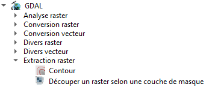
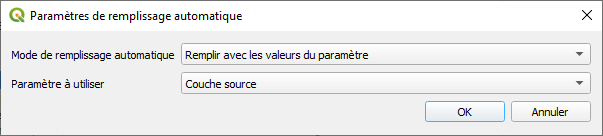
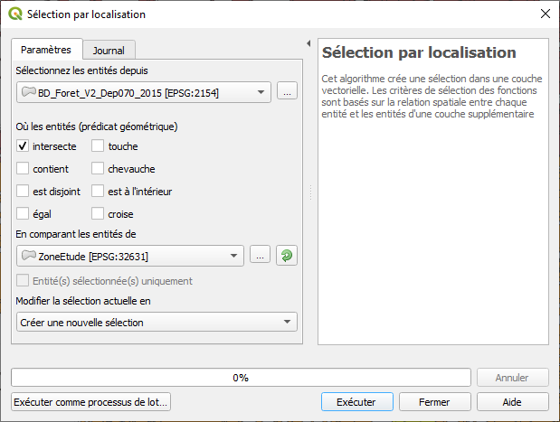
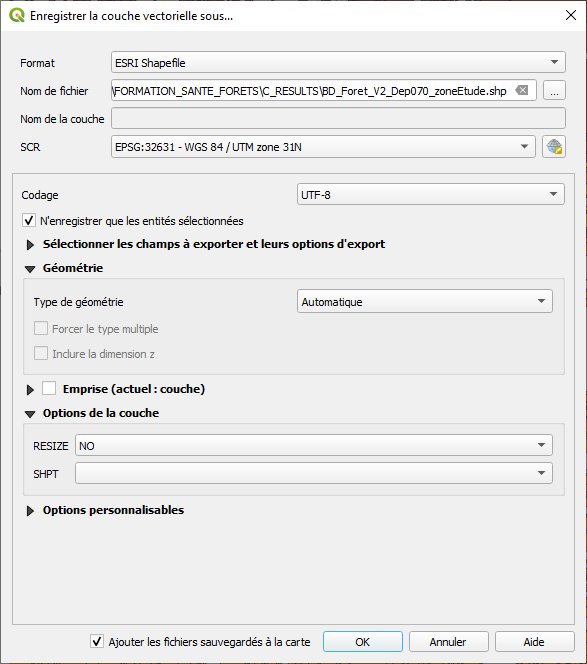
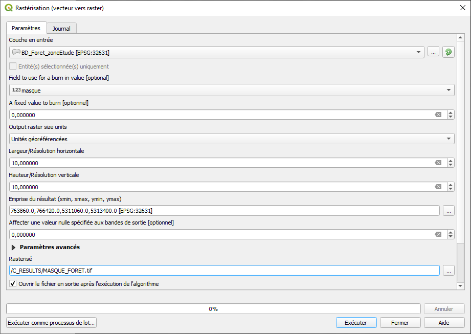

# Détection des foyers de mortalité dans les massifs de conifères par imagerie satellite Sentinel-2

---

Equipe de formation INRAE : Florian de Boissieu, Raphaël Dutrieux, Jean-Baptiste Féret, Kenji Ose

---

# TP-01 : Découverte des données Sentinel-2 et détection bi-date

---

# 5. Fiche D : Prétraitement des données S2 sous QGIS

Les données Sentinel-2 téléchargées depuis THEIA sont fournies sous forme d’archive ZIP, et doivent d’abord être décompressées pour être ensuite mise en forme en fonction des besoins. 
## 5.1. Décompression des données S2

> - A l’aide de l’explorateur Windows, ouvrir le répertoire `A_DATA/RASTER/THEIA` qui contient les deux images S2 zippées. Décompresser les images dans ce même répertoire. Vous obtenez les deux répertoires suivants :
>
>	- `SENTINEL2B_20170823-103018-461_L2A_T31UGP_D`
>	- `SENTINEL2A_20180823-103535-335_L2A_T31UGP_D`
>
>Ces répertoires sont organisés de la manière suivante :
>
>```bash=
>..\THEIA_DATA\SENTINEL2B_20170823-103018-461_L2A_T31UGP_D
>└───SENTINEL2B_20170823-103018-461_L2A_T31UGP_C_V2-2
>        │   SENTINEL2B_20170823-103018-461_L2A_T31UGP_C_V2-2_ATB_R1.tif
>        │   SENTINEL2B_20170823-103018-461_L2A_T31UGP_C_V2-2_ATB_R2.tif
>        │   SENTINEL2B_20170823-103018-461_L2A_T31UGP_C_V2-2_FRE_B11.tif
>        │   SENTINEL2B_20170823-103018-461_L2A_T31UGP_C_V2-2_FRE_B12.tif
>        │   SENTINEL2B_20170823-103018-461_L2A_T31UGP_C_V2-2_FRE_B2.tif
>        │   SENTINEL2B_20170823-103018-461_L2A_T31UGP_C_V2-2_FRE_B3.tif
>        │   SENTINEL2B_20170823-103018-461_L2A_T31UGP_C_V2-2_FRE_B4.tif
>        │   SENTINEL2B_20170823-103018-461_L2A_T31UGP_C_V2-2_FRE_B5.tif
>        │   SENTINEL2B_20170823-103018-461_L2A_T31UGP_C_V2-2_FRE_B6.tif
>        │   SENTINEL2B_20170823-103018-461_L2A_T31UGP_C_V2-2_FRE_B7.tif
>        │   SENTINEL2B_20170823-103018-461_L2A_T31UGP_C_V2-2_FRE_B8.tif
>        │   SENTINEL2B_20170823-103018-461_L2A_T31UGP_C_V2-2_FRE_B8A.tif
>        │   SENTINEL2B_20170823-103018-461_L2A_T31UGP_C_V2-2_MTD_ALL.xml
>        │   SENTINEL2B_20170823-103018-461_L2A_T31UGP_C_V2-2_QKL_ALL.jpg
>        │   SENTINEL2B_20170823-103018-461_L2A_T31UGP_C_V2-2_SRE_B11.tif
>        │   SENTINEL2B_20170823-103018-461_L2A_T31UGP_C_V2-2_SRE_B12.tif
>        │   SENTINEL2B_20170823-103018-461_L2A_T31UGP_C_V2-2_SRE_B2.tif
>        │   SENTINEL2B_20170823-103018-461_L2A_T31UGP_C_V2-2_SRE_B3.tif
>        │   SENTINEL2B_20170823-103018-461_L2A_T31UGP_C_V2-2_SRE_B4.tif
>        │   SENTINEL2B_20170823-103018-461_L2A_T31UGP_C_V2-2_SRE_B5.tif
>        │   SENTINEL2B_20170823-103018-461_L2A_T31UGP_C_V2-2_SRE_B6.tif
>        │   SENTINEL2B_20170823-103018-461_L2A_T31UGP_C_V2-2_SRE_B7.tif
>        │   SENTINEL2B_20170823-103018-461_L2A_T31UGP_C_V2-2_SRE_B8.tif
>        │   SENTINEL2B_20170823-103018-461_L2A_T31UGP_C_V2-2_SRE_B8A.tif
>        ├───DATA
>        └───MASKS
>```
> Dans cet exemple, le répertoire `SENTINEL2B..V2-2` contient l’ensemble des bandes spectrales de l’image Sentinel-2, soit un fichier image par bande. Deux types de conversion en réflectance au sol (ou TOC pour *Top of Canopy*)  sont ici proposés : SRE pour *Surface Reflectance* et, FRE pour *Flat Reflectance*. Ce dernier mode intègre, en plus des corrections atmosphériques, des corrections topographiques. Il est ici privilégié.
>
>- Supprimer les fichiers ayant pour suffixe *SRE_B*.tif

## 5.2. Ajuster les images à l'emprise d’une zone d'étude et harmoniser la résolution spatiale

>- Ouvrir le logiciel QGis (version utilisée : 3.16.1)
>- Dans QGis, ouvrir la **boîte à outils de traitements** : 
>
>`Traitement > Boîte à outils`
>
>- Dans la boîte à outils de traitements, rechercher l’outil :
>
>`GDAL > Extraction raster > Découper un raster selon [...] masque`
>
>
>
>- Cliquer-droit sur l’outil et, sélectionner “Exécuter comme processus de lot…”
>
>
>
>- Dans la fenêtre de Traitements par lots :
>	- pour le champ “Couche source” : cliquer sur `Auto-remplissage > sélectionner des fichiers...` et ouvrir tous les fichiers *FRE* de l’image S2 acquise en 2017
>	- pour le champ “Couche de masquage” : 
>		- sélectionner dans la première ligne le fichier `ZoneEtude.shp` dans le répertoire `A_DATA/VECTOR`
>		- cliquer sur `Auto-Remplissage… > Remplir` afin de renseigner automatiquement les lignes qui suivent.
>
>		
>
>	- pour le champ “Définir la résolution du fichier en sortie” : sélectionner sur la première ligne l’option “Oui” et effectuer un remplissage automatique pour les lignes qui suivent
>	- pour le champ “Résolution X pour les bandes en sortie”, saisir la valeur 10 et effectuer un remplissage automatique pour le lignes qui suivent
>	- pour le champ “Résolution Y pour les bandes en sortie”, saisir la valeur 10 et effectuer un remplissage automatique pour le lignes qui suivent
>	- pour le champ “Découpé (masque)”, enregistrer le résultat dans le répertoire `C_RESULTS` et donner en nom de fichier le préfixe “CROP_10m_”
>		- choisir les options comme indiqué sur la figure ci-dessous :
>
>
>
>- Cliquer enfin sur le bouton “Exécuter”

Chacune des bandes spectrales de l’image S2 de 2017 est ainsi découpée suivant l’emprise de la zone d’étude et ré-échantillonnée à 10 m de résolution spatiale. Les résultats sont enregistrés dans le répertoire `C_RESULTS` et leur nom de fichier est préfixé par la chaîne de caractères “CROP_10m_”.

>- Reproduire ce traitement pour l’image S2 de 2018

Suite aux traitements des deux images, le répertoire `C_RESULTS` devrait disposer de 20 fichiers images, soit 10 bandes spectrales par date.

## 5.3. Calcul d’indices de végétation

Deux types d’indice de végétation sont produits et testés : le **NDVI** et le **CRSWIR**. Leur calcul est réalisé à l’aide de la calculatrice Raster de QGis.

> - Dans un premier temps, charger si nécessaire dans QGis toutes les bandes spectrales prétraitées (cf. exercice précédent) de l’image S2 2017 :
>
>cliquer sur  : `Couche > Ajouter une couche > Ajouter une couche raster…`

### 5.3.1. Le NDVI

Le NDVI exploite les bandes situées dans les domaines visible rouge (R) et proche infrarouge (PIR), correspondant respectivement aux canaux B4 (665 nm) et B8 (842 nm) de Sentinel-2. Cet indice est particulièrement intéressant pour l'étude de la végétation et plus particulièrement de l'activité photosynthétique : il permet de tirer parti du contraste de réflectance entre les domaines rouge (très forte absorption due à la chlorophylle) et le domaine proche infrarouge (absence d'éléments absorbants dans la végétation). le NDVI est normalisé afin d’obtenir des valeurs comprises entre -1 et 1. 

L’expression du NDVI est la suivante :

`NDVI = (B8 - B4)/(B8 + B4)`

> La procédure pour calculer le NDVI à partir de QGIS est la suivante: 
>
>- Cliquer sur le menu : `Raster > Calculatrice Raster`
>- Saisir l’expression suivante :
>```
>("CROP_10m_SENTINEL2B_20170823-103018-461_L2A_T31UGP_C_V2-2_FRE_B8@1" - "CROP_10m_SENTINEL2B_20170823-103018-461_L2A_T31UGP_C_V2-2_FRE_B4@1") / ("CROP_10m_SENTINEL2B_20170823-103018-461_L2A_T31UGP_C_V2-2_FRE_B8@1" + "CROP_10m_SENTINEL2B_20170823-103018-461_L2A_T31UGP_C_V2-2_FRE_B4@1")
>```
>
>- Enregistrer le résultat sous `C_RESULTS\NDVI_2017.tif`
>- Exécuter le calcul
>
> Répéter cette procédure pour calculer le NDVI de l’image S2 2018 et enregistrer le résultat sous `C_RESULTS\NDVI_2018.tif`.

### 5.3.2. Le CRSWIR

L’indice CRSWIR exploite une bande du proche infrarouge et deux bandes du moyen infrarouge, respectivement les bandes B8A (864 nm), B11 (1610.4 nm) et B12 (2185.7 nm) de Sentinel-2. Cet indice se base sur le principe du Continuum Removal (CR), technique répandue dans le domaine hyperspectral qui permet de d’augmenter le contraste des domaines d’absorption de certains constituants distinguables par les mesures de spectroscopie, mais dont l’amplitude est possiblement très inférieure à la variabilité de la ‘ligne de base’ de la réflectance, induite par des conditions environnementales telles que la luminosité, l'humidité… Dans notre cas, le CRSWIR permet de rehausser l'intensité relative des variations de réflectance associées à la présence d’eau dans la végétation, caractérisée par un pic d'absorption important autour de 1500 nm. 

L’expression du CRSWIR est la suivante :

`CRSWIR = B11/(B8A+((B12-B8A)/(2185.7-864))x(1610.4-864))`

>- Comme pour le NDVI, calculer à l’aide de la calculatrice raster l’indice CRSWIR pour les années 2017 (`CRSWIR_2017.tif`) et 2018 (`CRSWIR_2018.tif`). 
>- A titre d’exemple, l’expression attendue pour 2017 est la suivante :
>```
>"CROP_10m_SENTINEL2B_20170823-103018-461_L2A_T31UGP_C_V2-2_FRE_B11@1" / ("CROP_10m_SENTINEL2B_20170823-103018-461_L2A_T31UGP_C_V2-2_FRE_B8A@1" + (("CROP_10m_SENTINEL2B_20170823-103018-461_L2A_T31UGP_C_V2-2_FRE_B12@1" - "CROP_10m_SENTINEL2B_20170823-103018-461_L2A_T31UGP_C_V2-2_FRE_B8A@1") / (2185.7 - 864)) * (1610.4 - 864))
>```

Pour être tout à fait rigoureux, il serait nécessaire d’adapter la longueur d’onde centrale des bandes 8A, 11 et 12 en fonction des caractéristiques de Sentinel-2A ou Sentinel-2B. Ici, nous partons du principe que les différences dans la réponse spectrale des capteurs sont négligeables, et utilisons la longueur d’onde centrale des bandes du capteur Sentinel-2A. 

## 5.4. Automatisation des tâches

Les tâches de décompression, découpage des images sur une zone d'étude, harmonisation de la résolution spatiale entre bandes (à 10 m ou 20 m), empilement des bandes au sein d’un fichier image unique, et de calcul d’un indice spectral associé aux images Sentinel-2, peuvent s'avérer chronophages et complexes a mettre en oeuvre sur de gros volumes de données. Afin de faciliter cette succession de traitements, une librairie a été développée et intégrée au package fordead. Cette librairie, nommée `maja_fun`, est mise en application dans le script `ex_preprocess_theia.py` présenté dans le dossier d’exemples du package et située à l'emplacement suivant :

`<MyWorkingDirectory>\B_PROGRAMS\Libraries\fordead_package\examples\`

>- Ce script peut être ouvert à l'aide d’un éditeur de texte (comme notepad++) ou un environnement de développement (comme spyder). Une fois les chemins relatifs mis à jour, il peut ensuite être lancé depuis une invite de commande anaconda avec l’instruction suivante : 
>
>```bash=
>python ex_preprocess_theia.py
>```
>
>- A l’issue de l'exécution, différentes images ont ete créées dans le répertoire suivant :
>
>`<MyWorkingDirectory>\C_RESULTS\maja_preprocess`

Ce repertoire inclut: 

- un repertoire `Unzip` contenant l’image `SENTINEL2B_20170823-103018-461_L2A_T31UGP_C_V2-2` décompressée
- un repertoire `Subsets` contenant des images découpées sur la zone d'étude, dont: 
	- une image au format netcdf comprenant différents produits raster (notamment l’image Sentinel-2 ajustée sur la zone d'étude, masque de la zone, indices spectraux NDVI et CRSWIR associés) : 
		- `SENTINEL2A_20180823-103535-335_L2A_T31UGP_D.nc`

	- les images correspondant à ces produits individualisés et au format tif :
		- `SENTINEL2A_20180823-103535-335_L2A_T31UGP_D_bands.tif`,
		- `SENTINEL2A_20180823-103535-335_L2A_T31UGP_D_CRSWIR.tif`,
		- `SENTINEL2A_20180823-103535-335_L2A_T31UGP_D_mask.tif`, 
		- `SENTINEL2A_20180823-103535-335_L2A_T31UGP_D_NDVI.tif`

Ce script d’exemple peut-être copié dans le répertoire principal des programmes : 

`<MyWorkingDirectory>\B_PROGRAMS\`

puis modifié pour ajuster ce traitement automatisé à d’autres jeux de données. Le paramétrage des variables d'entrée des fonctions incluses dans la librairie `maja_fun.py` offre de nombreuses possibilités, et celles-ci seront enrichies au fur et à mesure des versions du package.

## 5.5. Préparation et intégration du masque forêt

Pour cet exercice, le masque est construit à partir de la **BD Forêt ® V2** de l’IGN. Il faut tout d’abord définir les essences à conserver, ici les classes “FF2-00-00", "FF2-90-90", "FF2-91-91", "FF2G61-61" du champ CODE_TFV. Les résultats sont ensuite fusionnés et convertis en raster. Cette conversion requiert en entrée un champ attributaire codé en entier. Ici, les essences visées seront codées à 1, les autres à 0.

### 5.5.1. Sélection des entités vectorielles sur la zone d’étude

La zone d’étude étant à cheval sur deux départements, il convient dans un premier temps d’effectuer une sélection zonale afin de réduire le jeu de données initial, de fusionner ensuite ces résultats dans une seule et même couche.

>- Dans QGis, s’assurer que les couches vectorielles suivantes sont chargées :
>	- Dans le répertoire `[...]\A_DATA\VECTOR\ZONE_ETUDE` :
>		- ZoneEtude.shp
>	- Dans le répertoire `[...]\A_DATA\VECTOR\BD_FORET` :
>		- `BD_Foret_V2_Dep070_2015\BD_Foret_V2_Dep070_2015.shp`
>		- `BD_Foret_V2_Dep088_2014\BD_Foret_V2_Dep088_2014.shp`
>
>- Effectuer des sélections zonales sur les deux couches départementales de la BD Forêt ® et ce, en fonction de l’emprise de la zone d’étude. Par exemple pour le département 70, suivre la procédure suivante :
>- Dans le menu, cliquer sur :
> `Vecteur > Outils de recherche > Sélection par localisation…`
>- Dans le fenêtre de “Sélection par localisation”, paramétrer comme suit :
>
>
>
>- Cliquer-droit sur la couche BD Forêt ® du département 70 et exporter les entités sélectionnées sous :
>
>`C_RESULTS\BD_Foret_V2_Dep070_zoneEtude.shp`
>
>- Lors de l’enregistrement, modifier la projection en sortie (*SCR : EPSG:32631*) afin qu’elle soit conforme aux données Sentinel-2 ici utilisées :
>
>
>
>- Reproduire ce traitement pour la BD Forêt ® IGN du département 88, et enregistrer le résultat sous :
>
>`C_RESULTS\BD_Foret_V2_Dep088_zoneEtude.shp`
>
> Les deux fichiers résultants sont enfin fusionnés dans un seul et même fichier.
>- Dans le menu, cliquer sur :
>`Vecteur > Outils de gestion de données > Fusionner des couches vecteur…`
>- Sélectionner en couches d’entrée : 
>	- `C_RESULTS\BD_Foret_V2_Dep070_zoneEtude.shp`
>	- `C_RESULTS\BD_Foret_V2_Dep088_zoneEtude.shp`
>
>- Et enregistrer le résultat sous :
>
> `BD_Foret_zoneEtude.shp`

### 5.5.2. Ajout et renseignement d’un champ dans la table attributaire

Il est nécessaire de créer un nouveau champ dans la couche vectorielle afin de préciser quelles essences seront conservées ou non dans le masque final.

>- Ouvrir la couche vectorielle `C_RESULTS/BD_Foret_zoneEtude.shp`
>- Sélectionner la couche et ouvrir la calculatrice de champ en cliquant sur l’icône  dans la barre de menu.
>- Dans la calculatrice de champ :
>
>	- cocher l’option “créer un nouveau champ”
>	- choisir un nom de champ, par exemple : masque
>	- choisir le type de codage : Nombre entier
>	- dans l’espace “Expression”, saisir l’instruction suivante :
>
>```
>CASE
>WHEN  
>"CODE_TFV"  = 'FF2-00-00' OR
>"CODE_TFV"  = 'FF2-90-90' OR
>"CODE_TFV"  = 'FF2-91-91' OR
>"CODE_TFV"  = 'FF2G61-61'
>THEN 1
>ELSE 0
>END
>```
>
>- Enregistrer les modifications

### 5.5.3. Création du masque en mode raster

Une fois le champ des valeurs entières créé, il faut produire un raster binaire sur la même grille (origine, résolution, et dimension) que les images Sentinel-2 traitées (préfixées ‘CROP_10m_*’).

>- Dans le menu, cliquer sur :
> `Raster > Conversion > Rasteriser (vecteur vers raster) …`
>- Paramétrer comme suit :
>
>
>
>
>N.B. Pour le paramètre “Emprise du résultat”, utiliser l’option “Calculer depuis la couche” pour obtenir les coordonnées extrémales de l’image de référence. 
>
>Le résultat est une image binaire, 1 pour les zones d’intérêt, 0 pour le reste.

# 6. Fiche E : Détection de changements

Plusieurs solutions techniques sont possibles pour identifier les changements et tenter de les qualifier. Ces approches vont principalement de la mise à disposition ou non de données de terrain et des jeux de données image disponibles.

Dans le cadre de cet exercice, le jeu de données est limité à deux images acquises sur une même zone à deux dates différentes. Il ne s’agit donc pas d’une série temporelle. Pour détecter les changements, il est possible de produire un indice de changement en déterminant des seuils soit manuellement soit en fonction de la distribution statistique des pixels, de tester également des algorithmes de classification supervisée ou non.

## 6.1. Test 1. Différence normalisée d’indices de végétation

Le principe ici est de mettre en place un indice de changement en utilisant les indices NDVI ou CRSWIR calculés aux deux dates. Pour ce faire, à l’instar du NDVI, nous travaillons sur une différence normalisée.

>- Ouvrir la calculatrice raster
>- Saisir l’expression suivante :
>```
>("MASQUE_FORET@1"=0) * 255 + ("MASQUE_FORET@1"=1) * 
>(("NDVI_2018@1"-"NDVI_2017@1")/("NDVI_2018@1"+"NDVI_2017@1"))
>```
>- Enregistrer le résultat sous : `C_RESULTS\DIFF_CRSWIR_2017_2018_MASK.tif`
>
>Pour afficher correctement l’image sur QGis, il convient d’indiquer la valeur 255 en no data afin d’établir un contraste uniquement sur les valeurs du delta NDVI.
>
>- Double-cliquer sur le résultat dans la table des couches de QGis
>- Dans les propriétés de la couche, cliquer sur l’onglet Transparence et saisir 255 en tant que valeur nulle complémentaire

Le résultat est une image à une bande dont les valeurs sont théoriquement comprises entre -1 et 1. La valeur 255 étant associée aux essences non suivies. Les valeurs de pixels situées au voisinage de 0 correspondent à un état stable, celles qui tendent vers -1 reflètent une baisse d'activité photosynthétique due à des problèmes sanitaires, des pratiques sylvicoles ou autres.

>- De la même manière, calculer la différence de CRSWIR et,
>- Enregistrer le résultat sous : 
>
>`C_RESULTS\DIFF_CRSWIR_2017_2018_MASK.tif`
>
>- Analyser visuellement le résultat et comparer avec la différence des NDVI.
>……………………………………………………………………………………………
>……………………………………………………………………………………………
>……………………………………………………………………………………………
>……………………………………………………………………………………………
>……………………………………………………………………………………………
>……………………………………………………………………………………………

## 6.2. Test 2. Classifications automatiques

Une première approche possible pour détecter des anomalies en milieu forestier est de faire appel à des algorithmes de classification automatique d’images, supervisés ou non. Nous allons tester ici ces deux approches dans QGis, et cerner à la fois leurs avantages et inconvénients.

### 6.2.1. Classification non supervisée

La classification non supervisée regroupe les pixels qui partagent des caractéristiques similaires (par exemple, la radiométrie) en classe, sans toutefois les étiqueter. Il appartient alors à l’utilisateur d’attribuer chacune des classes à un type d’occupation du sol, un type de changement, etc.

>- Dans QGis, ouvrir à la boîte à outils de traitements en cliquant dans le menu sur :
>
>`Traitement > Boîte à outils`
>
>- Dans la boîte à outils de traitements, affichée par défaut à droite de l’interface, dérouler les menus suivants :
>
>	- `SAGA > Image analysis`
>
>Cette rubrique regroupe plusieurs outils de classification d’image. Nous limiterons les tests aux seules applications utilisables avec une configuration classique de QGis. En effet, certaines applications nécessitent l’installation de dépendances (par ex. opencv).
>
>- Ouvrir l’outil K-means clustering for grids, et configurer comme suit :
>
>	- Dans le champ Grilles, insérer les fichiers suivants :
>		- `CROP_10m_SENTINEL2A_20180823-103535-335_L2A_T31UGP_D_V1-8_FRE_B2.tif`
>		- `CROP_10m_SENTINEL2A_20180823-103535-335_L2A_T31UGP_D_V1-8_FRE_B3.tif`
>		- `CROP_10m_SENTINEL2A_20180823-103535-335_L2A_T31UGP_D_V1-8_FRE_B4.tif`
>		- `CROP_10m_SENTINEL2A_20180823-103535-335_L2A_T31UGP_D_V1-8_FRE_B8.tif`
>
>	- Dans le champ Méthode, choisir : 
>`[2] Combined Minimum Distance / Hillclimbing`
>
>	- Dans le champ Clusters, saisir : 10
>	- Dans le champ Maximum Iterations, saisir 10
>	- Cocher l’option Normalize
>	- Enregistrer la classification (Clusters) sous : 
> 
> `C_RESULTS\classif_kmeans_2018.sdat`
>
>En sortie, l’image est classée en 10 classes (clusters) sans étiquette. 
>
>- Attribuer une couleur et une étiquette à chacune des classes via les propriétés de la couche.
>
>- Relancer cet outil en incluant cette fois soit les bandes du visible et du proche infrarouge des années 2017 et 2018, soit les NDVI aux deux dates.

En analysant les résultats, quels sont selon vous les avantages et inconvénients de cette méthode dans une perspective opérationnelle ?
…………………………………………………………………………………………………………
…………………………………………………………………………………………………………
…………………………………………………………………………………………………………
…………………………………………………………………………………………………………
…………………………………………………………………………………………………………
…………………………………………………………………………………………………………
…………………………………………………………………………………………………………
…………………………………………………………………………………………………………

### 6.2.2. Classification supervisée

La classification supervisée requiert en entrée des données d’apprentissage pour entraîner le modèle de classification. Dans le cas présent, il s’agit des relevés terrain.

Pour les besoins de l’exercice, la couche vectorielle des relevés terrain (`A_DATA\VECTOR\BD_SCOLYTE\ValidatedScolytes.shp`) a été prétraitée de manière à ne conserver que les entités situées à l’intérieur de la zone d’étude, à coder un champ (‘class’) en valeur entière pour les parcelles saines (1) et celles impactées (2) par le scolyte.

>- Ouvrir la couche vectorielle :
>
>`A_DATA\VECTOR\BD_SCOLYTE\ValidatedScolytes.shp`
>
>- Dans la Boîte à outils de traitements, ouvrir l’application suivante :
>
>`SAGA > Image analysis > Supervised classification for grids`
>
>- Paramétrer comme suit :
>
>	- Dans le champ Entités, insérer les fichiers suivants :
>		- `CROP_10m_SENTINEL2A_20180823-103535-335_L2A_T31UGP_D_V1-8_FRE_B2.tif`
>		- `CROP_10m_SENTINEL2A_20180823-103535-335_L2A_T31UGP_D_V1-8_FRE_B3.tif`
>		- `CROP_10m_SENTINEL2A_20180823-103535-335_L2A_T31UGP_D_V1-8_FRE_B4.tif`
>		- `CROP_10m_SENTINEL2A_20180823-103535-335_L2A_T31UGP_D_V1-8_FRE_B8.tif`
>
>	- Cocher l’option Normalize
>	- Dans le champ Training Areas, sélectionner la couche :
>
> `ValidatedScolytes.shp`
>
>	- Dans le champ Class Identifier, sélectionner la couche :
>
> `ValidatedScolytes.shp`
>
>	- Dans le champ Méthode, sélectionner : [5] Spectral Angle Mapping
>- Enregistrer la classification sous :
>`C_RESULTS\classif_specang_2018.sdat`

La qualité d’une classification est évaluée en général sur le critère thématique, en estimant la cohérence de l'étiquetage vis-à-vis de la “réalité” (cf. matrice de confusion et métriques dérivées). Or, cette qualité dépend du classifieur en lui-même, mais aussi des jeux d’apprentissage et des caractéristiques descriptives (par ex. bandes spectrales d’une image) utilisées.

> En utilisant toujour le même outil SAGA, 
>
>- Tester une à deux autres méthodes de classification supervisée et,
>- Comparer visuellement les résultats :
>……………………………………………………………………………………………
>……………………………………………………………………………………………
>……………………………………………………………………………………………
>……………………………………………………………………………………………
>……………………………………………………………………………………………
>……………………………………………………………………………………………
>
>- Ajouter simultanément les bandes spectrales des années 2017 et 2018 et relancer la méthode qui vous paraît la plus efficace.
>- Comparer les résultats avec la même méthode entraînée sur une seule année :
>……………………………………………………………………………………………
>……………………………………………………………………………………………
>……………………………………………………………………………………………
>……………………………………………………………………………………………
>……………………………………………………………………………………………
>……………………………………………………………………………………………

La classification supervisée repose sur des données d’apprentissage, souvent des relevés terrain. Cette méthode vous paraît-elle adaptée pour le suivi de phénomènes évoluant dans le temps et dans l’espace ? Préciser les avantages et/ou inconvénients de cette approche.
…………………………………………………………………………………………………………
…………………………………………………………………………………………………………
…………………………………………………………………………………………………………
…………………………………………………………………………………………………………
…………………………………………………………………………………………………………
…………………………………………………………………………………………………………
…………………………………………………………………………………………………………
…………………………………………………………………………………………………………


