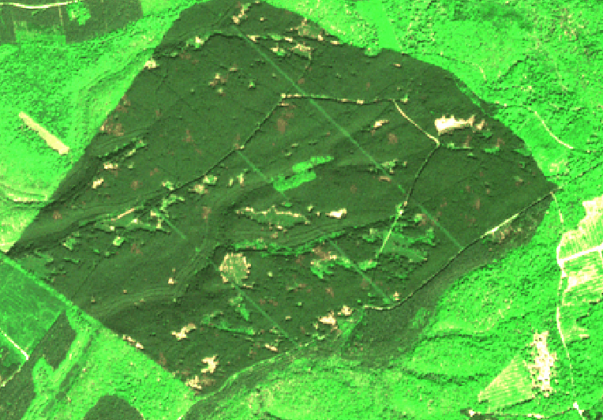

#### Step 1 : Computing the vegetation index and a mask for each SENTINEL-2 date

The first step consists in calculating a vegetation index and a mask for each SENTINEL-2 date. The mask corresponds to pixels that should not be used throughout the rest of the detection steps. SENTINEL-2 data will be automatically recognized by the algorithm, as long as in the **input_directory**, each sub-directory refers to a SENTINEL-2 image, with the corresponding date in its name, and stores one image file per spectral band with its name in the filename (B2 or B02, and so on...).

Here we have the following file tree for the input directory, named **study_area**:
```
├── fordead_data-main
│   ├── study_area
│       ├── SENTINEL2A_20151203-105818-575_L2A_T31UFQ_D_V1-1
│           ├── MASKS
│           ├── SENTINEL2A_20151203-105818-575_L2A_T31UFQ_D_V1-1_FRE_B2.tif
│           ├── SENTINEL2A_20151203-105818-575_L2A_T31UFQ_D_V1-1_FRE_B3.tif
│           ├── SENTINEL2A_20151203-105818-575_L2A_T31UFQ_D_V1-1_FRE_B4.tif
│           ├── ...
│       ├── SENTINEL2A_20151230-105153-392_L2A_T31UFQ_D_V1-1
│       ├── ...
```

For more details, you can find the complete guide for this step [here](https://fordead.gitlab.io/fordead_package/docs/user_guides/english/01_compute_masked_vegetationindex/).

##### Running this step using a script

Run the following instructions to perform this processing step:

```python
from fordead.steps.step1_compute_masked_vegetationindex import compute_masked_vegetationindex

input_directory = "<MyWorkingDirectory>/study_area"
data_directory = "<output directory>"

compute_masked_vegetationindex(input_directory = input_directory, 
                               data_directory = data_directory, 
                               lim_perc_cloud = 0.4, 
                               interpolation_order = 0, 
                               sentinel_source  = "THEIA", 
                               soil_detection = False, 
                               formula_mask = "B2 > 600 | (B3 == 0) | (B4 ==0)", 
                               vi = "CRSWIR", 
                               apply_source_mask = True)
```

##### Running this step from the command invite

The steps in this package can also be ran from the command prompt. The command `fordead masked_vi -h` will print the help information of this step. For example, to use it with the same parameters, the following command can be used:
```bash
fordead masked_vi -i <MyWorkingDirectory>/study_area -o <output directory> -n 0.4 --interpolation_order 0 --sentinel_source THEIA --formula_mask "(B2 > 600)" --vi CRSWIR --apply_source_mask
```

> **_NOTE :_** If the same parameters are used, the SENTINEL-2 dates already computed are ignored. However, if you change any parameter, all previous results will be deleted and calculated again. If new SENTINEL-2 data are added in the **input_directory**, they will be computed as long as they are more recent than the last computed SENTINEL-2 date. This way of saving information on previous processes and paths is done using fordead's [TileInfo](https://fordead.gitlab.io/fordead_package/docs/examples/ex_tileinfo_object/) class, of which an object is saved in the data_directory and is retrieved each time a process is launched.

As you can see, this step includes many options. However only the **input_directory** and **data_directory** parameters don't have a default value, and the **sentinel_source** has to correspond to the data provider ("THEIA", "Scihub" or "PEPS").

##### Outputs

Running this script will filter out all SENTINEL-2 dates with a cloud percentage above **lim_perc_cloud** based on the data provider's classification, and create two directories in your **data_directory** :
- A "VegetationIndex" directory, storing the chosen vegetation index (in this case, CRSWIR) calculated for each remaining date using SENTINEL-2 data interpolated at 10m resolution (in this case, `interpolation_order = 0` indicates nearest neighbour resampling).
- A "Mask" directory, containing the associated binary raster mask which corresponds to the two default masks (any negative value in the first band of the stack is considered outside the satellite swath and any pixel with a 0 value in any band is considered as a shadow) associated to the **formula_mask** which is chosen by the user, as well as the mask provided by the SENTINEL-2 data provider if **apply_source_mask** is True.


Vegetation index             |  Mask
:-------------------------:|:-------------------------:
  |  

If **soil_detection** is False, any logical operation formula can be used in **formula_mask** (see [compute_vegetation_index](https://fordead.gitlab.io/fordead_package/reference/fordead/masking_vi/#compute_vegetation_index)). 
If **soil_detection** is True, then the masks include bare ground detection as describe in the [step guide](https://fordead.gitlab.io/fordead_package/docs/user_guides/english/01_compute_masked_vegetationindex/), which can be useful but it has only been tested on THEIA data over France's coniferous forests and might not be adapted to other contexts and types of data. This package has been used in France to map bark beetle infested stands. In this context, bare ground detection has been useful to filter out clear cuts, deciduous forests as well as late stage bark beetle infested forest stands. This option is described in the step guide, but will not be exploited in this tutorial.


[NEXT PAGE](https://fordead.gitlab.io/fordead_package/docs/Tutorial/02_train_model)
