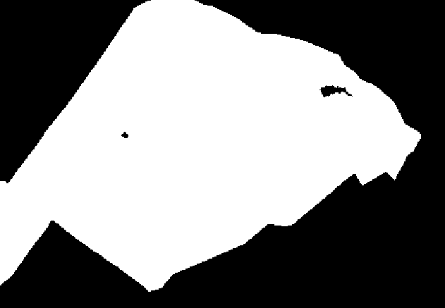

#### Step 4 : Creating a forest mask, which defines the areas of interest

The previous steps result in the adjustment of a periodic model for each pixel, even non-forested pixels. 
The export of results requires to filter out irrelevant areas. 
In our case, only coniferous forests are of interest. 

This steps aims at computing and writing a binary raster, then used as a 'forest mask'. 
This can be done either by rasterizing a vector file, or by producing this binary mask directly. 
The final mask must have the same dimensions, spatial resolution, origin, and projection as Sentinel-2 images. 
It is also possible to run _fordead_ without any forest mask. 
Specific options allow taking advantage of land cover or forest spatial database available in France ([BDFORET](https://inventaire-forestier.ign.fr/spip.php?article646) from IGN and [Land cover](https://www.theia-land.fr/en/ceslist/land-cover-sec/) from THEIA).

Here, we used a shapefile identifying forested areas in the example dataset, which was rasterized as a binary raster.

Comprehensive documentation can be found [here](https://fordead.gitlab.io/fordead_package/docs/user_guides/english/04_compute_forest_mask/).

Study area with area of interest             |  Resulting mask
:-------------------------:|:-------------------------:
  |  

##### Running this step using a script

Run the following instructions to perform this processing step:

```python
from fordead.steps.step4_compute_forest_mask import compute_forest_mask

compute_forest_mask(data_directory, 
                    forest_mask_source = "vector", 
                    vector_path = "<MyWorkingDirectory>/vector/area_interest.shp")
```

##### Running this step from the command prompt

This processing step can also be performed from a terminal:

```bash
fordead forest_mask -o <output directory> -f vector --vector_path <MyWorkingDirectory>/vector/area_interest.shp
```
##### Outputs

The outputs of this step, in the data_directory folder, are :
- In the folder ForestMask, the binary raster Forest_Mask.tif with the value 1 for pixels of interest, the value 0 elsewhere.

> **_NOTE :_** Though this step is presented as the fourth, it can actually be used at any point, even on its own in which case the parameter **path_example_raster** is needed to give a raster from which to copy the extent, resolution, etc...

[NEXT PAGE](https://fordead.gitlab.io/fordead_package/docs/Tutorial/05_compute_confidence)
