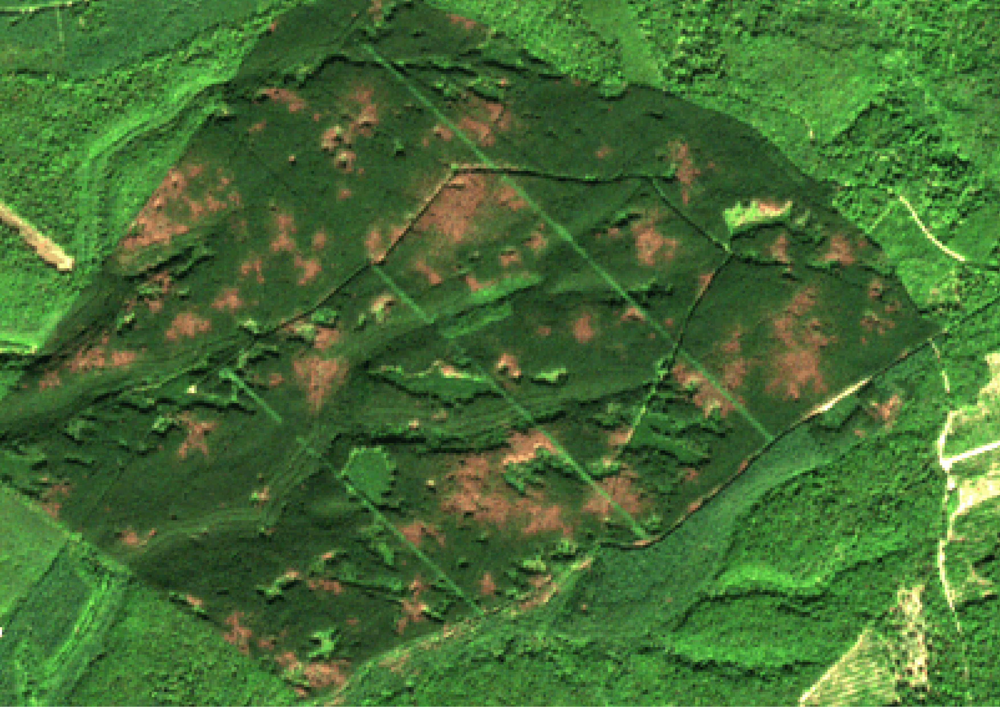

#### (OPTIONAL) Step 5 : Computing a confidence index to classify anomalies by degree of severity

This optional step aims at computing a confidence index increasing as the registered anomalies increase in severity. 
This confidence index can be used to describe the intensity of the detected disturbance and possibly help to filter out potential false detections. 
The index is a weighted mean of the difference between the vegetation index and the predicted vegetation index for all unmasked dates after the first anomaly subsequently confirmed. 
For each acquisition, the weight corresponds to the number of valid acquisitions from the first anomaly. 
In case of a disturbance, the intensity of anomalies often increases, which is why later dates have more weight. 
Since all SENTINEL-2 dates are used, this index describes the pixel state at the last available SENTINEL-2 acquisition, and not at the moment of detection. 
The following figure illustrates the computation of this confidence index:


Finally, pixels are classified into classes, based on the discretization of the confidence index using a list of thresholds. 
Pixels with only three anomalies correspond to low confidence index, as three anomalies might not be enough to calculate a meaningful index. The results are then vectorized.

Comprehensive documentation can be found [here](https://fordead.gitlab.io/fordead_package/docs/user_guides/english/05_compute_confidence/).

##### Running this step using a script

Run the following instructions to perform this processing step:

```python
from fordead.steps.step5_compute_confidence_index import compute_confidence_index

compute_confidence_index(data_directory, 
                         threshold_list = [0.265], 
                         classes_list = ["Low anomaly", "Severe anomaly"])
```

##### Running this step from the command prompt

This processing step can also be performed from a terminal:

```bash
fordead ind_conf -o <output directory> --threshold_list [0.265] --classes_list ["Low anomaly", "Severe anomaly"]
```

##### Outputs

The outputs of this fourth step, in the data_directory/Confidence_Index folder, are :
- confidence_class.shp, the vectorized classification results in shapefile format, where pixels are grouped as polygons by class
- confidence_index.tif, the raster containing the continuous confidence index value
- nb_dates.tif, the raster containing the number of unmasked dates since the first confirmed anomaly for each pixel

The following animated figure presents successively the last used SENTINEL-2 image (2019-09-20), the continuous confidence index raster, and the discretized / vectorized confidence class for this tutorial dataset.



> **_NOTE :_** If the confidence index was already calculated, any change in the threshold list or classes list will only import the results corresponding to the previous process. 
If additional SENTINEL-2 acquisitions are provided, the confidence index is updated and previous results are deleted.

[NEXT PAGE](https://fordead.gitlab.io/fordead_package/docs/Tutorial/06_export_results)
