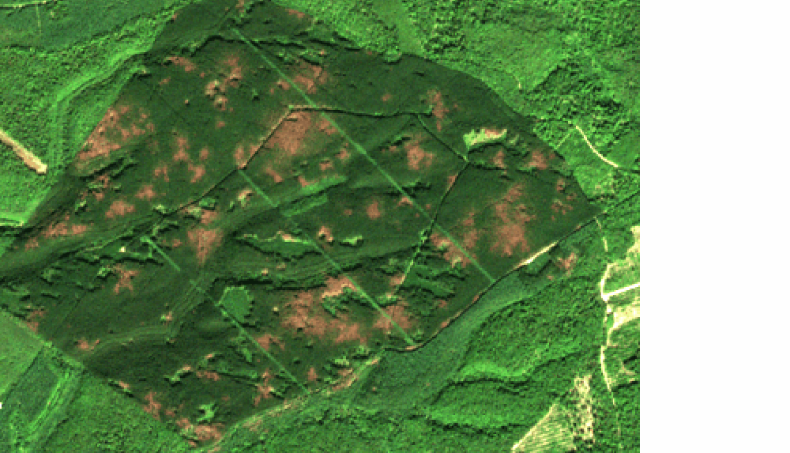

#### Step 6 : Exporting results to shapefile for visualizing results with a time step defined by the user

This step aims at exporting results in a vector format with user defined time step and footpprint defined by the mask. 
The minimum time step corresponds to the periods between available SENTINEL-2 dates. 
The results can be exported as multiple files, in which case each file corresponds to the end of a period, and the resulting polygons contain the state of the area at the end of this period, as detected in previous steps. If results are exported as a single file, polygons contain the period during which the first anomaly was detected. 
Pixels with unconfirmed anomalies, and pixels identified as anomaly and back to normal are ignored.

If the stress indices were computed in [step 3](https://fordead.gitlab.io/fordead_package/docs/user_guides/english/03_dieback_detection/) and the option is chosen, the stress index of the pixels currently detected as suffering from dieback is extracted and can be considered a confidence index.
This confidence index is then discretized, vectorized and intersected with the results, so the polygons also contain a confidence class, giving an information on the intensity of anomalies since detection. By construction, this class contains the "final" state, calculated at the last available SENTINEL-2 date. 

Comprehensive documentation can be found [here](https://fordead.gitlab.io/fordead_package/docs/user_guides/english/05_export_results/).

##### Running this step using a script

Run the following instructions to perform this processing step:

```python
from fordead.steps.step6_export_results import export_results

export_results(data_directory = data_directory, 
               frequency= "M", 
               multiple_files = False, 
			   conf_threshold_list = [0.265],
			   conf_classes_list = ["Low anomaly","Severe anomaly"])
```

##### Running this step from the command prompt

This processing step can also be performed from a terminal:

```bash
fordead export_results -o <output directory> --frequency M --t 0.265 -c "Low anomaly" -c "Severe anomaly"
```

##### Outputs

The output of this step, in the folder data_directory/Results, is the shapefile periodic_results_dieback, whose polygons contain the time period when the first anomaly was detected, as well as the confidence index class. 

Period of detection | Confidence class
:-------------------------:|:-------------------------:
 | 


[NEXT PAGE](https://fordead.gitlab.io/fordead_package/docs/Tutorial/06_create_timelapse)
