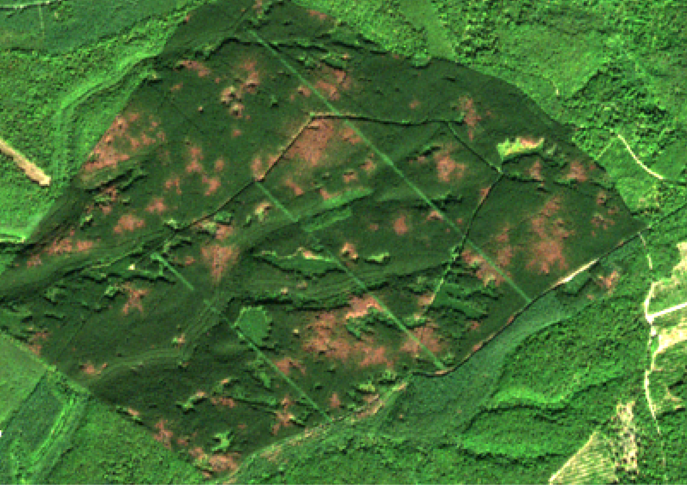
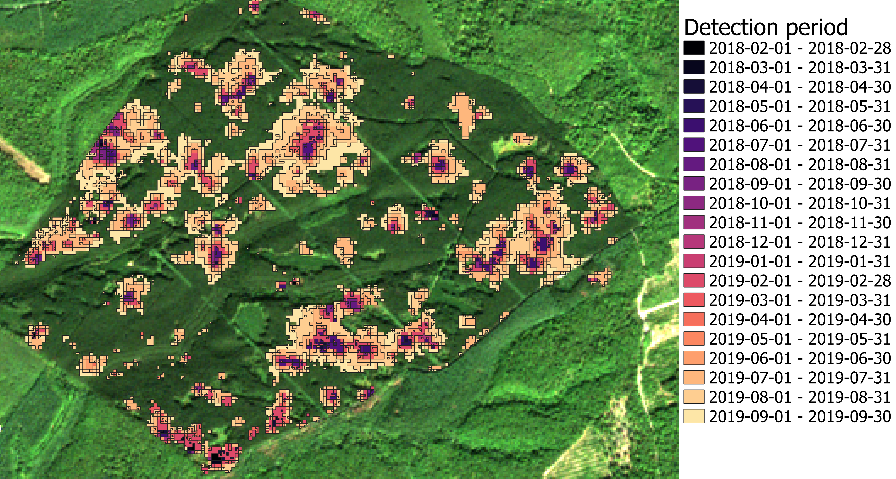

#### Step 6 : Exporting results as a shapefile allowing to visualize the results with the desired time step

This step aims at exporting results in a vectorized format, with the desired time step, ignoring areas outside the forest mask. The minimum time step corresponds to the periods between available Sentinel-2 dates. The results can be exported as multiple files, in which case each file correspond to the end of a period, and the resulting polygons contain the state of the area at the end of this period, as detected in previous steps. If results are exported as a single file, polygons contain the period during which the first anomaly was detected. Pixels with anomalies not yet confirmed, or which returned to normal, are ignored.

If the confidence index was computed, the polygons also contain the anomaly intensity class as calculated in the [previous step](https://fordead.gitlab.io/fordead_package/docs/user_guides/english/05_compute_confidence/). This class therefore contains the "final" state, calculated at the last available Sentinel-2 date. 

This step's complete guide can be found [here](https://fordead.gitlab.io/fordead_package/docs/user_guides/english/06_export_results/).

##### Running this step using a script

To run this step, simply add the following lines to the script :
```python
from fordead.steps.step6_export_results import export_results
export_results(data_directory = data_directory, frequency= "M", multiple_files = False, intersection_confidence_class = True)
```

##### Running this step from the command invite

This step can also be used from the command invite with the command :
```bash
fordead export_results -o <output directory> --frequency M --intersection_confidence_class
```

##### Outputs

The outputs of this fifth step, in the folder data_directory/Results, is the shapefile periodic_results_decline, whose polygons contain the time period when the first anomaly was detected, as well as the confidence index class. 



Period of detection | Confidence class
:-------------------------:|:-------------------------:
 | 


[NEXT PAGE](https://fordead.gitlab.io/fordead_package/docs/Tutorial/07_create_timelapse)
