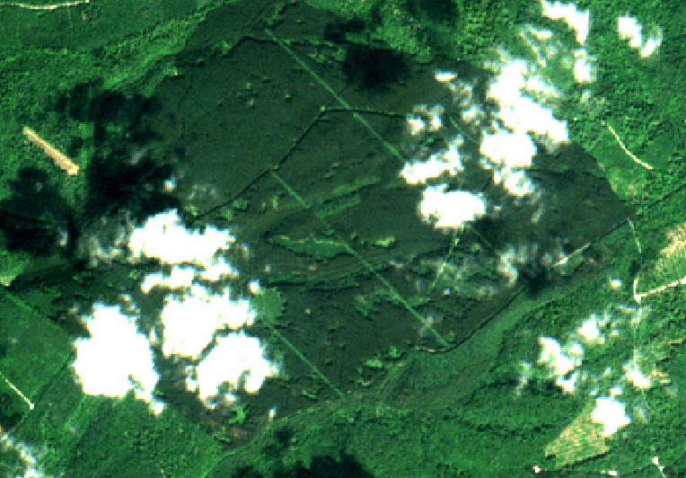

#### Tree structure for Sentinel-2 time series

The computation of a vegetation time series is paired with the production of a mask for each Sentinel-2 acquisition. 
This mask excludes invalid pixels for the next processing steps of fordead. 
Sentinel-2 acquisitions are automatically listed from the user-defined **input_directory**. 
This directory is expected to contain subdirectories corresponding to Sentinel-2 individual acquisitions. 
The name of each subdirectory is expected to include the date of acquisition. 
Each subdirectory is expected to contain one image file per Sentinel-2 spectral band, with the ID of the spectral band in its name. (B2/B02, B3/B03, B4/B04, B5/B05, B6/B06, B7/B07, B8/B08, B8A, B11, B12).
The following file tree corresponds to the input directory named **study_area** obtained from the tutorial data `sentinel_data\dieback_detection_tutorial\study_area` :

```
├── fordead_data-main
│   ├── study_area
│       ├── SENTINEL2A_20151203-105818-575_L2A_T31UFQ_D_V1-1
│           ├── MASKS
│           ├── SENTINEL2A_20151203-105818-575_L2A_T31UFQ_D_V1-1_FRE_B2.tif
│           ├── SENTINEL2A_20151203-105818-575_L2A_T31UFQ_D_V1-1_FRE_B3.tif
│           ├── SENTINEL2A_20151203-105818-575_L2A_T31UFQ_D_V1-1_FRE_B4.tif
│           ├── ...
│       ├── SENTINEL2A_20151230-105153-392_L2A_T31UFQ_D_V1-1
│       ├── ...
```


#### Compute vegetation indices and masks for each acquisition of a SENTINEL-2 time series

##### In a python environment

The computation of the vegetation indices and masks can be performed in a unique step for all Sentinel-2 acquisitions contained in **input_directory** :

```python
from fordead.steps.step1_compute_masked_vegetationindex import compute_masked_vegetationindex

input_directory = "fordead_data-main/fordead_data-main/sentinel_data/dieback_detection_tutorial/study_area"
data_directory = "tuto_output"

compute_masked_vegetationindex(input_directory = input_directory, 
                               data_directory = data_directory, 
                               lim_perc_cloud = 0.4, 
                               interpolation_order = 0, 
                               sentinel_source  = "THEIA", 
                               soil_detection = False, 
                               formula_mask = "B2 > 600 | (B3 == 0) | (B4 ==0)", 
                               vi = "CRSWIR", 
                               apply_source_mask = True)
```

The input variables and output products written on the disk when running `compute_masked_vegetationindex` are described in [the function's user guide](../../user_guides/english/01_compute_masked_vegetationindex.md).

##### In command line

This processing step can also be executed from the command prompt. 

```bash
fordead masked_vi -i <MyWorkingDirectory>/study_area -o <output directory> -n 0.4 --interpolation_order 0 --sentinel_source THEIA --formula_mask "(B2 > 600)" --vi CRSWIR --apply_source_mask
```

Additional information on the parameters can be displayed with the command `fordead masked_vi -h`. 

> **_NOTE :_** Sentinel-2 acquisitions already processed are ignored if the command is run multiple times with the same input variables. Changing input variables will automatically overwrite existing results. SENTINEL-2 acquisitions added in the **input_directory** will be computed as long as they are more recent than the latest SENTINEL-2 acquisition already processed. Information from previous processes and corresponding paths is managed with the class [TileInfo](https://fordead.gitlab.io/fordead_package/docs/examples/ex_tileinfo_object/): a `TileInfo` object is saved in the **data_directory** and is loaded when a process is launched.


Multiple configurations are possible for this processing step. 
However only **input_directory** and **data_directory** are required, and other input variables are optional arguments.  
The default **sentinel_source** is **THEIA**, but it should be set according to the corresponding data provider ("THEIA", "Scihub" or "PEPS").

##### Outputs

Two directories are created in **data_directory** :
- `VegetationIndex` : where the vegetation index (default value is CRSWIR) computed for each SENTINEL-2 acquisition is stored.
- `Mask` : where the corresponding binary raster mask is stored.

Sentinel-2 acquisitions are systematically interpolated at 10 m spatial resolution. 
Nearest neighbour resampling is the default setting (`interpolation_order = 0`). 

Two default filters are used for the mask: 
- pixels with negative value in the first band of the stack (B02) are considered outside the satellite swath,
- pixels with 0 value in any band are considered as a invalid due to shadows

These filters can be adjusted by user thanks to the input variable **formula_mask**.
The final mask is combined with the cloud mask provided by the SENTINEL-2 data provider if **apply_source_mask** is set to `True`.

Vegetation index             |  Mask
:-------------------------:|:-------------------------:
  |  

The maximum cloud cover (%) accepted to process a Sentinel-2 acquisition is defined by **lim_perc_cloud**, and requires classifictaion product from the data provider.

An option for soil detection is also available to help identify bare ground. 
This bare soil is defined based on a combination of spectral filters corresponding to `(B11 > 1250) AND (B2 < 600) AND ((B3 + B4) > 800)`.
This combination was derived empirically from a study case focusing on the detection of bark beetle outbreaks on Spruce forest in France, using THEIA data. 
In this context, bare ground detection was used to discriminate clear cuts, deciduous forests during leaf-off periods, as well as grey attack stage of bark beetles. 
This **soil_detection** requires additional tests to better identify its applicability. 

If **soil_detection** is set to False, any logical operation formula can be used in **formula_mask** (see [compute_vegetation_index](../../API_Reference/fordead/masking_vi.md#fordead.masking_vi.compute_vegetation_index)). 

If **soil_detection** is set to True, then pre-defined masks are combined with bare ground detection as described in the [step guide](../../user_guides/english/01_compute_masked_vegetationindex.md). 
