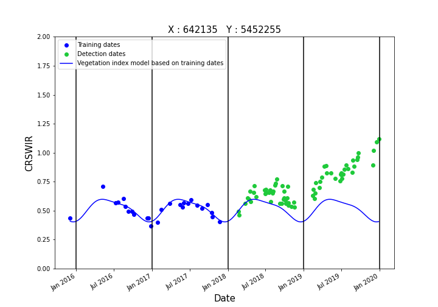

#### Step 2 : Definition of pixelwise seasonality based on a harmonic model

A harmonic model is adjusted for each pixel based on a time period defined by user, considered as representative of a 'normal' seasonal behavior of the vegetation index. 
This seasonality is influenced by many factors, such as forest density, composition, topography. 
Therefore, seasonality varies among pixels, even within an individual forest stand, which justifies the pixelwise processing.
The harmonic model adjusted over the training period is expressed as follows:

```math
a1 + b1\sin{\frac{2\pi t}{T}} + b2\cos{\frac{2\pi t}{T}} + b3\sin{\frac{4\pi t}{T}} + b4\cos{\frac{4\pi t}{T}}
```

The following figure illustrates a time series corresponding to the CR<sub>SWIR</sub> spectral index computed for a single pixel and valid Sentinel-2 acquisitions, and the corresponding harmonic model adjusted from the acquusutions over the training period:



This step is fully documented [here](https://fordead.gitlab.io/fordead_package/docs/user_guides/english/02_train_model/).

##### Running this step using a script

Run the following instructions to perform this processing step:
```python
from fordead.steps.step2_train_model import train_model

train_model(data_directory = data_directory, 
            nb_min_date = 10, 
            min_last_date_training="2018-01-01", 
            max_last_date_training="2018-06-01")
```

Here, the model is adjusted based on all Sentinel-2 acquisitions from the first acquisition available in **data_directory** to the last acquisition before 2018-01-01.
If less than 10 valid acquisitions are available on 2018-01-01, additional acquisitions are used in order to reach 10 valid acquisitions. 
If this number is not reach on 2018-06-01, the pixel is discarded and no seasonality model is adjusted.

A minimum of two years of SENTINEL-2 acquisitions is required to adjust the model. 
Therefore it is not recommended to define the end of the training before 2018.

##### Running this step from the command prompt

This procesing step can also be performed from a command prompt :

```bash
fordead train_model -o <output directory> --nb_min_date 10 --min_last_date_training 2018-01-01 --max_last_date_training 2018-06-01
```


> **_NOTE :_** This step can also be performed if user provides already computed vegetation index time series and corresponding mask: 
the parameters **path_vi** and **path_masks** correspond to the directories where the spectral index and corresponding mask are stored.
As for the computation of the spectral indices, the process is bypassed if the model is already computed and no parameters were changed. 
The model is updated and outputs are overwritten if the parameterization is modified.

##### Outputs

The outputs of this processing step are :
- **DataModel** directory :
    - **first_detection_date_index.tif** : a raster file containing the index of the first acquisition used for detection. 
	It allows to know which acquisitions are used for training for each pixel, and which ones are used for detection.
    - **coeff_model.tif** : a raster stack including 5 layers, one for each coefficient of the vegetation index model.
- **TimelessMasks** : the binary raster **sufficient_coverage_mask.tif** is written. Valid pixels (sufficient number of acquisitions to adjust the harmonic model) are coded with a value of 1, invalid pixels are coded with 0.


[PREVIOUS PAGE](https://fordead.gitlab.io/fordead_package/docs/Tutorial/01_compute_masked_vegetationindex) [NEXT PAGE](https://fordead.gitlab.io/fordead_package/docs/Tutorial/03_dieback_detection)
