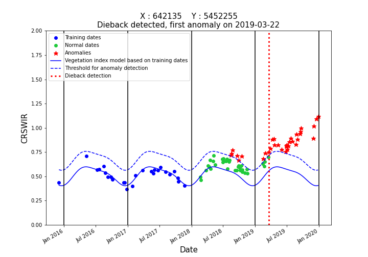
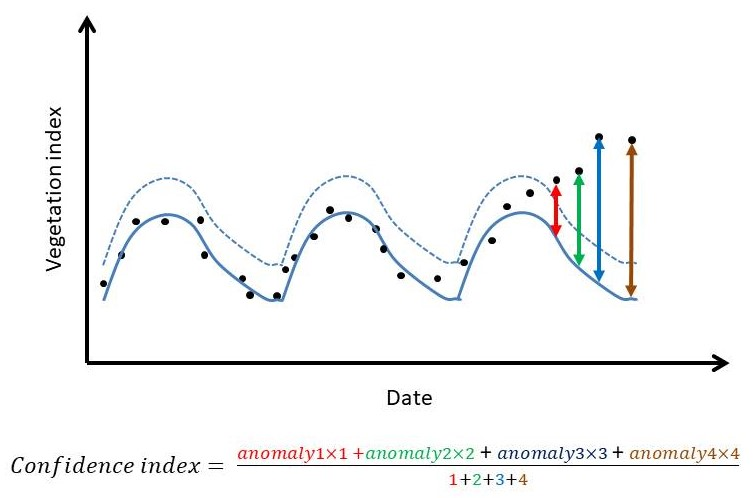

#### Step 3 : Detecting anomalies by comparing vegetation index to predicted value

The value of the vegetation index is compared to the vegetation index predicted from the harmonic model computed in the previous step, for each SENTINEL-2 acquisition available after the training period.
An anomaly is identified when the difference exceeds a threshold. 
The anomaly may be negative or positive compared to the expected value, depending on the spectral index.
For example, the CR<sub>SWIR</sub> is sensitive to canopy water content and tends to increase with decreasing water content (a symptom early detection of bark beetle attacks). Therefore, positive anomalies are monitored.

A pixel is detected as suffering from dieback when three successive anomalies are detected. 

This prevents false positive corresponding to one time events of anomalies due to an imperfect mask, or temporary climatic events. 

The following figure illustrates the time series of the vegetation index along with the threshold for anomaly detection, and the date of detection :

 

A pixel flagged as anomaly (after three successive anomalies) can return to normal state if no anomalies are detected for three successive acquisitions. 
This reduces the risk of false positive corresponding to long drought periods resulting in more than three successive anomalies.

Such **"stress periods"** identified as confirmed anomaly then return to normal are also provided in output products.

A stress index is computed for each stress period. 
This stress index is computed as the mean of the difference between the vegetation index and its prediction for successive anomalies, 
or as the weighted mean, where the weight corresponds to the number of acquisitions since the first anomaly of the period.
This stress index is meant to describe the intensity of detected anomalies in the period, and can be used as a confidence index for the final detection. It is illustrated in the following figure :



Comprehensive documentation can be found [here](https://fordead.gitlab.io/fordead_package/docs/user_guides/english/03_dieback_detection/).

##### Running this step using a script

Run the following instructions to perform this processing step:
```python
from fordead.steps.step3_dieback_detection import dieback_detection

dieback_detection(data_directory = data_directory, 
                  threshold_anomaly = 0.16,
				  stress_index_mode = "weighted_mean")
```

##### Running this step from the command prompt

This processing step can also be performed from a terminal:
```bash
fordead dieback_detection -o <output directory> --threshold_anomaly 0.16 --stress_index_mode weighted_mean
```
> **_NOTE :_** As for previous steps, if the process is executed multiple times and no parameters were changed, the process is ignored. If parameters were changed, previous results from this step and subsequent steps are deleted and the model is computed anew.

##### Outputs

The outputs of this step are :
- **DataDieback** folder, including three raster files :
    - **count_dieback** : the number of successive acquisitions with anomalies
	- **first_date_unconfirmed_dieback** : the index of the acquisition corresponding to the latest potential state change of the pixels, 
    first anomaly if pixel is not detected as dieback, first non-anomaly if pixel is detected as dieback, not necessarily confirmed.
    - **first_date_dieback**: the index of the first acquisition with an anomaly in the last series of anomalies
    - **state_dieback** : a binary raster with pixels showing at least three successive anomalies (confirmed dieback) identified as 1.
- **DataStress** folder, including four raster files :
    - **dates_stress** : a raster file with **max_nb_stress_periods***2+1 bands, containing the index of the acquisition corresponding to the first anomaly, and of return to normal for each stress period.
    - **nb_periods_stress** : a raster file containing the total number of stress periods for each pixel 
    - **cum_diff_stress**: a raster file with **max_nb_stress_periods**+1 bands, containing the sum of the difference between the vegetation index and its prediction, multiplied by the weight if stress_index_mode is "weighted_mean", for each stress period 
	- **nb_dates_stress** : a raster file with **max_nb_stress_periods**+1 bands containing the number of unmasked acquisitions of each stress period.
	- **stress_index** : a raster file with **max_nb_stress_periods**+1 bands containing the stress index of each stress period.
    (mean or weighted mean of the difference between the vegetation index and its prediction depending on **stress_index_mode**, obtained from **cum_diff_stress** and **nb_dates_stress**)
	The number of bands of these raster files is meant to account for each potential stress period, and another for a potential final dieback detection
- **DataAnomalies** folder, including a raster file for each date **Anomalies_YYYY-MM-DD.tif** for which value is 1 where anomalies are detected.


[PREVIOUS PAGE](https://fordead.gitlab.io/fordead_package/docs/Tutorial/02_train_model) [NEXT PAGE](https://fordead.gitlab.io/fordead_package/docs/Tutorial/04_compute_forest_mask)
