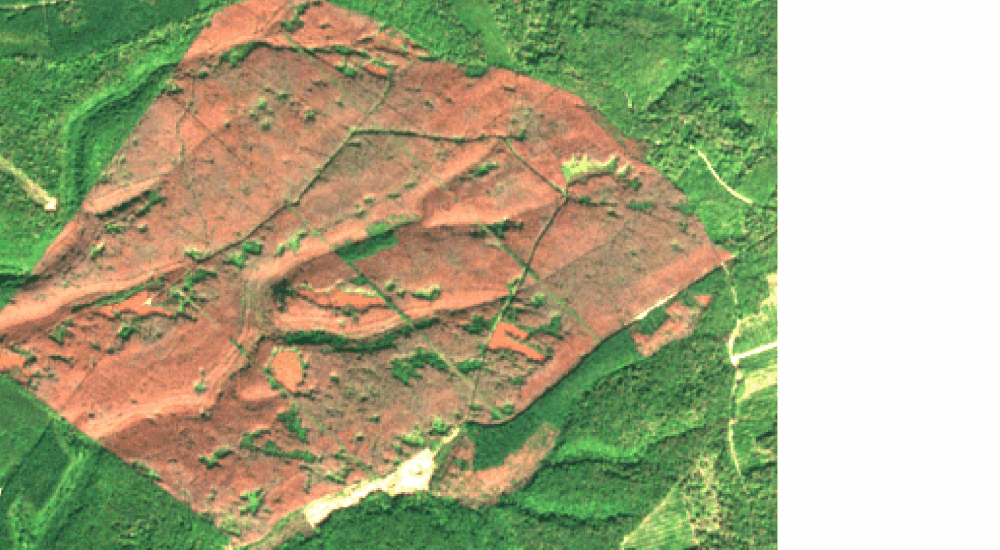
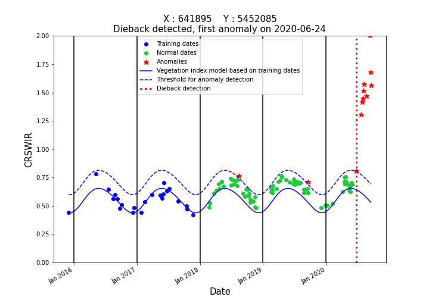

## Updating detection

The dieback detection can be updated simply by adding new Sentinel-2 dates which can be very useful for monitoring vegetation. To illustrate this, copy the files from the directory **update_study_area** to the directory **study_area**, then run the entire script again.
You can save results from the **Results**, **Timelapses** and **TimeSeries** in an other folder if you wish to compare them with the updated results which will overwrite them.

Here, you can find the complete script all in one place :
```python
from fordead.steps.step1_compute_masked_vegetationindex import compute_masked_vegetationindex
from fordead.steps.step2_train_model import train_model
from fordead.steps.step3_dieback_detection import dieback_detection
from fordead.steps.step4_compute_forest_mask import compute_forest_mask
from fordead.steps.step5_export_results import export_results

from fordead.visualisation.create_timelapse import create_timelapse
from fordead.visualisation.vi_series_visualisation import vi_series_visualisation

input_directory = "<MyWorkingDirectory>/study_area"
data_directory = "<output directory>"

compute_masked_vegetationindex(input_directory = input_directory, 
                               data_directory = data_directory, 
                               lim_perc_cloud = 0.4, 
                               interpolation_order = 0, 
                               sentinel_source  = "THEIA", 
                               soil_detection = False, 
                               formula_mask = "B2 > 600", 
                               vi = "CRSWIR", 
                               apply_source_mask = True)

train_model(data_directory = data_directory, 
            nb_min_date = 10, 
            min_last_date_training="2018-01-01", 
            max_last_date_training="2018-06-01")

dieback_detection(data_directory = data_directory, 
                  threshold_anomaly = 0.16,
				  stress_index_mode = "weighted_mean")
				  
compute_forest_mask(data_directory, 
                    forest_mask_source = "vector", 
                    vector_path = "<MyWorkingDirectory>/vector/area_interest.shp")

export_results(data_directory = data_directory, 
               frequency= "M", 
               multiple_files = False, 
			   conf_threshold_list = [0.265],
			   conf_classes_list = ["Low anomaly","Severe anomaly"])

create_timelapse(data_directory = data_directory, 
                 x = 643069, 
                 y = 5452565, 
                 buffer = 1500)

vi_series_visualisation(data_directory = data_directory, 
                        shape_path = "<MyWorkingDirectory>/vector/points_for_graphs.shp", 
                        name_column = "id", 
                        ymin = 0, 
                        ymax = 2, 
                        chunks = 100)
```

Results can be updated using only the new Sentinel-2 dates, saving on computation time. 

The following figures show how the bark beetle attack progressed for the entire area, and for a single pixel :

Original | Updated
:-------------------------:|:-------------------------:
 | 
 | 

[PREVIOUS PAGE](https://fordead.gitlab.io/fordead_package/docs/Tutorials/Dieback_Detection/07_create_graphs)