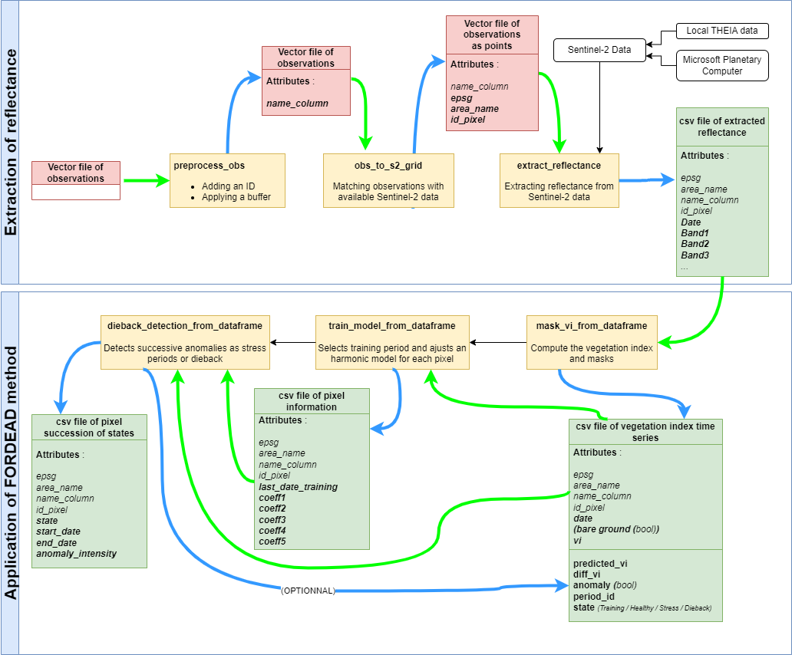

# <div align="center"> Validation of the detections from observations </div>

This tutorial illustrates how to use the calibration / validation module (CALVAL) in order to apply _fordead_ on a set of geolocated spatial entities defined in a vector layer. 
This CALVAL module applies _fordead_ on a limited number of pixels, such as labelled ground observations, and is therefore computationally efficient once information is extracted from Sentinel-2 time series.
This CALVAL module can be used to explore and compare the results obtained from multiple input settings, in order to :
- identify the combination of spectral index, anomaly treshold and other input variables, resulting in optimal detection for a given type of dieback/degradation.
- validate the optimal combination with quantitative indicators

Here is the CALVAL module workflow diagram :


## Requirements
### Package installation 
Follow the [installation instruction guide](https://fordead.gitlab.io/fordead_package/docs/Installation/) if relevant. 
Then launch the command prompt and activate the environment with the command `conda activate <environment name>`

### Downloading the tutorial dataset

This tutorial requires :
- a vector file including points or polygons with an ID column 
- a directory containing raster data following the same structure as described in the [main tutorial](https://fordead.gitlab.io/fordead_package/docs/Tutorials/Dieback_Detection/01_compute_masked_vegetationindex/)

Sentinel-2 acquisitions and spectral bands are then parsed from each subdirectory in order to extract the spectral information corresponding to the points or polygons defined in the vector file for the whole time series.

A reduced dataset is available from the [fordead_data repository](https://gitlab.com/fordead/fordead_data), if you have not already downloaded it for the [dieback detection tutorial](https://fordead.gitlab.io/fordead_package/docs/Tutorials/Dieback_Detection/00_Intro/).
The Sentinel-2 data used in this tutorial correspond to the folder ~/sentinel_data/validation_tutorial.

In this tutorial, we used data provided by [THEIA](https://www.theia-land.fr/), but data from other providers ([ESA-Copernicus](https://scihub.copernicus.eu/), [CNES-PEPS](https://peps.cnes.fr/rocket/#/home)) can also be used.
We used level-2A FRE (**F**lat **RE**flectance) data, which corresponds to atmospherically and topographically corrected reflectance data.
The Sentinel-2 product contains a Scene Classification Map (for more information, please visit the [related page](https://labo.obs-mip.fr/multitemp/sentinel-2/theias-sentinel-2-l2a-product-format/#English) ).

Here is the file tree for the Sentinel-2 directory example for this tutorial :

```
├── fordead_data/sentinel_data/validation_tutorial/sentinel_data
│   ├── T31UGP
│       ├── SENTINEL2A_20151130-105641-486_L2A_T31UGP_D_V1-1
│           ├── MASKS
│           ├── SENTINEL2A_20151130-105641-486_L2A_T31UGP_D_V1-1_FRE_B2.tif
│           ├── SENTINEL2A_20151130-105641-486_L2A_T31UGP_D_V1-1_FRE_B3.tif
│           ├── SENTINEL2A_20151130-105641-486_L2A_T31UGP_D_V1-1_FRE_B4.tif
│           ├── ...
│       ├── SENTINEL2A_20151207-104805-033_L2A_T31UGP_D_V1-1
│       ├── ...
```

The path of the vector file corresponding to observation data is **fordead_data/vector/observations_tuto.shp**. 
**Figure 1** displays these polygons over a Sentinel-2 acquisition.
Each spatial entity corresponds to a polygon and requires an ID column which is called "id" in this case.
In addition to the ID column, these polygons also include optional information, "Date" and "Class", corresponding to the date of observation and the corresponding status.

*Fig 1 : Observations on the Sentinel-2 acquisition of 27-02-2019 on tile 31UGP*   |  *Fig 2 : Attribute table of the observations*
:-------------------------:|:-------------------------:
  |  


### Disk space required

Once _fordead_ is installed, a minimum of 1 Go of free disk space is recommended to run this tutorial.

[NEXT PAGE](https://fordead.gitlab.io/fordead_package/docs/Tutorials/Validation/01_preprocessing_observations)

