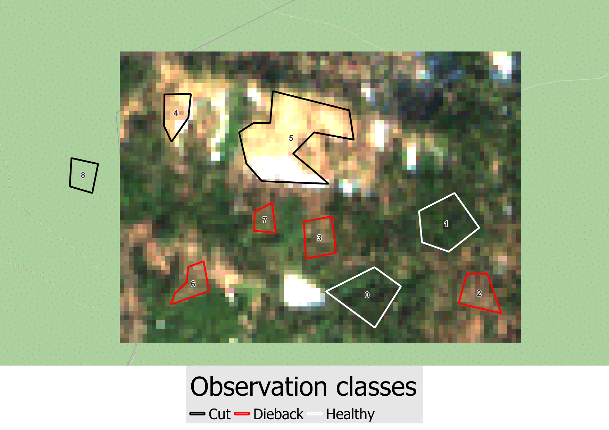
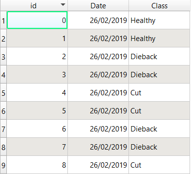

# <div align="center"> Validation of the detections from observations </div>

In this tutorial, we will show how observations can be used to extract Sentinel-2 data, so the method provided in this package can be applied on a specific dataset, allowing a user to run tests very quickly which can be used to optimize the parameters and to validate the method using this observation dataset.

The Sentinel-2 data we will use in this example, follows the following file tree :

```
├── fordead_data/sentinel_data/validation_tutorial/sentinel_data
│   ├── T31UGP
│       ├── SENTINEL2A_20151130-105641-486_L2A_T31UGP_D_V1-1
│           ├── MASKS
│           ├── SENTINEL2A_20151130-105641-486_L2A_T31UGP_D_V1-1_FRE_B2.tif
│           ├── SENTINEL2A_20151130-105641-486_L2A_T31UGP_D_V1-1_FRE_B3.tif
│           ├── SENTINEL2A_20151130-105641-486_L2A_T31UGP_D_V1-1_FRE_B4.tif
│           ├── ...
│       ├── SENTINEL2A_20151207-104805-033_L2A_T31UGP_D_V1-1
│       ├── ...
│   ├── T32ULU
│       ├── SENTINEL2A_20151207-104805-033_L2A_T32ULU_D_V1-1
│           ├── MASKS
│           ├── SENTINEL2A_20151207-104805-033_L2A_T32ULU_D_V1-1_FRE_B2.tif
│           ├── SENTINEL2A_20151207-104805-033_L2A_T32ULU_D_V1-1_FRE_B3.tif
│           ├── SENTINEL2A_20151207-104805-033_L2A_T32ULU_D_V1-1_FRE_B4.tif
│           ├── ...
│       ├── SENTINEL2A_20151207-104805-033_L2A_T32ULU_D_V1-1
│       ├── ...
```
And the vector file containing observation data has the following path : fordead_data/vector/observations_tuto.shp
Here they are shown, against the Sentinel-2 acquisition of 27-02-2019 on tile T31UGP along with their attributes.

Observations on the Sentinel-2 acquisition of 27-02-2019   |  Attribute table of the observations
:-------------------------:|:-------------------------:
 | 

The observations can be polygons or points, but they must have an ID column which is called "id" in this dataset.

[NEXT PAGE](https://fordead.gitlab.io/fordead_package/docs/Tutorials/Validation/01_preprocessing_observations)

