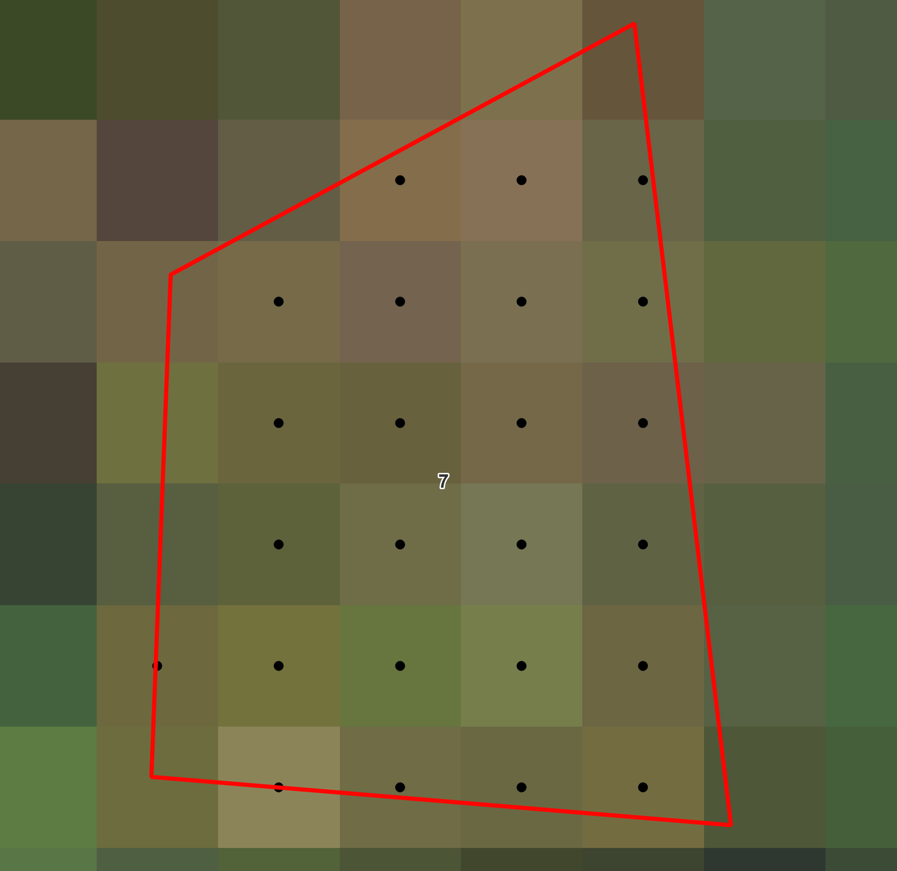

# <div align="center"> Preprocessing observations used for validation </div>

The initial vector file is first used to generate a new vector file containing points at the center of each 10 m Sentinel-2 pixel included in the polygon.

Each new point includes the following attributes :
- original polygon ID
- **id_pixel**: ID of the pixel
- **name_area** : Name of the corresponding area (e.g. Sentinel-2 tile ID)
- **epsg**: CRS of the associated Sentinel-2 tile as the EPSG integer.

These datapoints are used in the next step to extract Sentinel-2 data more efficiently.

The points generated are kept in the CRS of the original vector file.

##### Running this step using a script

Run the following instructions to perform this preprocessing step:

```python
from fordead.validation.obs_to_s2_grid import obs_to_s2_grid

obs_path = "<MyWorkingDirectory>/vector/observations_tuto.shp"
sentinel_dir = "<MyWorkingDirectory>/sentinel_data/validation_tutorial/sentinel_data/"
preprocessed_obs_path = "<MyWorkingDirectory>/vector/preprocessed_obs_tuto.shp"

obs_to_s2_grid(
	obs_path = obs_path,
	sentinel_dir = sentinel_dir, 
	export_path = preprocessed_obs_path,
	name_column = "id")
```

> **_NOTE :_** Set **obs_to_s2_grid** input variable `overwrite = True` to re-run this processing stage, otherwise it will raise an error.


##### Running this step from the command invite

This step can also be ran from the command prompt. The command `fordead obs_to_s2_grid -h` will print the help information of this step. For example, to use it with the same parameters, the following command can be used:
```bash
fordead obs_to_s2_grid --obs_path <MyWorkingDirectory>/vector/observations_tuto.shp --sentinel_dir <MyWorkingDirectory>/sentinel_data/validation_tutorial/sentinel_data/ --export_path <MyWorkingDirectory>/vector/preprocessed_obs_tuto.shp --name_column id
```

#### OUTPUTS

The vector file containing only points is written in the following file: **fordead_data/vector/preprocessed_obs_tuto.shp**

Observations outside of the footprint of the Sentinel-2 data are removed from the resulting vector and their ID printed in the command prompt.

The following figure shows a zoomed view on observation 7 and corresponding attribute table.



> **_NOTE :_** If the initial vector file contains points, their locations are preserved and their id_pixel attribute is set to 1.

[PREVIOUS PAGE](https://fordead.gitlab.io/fordead_package/docs/Tutorials/Validation/00_Intro) [NEXT PAGE](https://fordead.gitlab.io/fordead_package/docs/Tutorials/Validation/02_extract_reflectance)

