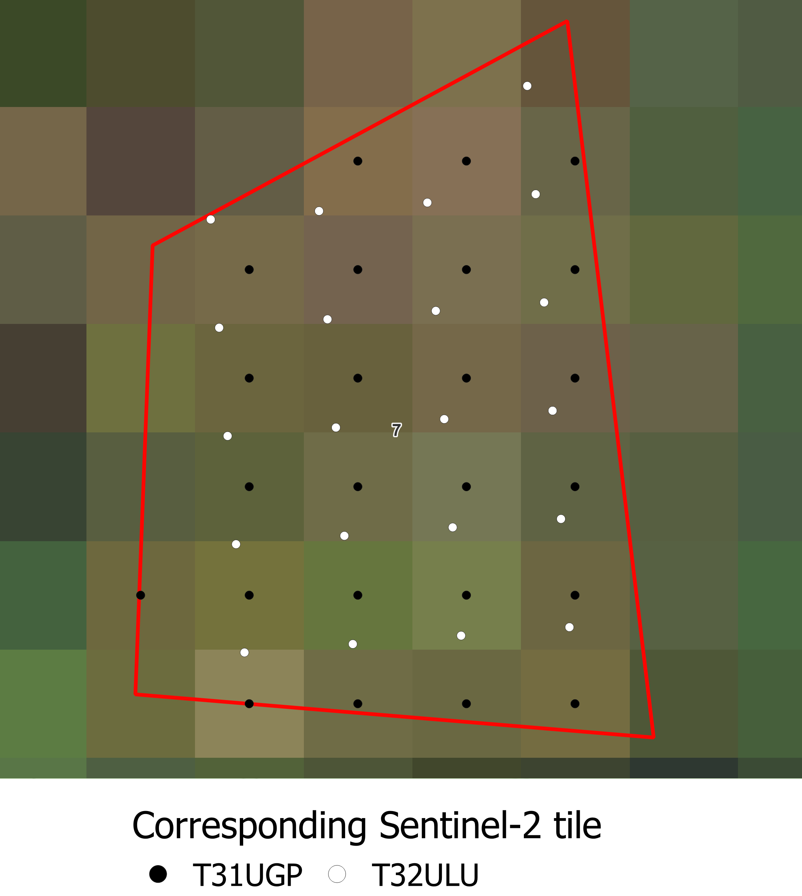

# <div align="center"> Preprocessing observations used for validation </div>

To extract Sentinel-2 data from the polygons, they must first be converted to points for each Sentinel-2 pixel inside of the polygons. 
The points are located at the center of the pixels, and are given an ID are and associated with the name of the tile, and its CRS.


##### Running this step using a script

Run the following instructions to perform this preprocessing step:

```python
from fordead.validation.obs_to_s2_grid import obs_to_s2_grid

obs_path = "<MyWorkingDirectory>/vector/observations_tuto.shp"
sentinel_dir = "<MyWorkingDirectory>/sentinel_data/validation_tutorial/sentinel_data/"
preprocessed_obs_path = "<MyWorkingDirectory>/vector/preprocessed_obs_tuto.shp"

obs_to_s2_grid(
	obs_path = obs_path,
	sentinel_dir = sentinel_dir, 
	export_path = preprocessed_obs_path,
	name_column = "id")
```

##### Running this step from the command invite

This step can also be ran from the command prompt. The command `fordead obs_to_s2_grid -h` will print the help information of this step. For example, to use it with the same parameters, the following command can be used:
```bash
fordead obs_to_s2_grid --obs_path <MyWorkingDirectory>/vector/observations_tuto.shp --sentinel_dir <MyWorkingDirectory>/sentinel_data/validation_tutorial/sentinel_data/ --export_path <MyWorkingDirectory>/vector/preprocessed_obs_tuto.shp --name_column id
```

As we can see from the attribute table and a view from QGIS zoomed on observation 7, the attributes "epsg", "area_name", and "id_pixel" were added, linking each point with a Sentinel-2 tile.

> **_NOTE :_** If a polygon is contained in several Sentinel-2 tiles, a set of point is generated for each tile. Two points can have the same IDs, but have different locations if they are associated with two tiles of different CRS.
Here is an example of this for a polygon situated on the overlapping area between tile T31UGP and T32ULU.

Centroids over T31UGP Sentinel-2 data   |  Centroids over T32ULU Sentinel-2 data
:-------------------------:|:-------------------------:
  |  


[PREVIOUS PAGE](https://fordead.gitlab.io/fordead_package/docs/Tutorials/Validation/00_Intro) [NEXT PAGE](https://fordead.gitlab.io/fordead_package/docs/Tutorials/Validation/02_extract_reflectance)
