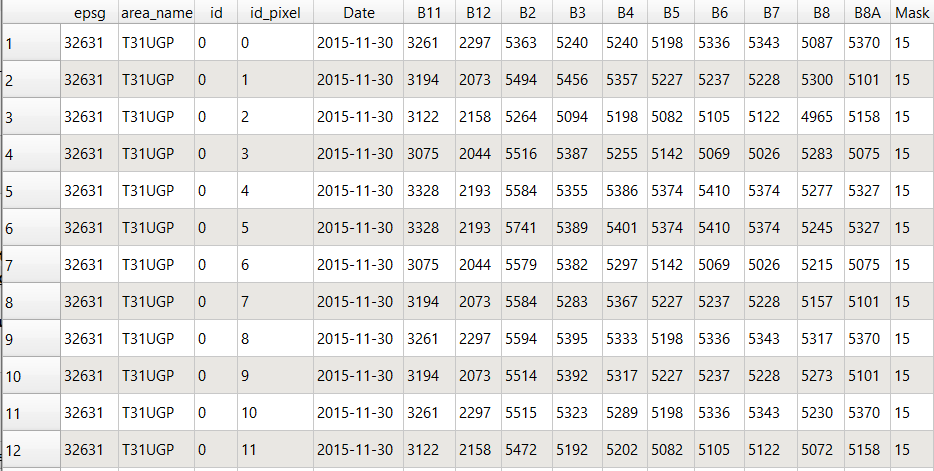

# <div align="center"> Extraction of reflectance from Sentinel-2 data </div>

The vector file created in the previous step is used to extract reflectance from Sentinel-2 data.

### Using local Sentinel-2 data

Add the following instructions to your script to extract reflectance corresponding to datapoints saved in **preprocessed_obs_path** from Sentinel-2 time series.
In this example, we choose to extract only data from acquisitions with a cloud cover under 30%, so we need to compute and extract cloud cover from the THEIA mask first, before extracting reflectance from relevant acquisitions.

```python
from fordead.validation.extract_reflectance import extract_reflectance
from fordead.validation.extract_cloudiness import extract_cloudiness

cloudiness_path = output_dir / "extracted_cloudiness.csv"
reflectance_path = output_dir / "extracted_reflectance.csv"

extract_cloudiness(
	sentinel_dir = sentinel_dir, 
	export_path = extracted_cloudiness_path,
	sentinel_source = "THEIA")

extract_reflectance(
    obs_path = preprocessed_obs_path,
    sentinel_source = sentinel_dir, 
    cloudiness_path = cloudiness_path,
    lim_perc_cloud = 0.3,
    export_path = reflectance_path,
    name_column = "id")

```

See complete user guides [here](../../user_guides/english/validation_tools/03_extract_cloudiness.md) and [here](../../user_guides/english/validation_tools/04_extract_reflectance.md)

### Using Planetary Computer

Add the following instructions to your script to extract reflectance corresponding to datapoints saved in **preprocessed_obs_path** from Sentinel-2 time series.
In this example, we choose to extract only data from acquisitions with a cloud cover under 50%.


```python
from fordead.validation.extract_reflectance import extract_reflectance

reflectance_path = output_dir / "extracted_reflectance.csv"

extract_reflectance(
    obs_path = preprocessed_obs_path,
    sentinel_source = "Planetary", 
    lim_perc_cloud = 0.3,
    export_path = reflectance_path,
    name_column = "id")


```

See complete user guide [here](../../user_guides/english/validation_tools/04_extract_reflectance.md)
## Output

The csv written in **export_path** includes the following attributes corresponding to the different pixels : 
- epsg: 
- area_name: Sentinel-2 tile ID when available
- id: 
- id_pixel:
- Date: date of acquisition
- B2-B11: reflectance extracted from Sentinel-2 data for the corresponding pixel [sort by increasing wavelength: B2-B11, not B11-B8A]
- Mask : SCL value for Planetary, CLM value for THEIA 



The file will not be overwritten if the process is re-run with the same data.
New Sentinel-2 acquisitions or ground observations will be appended to the file if added to the input data. 

The update procedure can be tested with additional Sentinel-2 data located in <MyWorkingDirectory>/validation_tutorial/sentinel_data_update:
copy and paste this additional data to the sentinel_data directory and run this step again.

