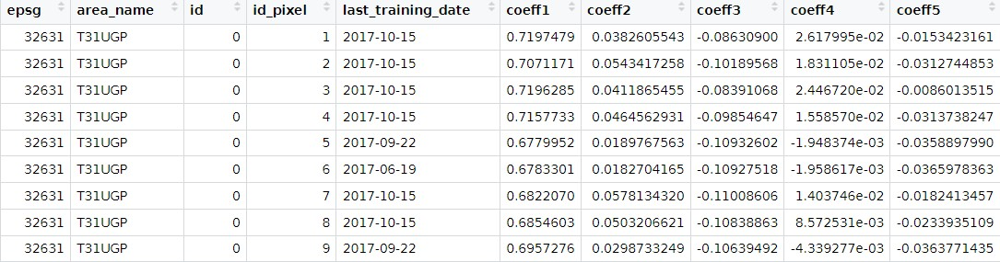

# <div align="center"> Applying the FORDEAD method </div>

Here we will apply the main three steps of the fordead method, as shown in the second part of the workflow diagram.


First, for each pixel of each observation, for each valid Sentinel-2 acquisition, we will calculate a chosen vegetation index, as well as masks.
Then, we will compute the harmonic model of the vegetation index for each pixel.
Finally, the dieback and stress detection is performed.
##### Running this step in a script

Run the following instructions, replacing 

```python
from fordead.validation.mask_vi_from_dataframe import mask_vi_from_dataframe
from fordead.validation.train_model_from_dataframe import train_model_from_dataframe
from fordead.validation.dieback_detection_from_dataframe import dieback_detection_from_dataframe


mask_vi_from_dataframe(reflectance_path = reflectance_path,
					masked_vi_path = output_dir / "mask_vi_tuto.csv",
					periods_path = output_dir / "periods_tuto.csv",
					vi = "CRSWIR",
					soil_detection = True,
					name_column = "id")


train_model_from_dataframe(masked_vi_path = output_dir / "mask_vi_tuto.csv",
							pixel_info_path = output_dir / "pixel_info_tuto.csv",
							periods_path = output_dir / "periods_tuto.csv",
						   name_column = 'id',
						   min_last_date_training = "2018-01-01",
						   max_last_date_training = "2018-06-01",
						   nb_min_date = 10)

dieback_detection_from_dataframe(
				masked_vi_path = output_dir / "fordead_results/mask_vi_tuto.csv",
                pixel_info_path = output_dir / "fordead_results/pixel_info_tuto.csv",
                periods_path = output_dir / "fordead_results/periods_tuto.csv",
                name_column = "id",
                stress_index_mode = "mean",
                update_masked_vi = True)
```

The complete user guides can be found here :
-  [mask_vi_from_dataframe](../../user_guides/english/validation_tools/05_compute_masks_and_vegetation_index_from_dataframe.md)
- [train_model_from_dataframe](../../user_guides/english/validation_tools/06_training_model_from_dataframe.md)
- [dieback_detection_from_dataframe](../../user_guides/english/validation_tools/07_dieback_detection_from_dataframe.md)

-----
### OUTPUT
-----
There are three resulting files:

- In the *masked_vi_path* csv, information at the acquisition level with the following columns :
	- **epsg** : The CRS of the Sentinel-2 tile from which data was extracted
	- **area_name** : The name of the Sentinel-2 tile from which data was extracted
	- an ID column corresponding to the **name_column** parameter
	- **id_pixel** : The ID of the pixel
	- **Date** : The date of the Sentinel-2 acquisition
	- **vi** : The value of the vegetation index
	- **predicted_vi** : The prediction of the vegetation index using the harmonic model
	- **diff_vi** : Difference between the vegetation and its prediction, in the expected direction of anomalies for the vegetation index
	- **anomaly** : True if 'diff_vi' exceeds 'threshold_anomaly', else False
	- **period_id** : id of the period the acquisition is associated with
	- **state** : Status of of the associated period, can be 'Training', 'Healthy', 'Stress', 'Dieback' or 'Invalid'.


- In the *periods_path* csv, information at the period level for each pixel. See details [here](../../user_guides/english/validation_tools/07_dieback_detection_from_dataframe.md).


- In the *pixel_info_path* csv, information at the pixel level, with the last date used for training the harmonic model of vegetation index prediction, and the 5 coefficients of the adjusted model.

