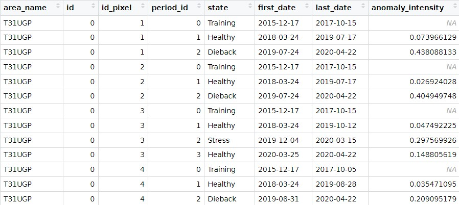
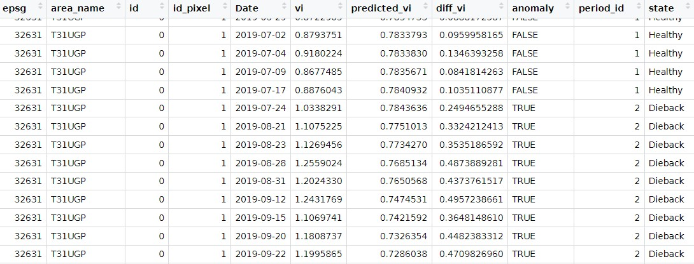

# <div align="center"> Detecting dieback and stress </div>


Now we will now perform the dieback and stress detection. This is the final step of the detection.

##### Running this step in a script

Run the following instructions :

```python
from fordead.validation.dieback_detection_from_dataframe import dieback_detection_from_dataframe

dieback_detection_from_dataframe(
				masked_vi_path = fordead_results_dirpath / "fordead_results/mask_vi_tuto.csv",
                pixel_info_path = fordead_results_dirpath / "fordead_results/pixel_info_tuto.csv",
                periods_path = fordead_results_dirpath / "fordead_results/periods_tuto.csv",
                name_column = "id",
                update_masked_vi = True)

```

-----
### OUTPUT
-----
The results are condensed in the csv at *periods_path* , giving information on all periods :



A more detailed csv is updated at *masked_vi_path*, and now holds the following information : 



See complete user guide [here](https://fordead.gitlab.io/fordead_package/docs/user_guides/english/validation_tools/07_dieback_detection_from_dataframe) to get more information about parameters and outputs.