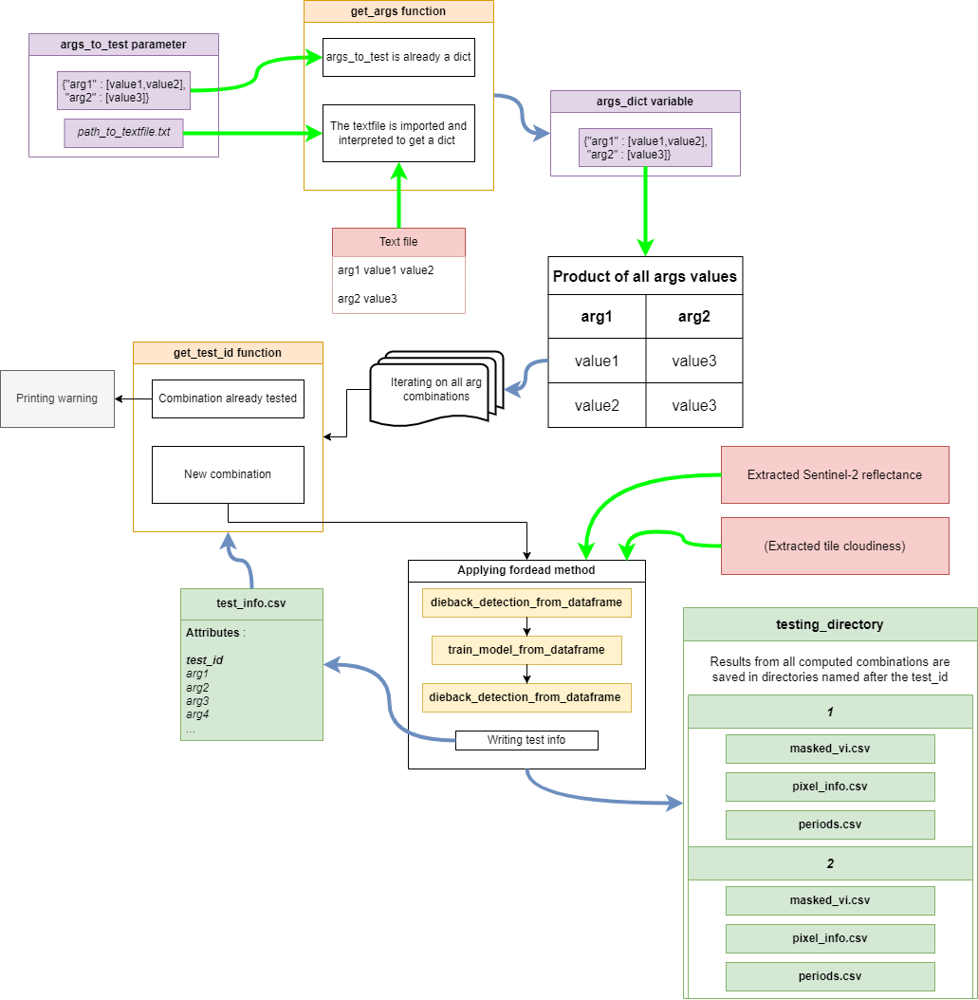
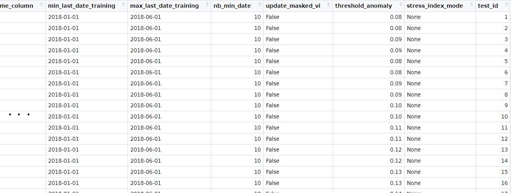

# <div align="center"> Detecting dieback and stress </div>


In order to calibrate *fordead*, it is possible to test many parameter combinations, running the last three steps of the detection and saving the results for each combination. 

It can be performed in a single function call, using a dictionnary or a textfile with parameters and their values. If a parameter is not specified, the value by default is used. If more than one value is given, all combinations with other parameters will be used.



In this example, we want to test several threshold_anomaly values, on several vegetation indices. 

##### Running this step in a script

In the following script, we will test threshold_anomaly values from 0.08 to 0.19 with a 0.01 step, with two vegetation indices : CRSWIR, and NDVI. 

In a new script, run the following instructions :

```python
from fordead.validation.sensitivity_analysis import sensitivity_analysis
from pathlib import Path

sensitivity_dir = Path("<MyOutputDirectory>")

reflectance_path = output_dir / "extracted_reflectance.csv"
cloudiness_path = output_dir / "extracted_cloudiness.csv"

args_to_test = {"threshold_anomaly" : [0.08,0.09,0.1,0.11,0.12,0.13,0.14,0.15,0.16,0.17,0.18,0.19], 
                "vi" : ["CRSWIR","NDVI"]}

sensitivity_analysis(testing_directory = sensitivity_dir,
                    reflectance_path = reflectance_path,
                    name_column = 'id',
                    update_masked_vi = False, #Computes faster
                    args_to_test = args_to_test)

```

-----
### OUTPUT
-----
Results are output in the *testing_directory*.

For each test, a directory is created whose name is the ID of the test. Inside each of those directories, are the ouputs of FORDEAD as seen in the [previous page](./03_apply_fordead.md).   

A "test_info.csv" file is also written, where each test_id is associated with the value of all parameters used in the iteration : 

