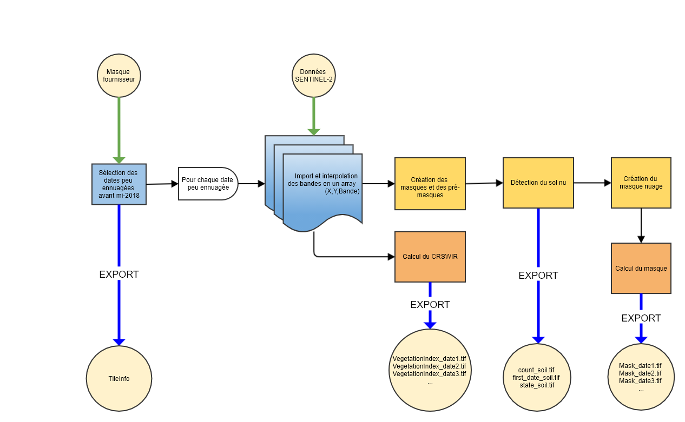

## ÉTAPE 1 : step1_compute_masked_vegetationindex.py
Cette étape permet le calcul d'indices de végétation et de masques pour chaque date SENTINEL-2

#### ENTRÉES
Les paramètres en entrée sont :
- **input_directory** : le chemin du dossier correspondant à une tuile ou une zone contenant un dossier par date SENTINEL contenant les différentes bandes. Les dossiers doivent contenir la date correspondante dans leur nom sous un des formats suivants : YYYY-MM-DD, YYYY_MM_DD, YYYYMMDD, DD-MM-YYYY, DD_MM_YYYY ou DDMMYYYY. Les fichiers des bandes doivent contenir le nom de la bande correspondante (B2 ou B02, B3 ou B03, etc...).
- **data_directory** : Le chemin du dossier de sortie, dans lequel seront écrit les indices de végétations et masques
- **lim_perc_cloud** : Le pourcentage maximum de nuages. Si le pourcentage de nuage de la date SENTINEL, calculé à partir de la classification du fournisseur, est supérieur à ce seuil, la date est ignorée.
- **interpolation_order** : Ordre d'interpolation pour le passage des bandes de 20m de résolution à 10m. 0 : plus proche voisin, 1 : linéaire, 2 : bilinéaire, 3 : cubique
- **sentinel_source** : Source des données parmi 'THEIA' et 'Scihub' et 'PEPS'
- **vi** : Indice de végétation utilisé
- **extent_shape_path** : Chemin d'un shapefile contenant un polygone utilisé pour restreindre les calculs à une zone. Si non renseigné, le calcul est appliqué à l'ensemble de la tuile
- **path_dict_vi** : Chemin d'un fichier texte permettant d'ajouter des indices de végétations utilisables. Si non renseigné, uniquement les indices prévus dans le package sont utilisable (CRSWIR, NDVI). Le fichier examples/ex_dict_vi.txt donne l'exemple du formattage de ce fichier. Il s'agit de renseigner son nom, sa formule, et "+" ou "-" selon si l'indice augmente en cas de déperissement, ou si il diminue.

Note : **input_directory** et **data_directory** n'ont pas de valeur par défaut et doivent absolument être renseignés. **sentinel_source** doit correspondre au fournisseur de vos données. Le package a presque exclusivement été testé à partir des données THEIA.

#### SORTIES
Les sorties de cette première étape, dans le dossier data_directory, sont :
- Un fichier TileInfo qui contient les informations relatives à la zone étudiée, dates utilisées, chemins des rasters... Il est importé par les étapes suivantes pour réutilisation de ces informations.
- Dans le dossier **VegetationIndex**, un raster pour chaque date où l'indice de végétation est calculé pour chaque pixel
- Dans le dossier **Mask**, un raster binaire pour chaque date où les pixels masqués valent 1, et les pixels valides 0.
- Dans le dossier **DataSoil**, trois rasters :
    - **count_soil** : le nombre de dates successives avec des anomalies de sol
    - **first_date_soil** : L'index de la première date avec une anomalie de sol de la dernière série d'anomalies de sol
    - **state_soil** : Un raster binaire qui vaut 1 si le pixel est détecté comme sol (Au moins trois anomalies de sol successives)
A partir de state_soil et first_date_soil, il est donc possible de savoir quels pixels sont détectés comme sol nu/coupe, et à partir de quelle date. count_soil permet de mettre à jour ces données en ajoutant de nouvelles dates SENTINEL.

