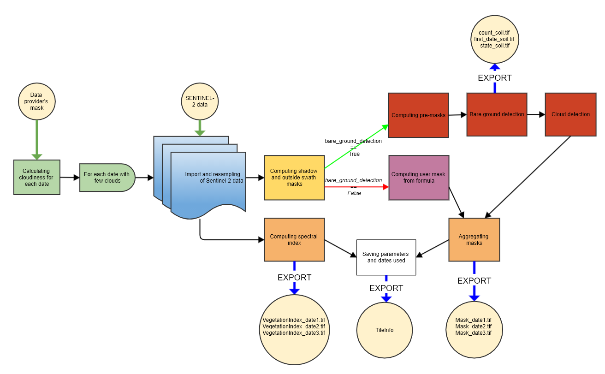

# STEP 1 : Compute vegetation indices and masks for each SENTINEL-2 date

#### INPUTS
The input parameters are:

- **input_directory**: the path of the folder corresponding to a tile or area containing a folder for each SENTINEL date containing a file for each band. The folders must contain the corresponding date in their name in one of the following formats: YYYY-MM-DD, YYYY_MM_DD, YYYYMMDD, DD-MM-YYYY, DD_MM_YYYY or DDMMYYYY. The band files must contain the name of the corresponding band (B2 or B02, B3 or B03, etc.).
- **data_directory**: The path of the output folder, in which the vegetation indices and masks will be written
- **lim_perc_cloud** : The maximum percentage of clouds. If the cloudiness percentage of the SENTINEL date, calculated from the provider's classification, is higher than this threshold, the date is ignored. If set to -1, all dates are used regardless of their cloudiness, and the provider's mask is not needed.
- **interpolation_order** : Interpolation order for the conversion of the bands from a 20m resolution to a 10m resolution. 0 : nearest neighbor, 1 : linear, 2 : bilinear, 3 : cubic
- **sentinel_source** : Provider of the data among 'THEIA' and 'Scihub' and 'PEPS'.
- **apply_source_mask** : If True, the mask of the provider is also used to mask the data
- **soil_detection** : If True, bare ground is detected and used as mask, but the process might not be adapted to other situations than THEIA data on France's coniferous forests. If False, mask from formula_mask is applied.
- **formula_mask** : formula whose result would be binary, format described [here](https://fordead.gitlab.io/fordead_package/reference/fordead/masking_vi/#compute_vegetation_index). Is only used if soil_detection is False.
- **vi** : Vegetation index used, can be one of the indices provided in the package (CRSWIR, NDVI, NDWI), or any spectral index can be added using the path_dict_vi parameter.
- **extent_shape_path** : Path of a shapefile containing a polygon used to restrict the calculation to an area. If not provided, the calculation is applied to the whole tile
- **path_dict_vi** : Path to a text file used to add potential vegetation indices. If not filled in, only the indices provided in the package can be used (CRSWIR, NDVI, NDWI). The file examples/ex_dict_vi.txt gives an example for how to format this file. One must fill the index's name, formula, and "+" or "-" according to whether the index increases or decreases when anomalies occur.

Note : **input_directory** and **data_directory** have no default value and must be filled in. The **sentinel_source** must correspond to the provider of your data. The package has been almost exclusively tested with THEIA data.

#### OUTPUTS
The outputs of this first step, in the data_directory folder, are :
- A TileInfo file which contains information about the computed area, dates used, raster paths... It is imported and used in the subsequent steps.
- In the **VegetationIndex** folder, a raster for each date corresponding to the vegetation index calculated for each pixel
- In the **Mask** folder, a binary raster for each date where the masked pixels take the value "1", and the valid pixels take the value "0".
- In the **DataSoil** folder, three rasters:
    - **count_soil** : the number of successive dates with soil anomalies
    - **first_date_soil**: The index of the first date with a soil anomaly in the latest series of soil anomalies
    - **state_soil**: A binary raster whose pixels take the value "1" if detected as soil (at least three successive soil anomalies), and "0" otherwise.
From state_soil and first_date_soil, it is therefore possible to know which pixels are detected as bare soil/cutting, and the date of detection. count_soil allows the updating of this detection using new SENTINEL dates.

## How to use
### From a script

```bash
from fordead.steps.step1_compute_masked_vegetationindex import compute_masked_vegetationindex
compute_masked_vegetationindex(input_directory = <input_directory>, data_directory = <data_directory>)
```

### From the command line

```bash
fordead masked_vi [OPTIONS]
```

See detailed documentation on the [site](https://fordead.gitlab.io/fordead_package/docs/cli/#fordead-masked_vi)

## How it works



### Importing information on previous processes, deletion of obsolete results
Informations related to the previous processes, if any, are imported (parameters, data paths, used dates...). If the parameters used have been modified, all the results from this step onwards are deleted. Thus, unless the parameters have been modified, the calculations are only performed on the new SENTINEL dates.
> **_Functions used:_** [TileInfo()](https://fordead.gitlab.io/fordead_package/reference/fordead/import_data/#tileinfo), methods of the TileInfo class [import_info()](https://fordead.gitlab.io/fordead_package/reference/fordead/import_data/#import_info), [add_parameters()](https://fordead.gitlab.io/fordead_package/reference/fordead/import_data/#add_parameters), [delete_dirs()](https://fordead.gitlab.io/fordead_package/reference/fordead/import_data/#delete_dirs)

### Filtering out overly cloudy dates
The cloudiness of each SENTINEL date is calculated from the provider's mask.
 > **_Functions used:_** [get_cloudiness()](https://fordead.gitlab.io/fordead_package/reference/fordead/import_data/#get_cloudiness), [get_date_cloudiness_perc()](https://fordead.gitlab.io/fordead_package/reference/fordead/import_data/#get_date_cloudiness_perc)

We then use only the new dates in the **input_directory** folder with a cloudiness lower than **lim_perc_cloud**.

### Importing and resampling of the SENTINEL data
The bands of interest of the filtered dates are imported and resampled to 10m
 > **_Functions used:_** [import_resampled_sen_stack()](https://fordead.gitlab.io/fordead_package/reference/fordead/import_data/#import_resampled_sen_stack)

### Calculation of the vegetation index
The selected vegetation index is calculated from the vegetation indices and formulas already provided in the package, or added through a text file whose path is corresponds to parameter **path_dict_vi** (see [get_dict_vi](https://fordead.gitlab.io/fordead_package/reference/fordead/masking_vi/#get_dict_vi).
 > **_Functions used :_** [compute_vegetation_index()](https://fordead.gitlab.io/fordead_package/reference/fordead/masking_vi/#compute_vegetation_index)
Invalid values (division by zero...) are changed to zero.

### Computing the mask 

#### Computing default masks
The following masks are computed : 

- Detection of some shadows: 0 in any of the bands
- Detection of areas outside the satellite swath: Value less than 0 in any of the bands (should have the value -10000 for THEIA data) 
- Invalid values of the vegetation index are also masked (division by zero...)

If **apply_source_mask** is True, the provider's mask is also applied.
 **_Functions used:_** [get_source_mask()](https://fordead.gitlab.io/fordead_package/reference/fordead/masking_vi/#get_source_mask)
 
The rest of the process depends on the selected mask mode, if soil_detection is True, the mask includes a detection of bare ground which might no be adapted depending on situations and Sentinel-2 data source.
#### If soil_detection is True
The mask for each date is computed in the three following steps.
 > **_Fonctions utilisées :_** [compute_masks()](https://fordead.gitlab.io/fordead_package/reference/fordead/masking_vi/#compute_masks)

##### Creation of the premask
Detection of soil anomalies : (B11 > 1250) AND (B2 < 600) AND ((B3 + B4) > 800)
Invalids : aggregation of the shadow mask, out of swath mask and highly visible clouds (B2 >= 600)
 > **_Functions used:_** [get_pre_masks()](https://fordead.gitlab.io/fordead_package/reference/fordead/masking_vi/#get_pre_masks)

##### Bare ground detection
Pixels are detected as bare ground if they have three consecutive dates with soil anomalies (soil_anomaly is True), without counting invalid dates.
 > **_Functions used:_** [detect_soil()](https://fordead.gitlab.io/fordead_package/reference/fordead/masking_vi/#detect_soil)

##### Cloud detection
To detect clouds, we take the set of highly visible clouds (B2 > 700), then add the thinner clouds $`\frac{B3}{B8A+B4+B3} >0.15`$ AND $`B2 >400`$.
Then, the pixels detected as bare ground or ground anomaly, with which there may be confusion, are removed before a dilation of three pixels is used to recover the edges of the clouds.
 > **_Functions used:_** [detect_clouds()](https://fordead.gitlab.io/fordead_package/reference/fordead/masking_vi/#detect_clouds)

##### Aggregation of masks
Aggregation of shadows, clouds, out of swath pixels, bare ground, bare ground anomalies.

#### If soil_detection is False
The mask defined by the user using the parameter **formula_mask** is added to the default masks.
This formula must be a logical operation involving Sentinel-2 band names (ex : `"B2 > 600"`). It can also use logical operators, as would be used on xarrays, OR (`|`), AND (`&`) et NOT (`~`) (ex : `"(B2 > 600) & (B11 > 1000) | ~(B3 <= 500)"`)
 > **_Fonctions utilisées :_** [compute_user_mask()](https://fordead.gitlab.io/fordead_package/reference/fordead/masking_vi/#compute_user_mask), [compute_vegetation_index()](https://fordead.gitlab.io/fordead_package/reference/fordead/masking_vi/#compute_vegetation_index)

### Writing the results
The vegetation indices, masks and ground detection data are written. All parameters, data paths and dates used are also saved.
 > **_Functions used:_** [write_tif()](https://fordead.gitlab.io/fordead_package/reference/fordead/writing_data/#write_tif), TileInfo method [save_info()](https://fordead.gitlab.io/fordead_package/reference/fordead/import_data/#save_info)
