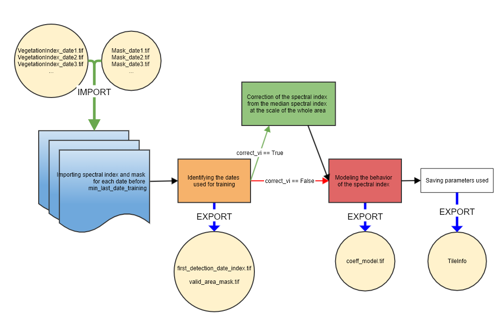

## STEP 2: Training a model of the vegetation index pixel by pixel from the first dates
In this step, a model is trained from the first SENTINEL dates, which are considered representative of the normal seasonal behavior of the vegetation index. This model can then be used to predict the value of the vegetation index at any date.

#### INPUTS
The input parameters are:
- **data_directory**: The path to the output folder where the model coefficients will be written.
- **nb_min_date** : Minimum number of valid dates to calculate a model
- **min_last_date_training**: The date in YYYY-MM-DD format after which SENTINEL dates are no longer used for training, as long as there are at least nb_min_date dates valid for the pixel
- **max_last_date_training**: Date in YYYY-MM-DD format until which SENTINEL dates can be used for training to reach the number of nb_min_date valid dates
- **path_vi**: Path to the folder containing the vegetation index raster for each date. This parameter is optionnal if these raster were calculated through the first step of this package, in which case the path is imported through the TileInfo file.
- **path_masks** : Path to the folder containing a binary raster for each date where the masked pixels are 1, and the valid pixels 0. This parameter is optionnal if these raster were calculated through the [first step of this package](https://gitlab.com/fordead/fordead_package/-/blob/translation_doc/docs/user_guides/english/01_compute_masked_vegetationindex.md), in which case the path is imported through the TileInfo file.
- **correct_vi** : If True, the vegetation index is corrected using the median vegetation index of the unmasked pixels of interest at the scale of the whole area. If enabled, [the area of interest definition step](https://fordead.gitlab.io/fordead_package/docs/user_guides/english/04_compute_forest_mask/) must therefore be performed before this step. This allows for correction of large scale effects, not necessarily related to trees suffering from dieback.
The model coefficients are calculated for each pixel. For each pixel, only unmasked dates are used. If there are nb_min_date valid dates at the max_last_date_training, the training stops at this date. If the number of valid dates reaches nb_min_date at a date between min_last_date_training and max_last_date_training, the training stops at this date. If the number of valid dates does not reach nb_min_date at max_last_date_training, the pixel dropped and will not be associated to a model.
This method allows, in the case of a relatively ancient source of anomalies such as the bark beetle crisis, to start the detection as early as 2018 if there are enough valid dates at the beginning of the year, while allowing the study of pixels in situations with less data available simply by performing the training over a longer period to retrieve other valid dates. It is not recommended to end the training before 2018, because since the periodic model is annual, the use of at least two years of SENTINEL-2 data is advised.

#### OUTPUTS
The outputs of this second step, in the data_directory folder, are:
- In the **DataModel** folder, two files:
    - **first_detection_date_index.tif**, a raster that contains the index of the first date that will be used for detection. It allows to know for each pixel which dates were used for training and which ones are used for detection.
    - **coeff_model.tif**, a stack with 5 bands, one for each coefficient of the vegetation index model.
- In the **ForestMask** directory, the binary raster **valid_area_mask.tif** which is 1 for pixels where the model could be computed, 0 if there were not enough valid dates.
- The TileInfo file is updated.

## How to use
### From a script

```bash
from fordead.steps.step2_train_model import train_model
train_model(data_directory = <data_directory>)
```

### From the command line

```bash
fordead train_model [OPTIONS]
```

See detailed documentation on the [site](https://fordead.gitlab.io/fordead_package/docs/cli/#fordead-train_model)

## How it works



### Importing information on previous processes and deleting obsolete results if they exist
First, if the processing chain has already been used on the area, the information related to these calculations is imported (parameters, data paths, dates used...). If the parameters used have been modified, the results of previous calculations are deleted from this step onwards and recalculated with the new parameters. It is possible to skip the first step and start the process at this stage if the vegetation index and mask have already been calculated for each date through another method.
> **_Functions used:_** [TileInfo()](https://fordead.gitlab.io/fordead_package/reference/fordead/import_data/#tileinfo), methods of the TileInfo class [import_info()](https://fordead.gitlab.io/fordead_package/reference/fordead/import_data/#import_info), [add_parameters()](https://fordead.gitlab.io/fordead_package/reference/fordead/import_data/#add_parameters), [delete_dirs()](https://fordead.gitlab.io/fordead_package/reference/fordead/import_data/#delete_dirs)

### Importing the vegetation index and mask for each date up to **min_last_date_training**
> **_Functions used:_** [import_stackedmaskedVI()](https://fordead.gitlab.io/fordead_package/reference/fordead/import_data/#import_stackedmaskedvi)

### (OPTIONAL - if **correct_vi** is True) Correction of the vegetation index from the median vegetation index of the unmasked pixels of interest at the scale of the whole area
- Pixels not belonging to the area of interest or masked are dropped
- Calculation of the median vegetation index of the whole area for each date until **max_last_date_training**.
- Fitting of a harmonic model on these medians, this model must therefore account for the normal behavior of the vegetation index on the entire area of interest.
- Calculation of a correction term for each date, by substracting the model prediction at the given date and the corresponding calculated median
- Application of the correction terms for each date by adding it to the value of the vegetation index of all the pixels of the date.
> **_Functions used:_** [model_vi_correction()](https://fordead.gitlab.io/fordead_package/reference/fordead/model_vegetation_index/#model_vi_correction)

### Identifying the dates used for training
The starting date of detection can be different between each pixel. For each pixel, the model must be trained on at least **nb_min_date** dates, and at least on all dates prior to **min_last_date_training**. If there are not at least **nb_min_date** at **max_last_date_training**, the pixel is dropped. This allows to start the detection as soon as possible if it is possible, while keeping a maximum of pixels by allowing a later start of detection on areas with less valid dates.
> **_Functions used:_** [get_detection_dates()](https://fordead.gitlab.io/fordead_package/reference/fordead/model_vegetation_index/#get_detection_dates)

### Modeling the behavior of the vegetation index
For each pixel, a model is fitted on the training dates. The model used is the following:
```math
a1 + b1\sin{\frac{2\pi t}{T}} + b2\cos{\frac{2\pi t}{T}} + b3\sin{\frac{4\pi t}{T}} + b4\cos{\frac{4\pi t}{T}}
```
This step consists in computing the coefficients a1, b1, b2, b3 and b4 for each pixel.
> **_Functions used:_** [model_vi()](https://fordead.gitlab.io/fordead_package/reference/fordead/model_vegetation_index/#model_vi)

 ### Writing the results
The coefficients of the model, the index of the first date used for detection and the mask of the pixels that are valid because they have enough Sentinel dates for the calculation of the model are written as rasters.
> **_Functions used:_** [write_tif()](https://fordead.gitlab.io/fordead_package/reference/fordead/writing_data/#write_tif)
