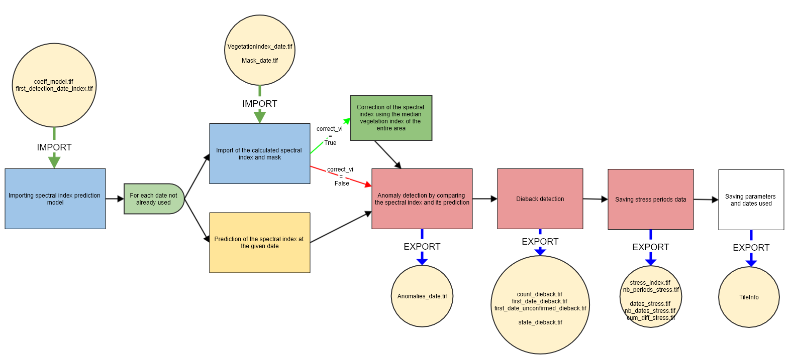

## STEP 3: Detection of dieback by comparing the model-predicted vegetation index with the actual vegetation index
This step allows the detection of dieback. For each SENTINEL date not used for training, the actual vegetation index is compared to the vegetation index predicted from the model calculated in the previous step. If the difference exceeds a threshold, an anomaly is detected. If three successive anomalies are detected, the pixel is considered as suffering from dieback. If after being detected as suffering from dieback, the pixel has three successive dates without anomalies, it is no longer considered as suffering from dieback. Those periods between detection and return to normal can be saved along with an associated stress index.
This stress index can either be the mean of the difference between the vegetation index and its prediction, or a weighted mean where for each date used, the weight corresponds to the number of the date from the first anomaly :


#### INPUTS
The input parameters are :
- **data_directory**: The path of the output folder where the detection results will be written.
- **threshold_anomaly**: Threshold at which the difference between the actual and predicted vegetation index is considered as an anomaly
- **max_nb_stress_periods** : Maximum number of stress periods, pixels with a higher number of stress periods are masked in exports.
- **stress_index_mode** : Chosen stress index, if 'mean', the index is the mean of the difference between the vegetation index and the predicted vegetation index for all unmasked dates after the first anomaly subsequently confirmed. If 'weighted_mean', the index is a weighted mean, where for each date used, the weight corresponds to the number of the date (1, 2, 3, etc...) from the first anomaly. If None, the stress periods are not detected, and no informations are saved
- **vi**: Vegetation index used, can be ignored if the [_compute_masked_vegetationindex_](https://fordead.gitlab.io/fordead_package/docs/user_guides/english/01_compute_masked_vegetationindex/) step has been used.
- **path_dict_vi** : Path to a text file allowing to add usable vegetation indices. If not filled in, only the indices provided in the package are usable (CRSWIR, NDVI, NDWI). The file [examples/ex_dict_vi.txt](/examples/ex_dict_vi.txt) gives an example on how to format of this file. It is necessary to fill in its name, its formula, and "+" or "-" depending on whether the index's value increases or decreases in case of diebacks. Can be ignored in if it has been done previously in the [_compute_masked_vegetationindex_ step](https://fordead.gitlab.io/fordead_package/docs/user_guides/english/01_compute_masked_vegetationindex/).

#### OUTPUTS
The outputs of this step, in the data_directory folder, are :
- In the **DataDieback** folder, three rasters:
    - **count_dieback** : the number of successive dates with anomalies
	- **first_date_unconfirmed_dieback** : The date index of latest potential state change of the pixels, first anomaly if pixel is not detected as dieback, first non-anomaly if pixel is detected as dieback, not necessarily confirmed.
    - **first_date_dieback**: The index of the first date with an anomaly in the last series of anomalies
    - **state_dieback**: A binary raster whose value is 1 if the pixel is detected as suffering from dieback (at least three successive anomalies)
- In the **DataStress** folder, four rasters:
    - **dates_stress** : A raster with **max_nb_stress_periods***2+1 bands, containing the date indices of the first anomaly, and of return to normal for each stress period.
    - **nb_periods_stress**: A raster containing the total number of stress periods for each pixel 
    - **cum_diff_stress**: a raster with **max_nb_stress_periods**+1 bands containing containing for each stress period the sum of the difference between the vegetation index and its prediction, multiplied by the weight if stress_index_mode is "weighted_mean"
	- **nb_dates_stress** : a raster with **max_nb_stress_periods**+1 bands containing the number of unmasked dates of each stress period.
	- **stress_index** : a raster with **max_nb_stress_periods**+1 bands containing the stress index of each stress period, it is the mean or weighted mean of the difference between the vegetation index and its prediction depending on **stress_index_mode**, obtained from cum_diff_stress and nb_dates_stress
	The number of bands of these rasters is meant to account for each potential stress period, and another for a potential final dieback detection
- In the **DataAnomalies** folder, a raster for each date **Anomalies_YYYY-MM-DD.tif** whose value is 1 where anomalies are detected.

## How to use
### From a script

```bash
from fordead.steps.step3_dieback_detection import dieback_detection
dieback_detection(data_directory = <data_directory>)
```

### From the command line
```bash
fordead dieback_detection [OPTIONS]
```
See detailed documentation on the [site](https://fordead.gitlab.io/fordead_package/docs/cli/#fordead-dieback_detection)

## How it works



### Importing information on previous processes and deleting obsolete results if they exist
The informations about the previous processes are imported (parameters, data paths, used dates...). If the parameters used have been modified, all the results from this step onwards are deleted. Thus, unless the parameters have been modified or this is the first time this step is performed, the detection of dieback is updated using only with the new SENTINEL dates.
> **_Functions used:_** [TileInfo()](https://fordead.gitlab.io/fordead_package/reference/fordead/import_data/#tileinfo), TileInfo class methods [import_info()](https://fordead.gitlab.io/fordead_package/reference/fordead/import_data/#import_info), [add_parameters()](https://fordead.gitlab.io/fordead_package/reference/fordead/import_data/#add_parameters), [delete_dirs()](https://fordead.gitlab.io/fordead_package/reference/fordead/import_data/#delete_dirs)

### Importing the results of the previous steps
The coefficients of the vegetation index prediction model are imported, as well as the array containing the index of the first date used for the detection. The arrays containing the information related to the detection of diebacks (state of the pixels, number of successive anomalies, index of the date of the first anomaly) are initialized if the step is used for the first time, or imported if it is an update of the detection.
> **_Functions used:_** [import_coeff_model()](https://fordead.gitlab.io/fordead_package/reference/fordead/import_data/#import_coeff_model), [import_first_detection_date_index()](https://fordead.gitlab.io/fordead_package/reference/fordead/import_data/#import_first_detection_date_index), [initialize_dieback_data()](https://fordead.gitlab.io/fordead_package/reference/fordead/import_data/#initialize_dieback_data), [import_dieback_data()](https://fordead.gitlab.io/fordead_package/reference/fordead/import_data/#import_dieback_data)

### For each date not already used for dieback detection:

#### Import of the calculated vegetation index and the mask
> **_Functions used:_** [import_masked_vi()](https://fordead.gitlab.io/fordead_package/reference/fordead/import_data/#import_masked_vi)

### (OPTIONAL - if **correct_vi** is True in [previous model calculation step](https://fordead.gitlab.io/fordead_package/docs/user_guides/03_train_model/) Correction of the vegetation index using the median vegetation index of the unmasked pixels of interest across the entire area
- Masking of the pixels not belonging to the area of interest, or masked
- Calculation of the median vegetation index on the remaining pixels of the whole area
- Calculation of a correction term, by difference between the calculated median and the prediction of the model calculated during the previous step from the median calculated for all the dates
- Application of the correction term by adding it to the value of the vegetation index of every pixel
> **_Functions used:_** [correct_vi_date()](https://fordead.gitlab.io/fordead_package/reference/fordead/model_vegetation_index/#correct_vi_date)

#### Prediction of the vegetation index at the given date.
The vegetation index is predicted from the model coefficients.
> **_Functions used:_** [prediction_vegetation_index()](https://fordead.gitlab.io/fordead_package/reference/fordead/dieback_detection/#prediction_vegetation_index)

#### Anomaly detection
Anomalies are detected by comparing the vegetation index with its prediction. Knowing whether the vegetation index is expected to increase or decrease in case of dieback, anomalies are detected where the difference between the index and its prediction is greater than **threshold_anomaly** in the direction of expected change in case of dieback.
> **_Functions used:_** [detection_anomalies()](https://fordead.gitlab.io/fordead_package/reference/fordead/dieback_detection/#detection_anomalies)

#### Detection of dieback
The successive anomalies are counted, the pixel is considered suffering from dieback if there are three successive anomalies. If the pixel is considered as suffering from dieback, the successive dates without anomalies are counted instead, and the pixel is not considered as suffering from dieback anymore if there are three successive dates without anomalies, 
> **_Functions used:_** [detection_dieback()](https://fordead.gitlab.io/fordead_package/reference/fordead/dieback_detection/#detection_dieback)

#### Saving stress periods information (OPTIONAL - if **stress_index_mode** is not None)
The rasters containing stress periods information are updated, the number of stress periods is updated when pixels return to normal. When changes of state are confirmed, the first date of anomaly or return to normal is saved. For each date, the number of dates within stress periods is updated if the pixel is unmasked and in a stress period.
The difference between the vegetation index and its prediction is added to the cum_diff_stress raster, after being multiplied be the number of the date if stress_index_mode is "weighted_mean".
> **_Functions used:_** [save_stress()](https://fordead.gitlab.io/fordead_package/reference/fordead/dieback_detection/#save_stress)

### The stress index is calculated
If stress_index_mode is "mean", the stress index raster is the cum_diff_stress raster divided by the nb_dates_stress raster
If stress_index_mode is "weighted_mean", the stress index raster is the cum_diff_stress raster divided by the sum of the weights (1+2+3+...+ nb_dates_stress)

 ### Writing the results
The information related to the detection of dieback, stress data and stress indices are written. All parameters, data paths and dates used are also saved.
> **_Functions used:_** [write_tif()](https://fordead.gitlab.io/fordead_package/reference/fordead/writing_data/#write_tif),
