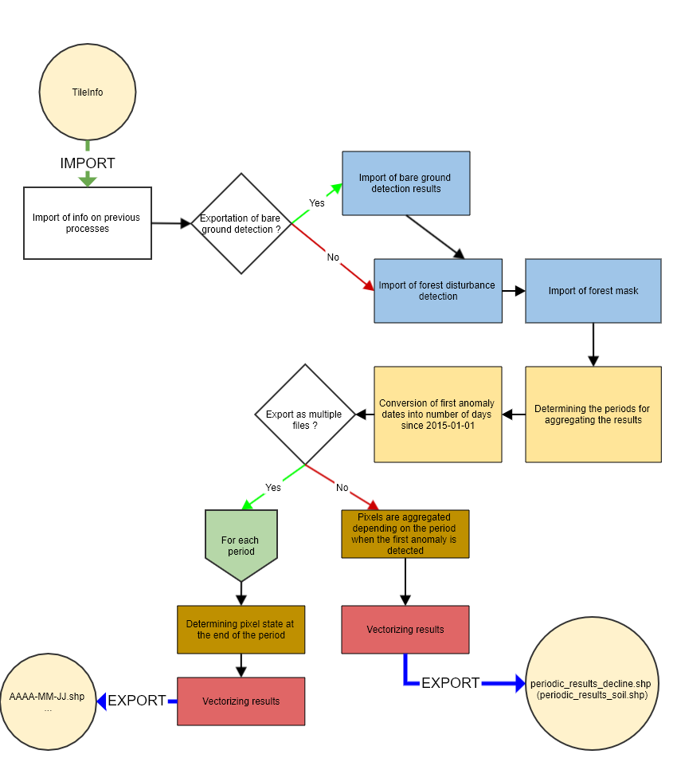

## STEP 5: Output export
This step allows you to output the results in the format desired by the user, for the desired period and frequency. 

#### INPUTS
The input parameters are :
- **data_directory**: The path of the output folder in which the results will be written
- **start_date**: Start date, in YYYY-MM-DD format
- **end_date** : End date, in YYYY-MM-DD format
- **frequency** : Frequency used to aggregate results. Can be "sentinel", in which case the periods used to aggregate results corresponds to the time between available SENTINEL dates, Can also be a frequency as accepted by the pandas.date_range function (e.g.: 'M' (every month), '3M' (every three months), '15D' (every 15 days)")
- **multiple_files** : If True, one shapefile will be exported per period, where each polygon corresponds to the state of the area at the end of the period. Otherwise, only one shapefile is exported and the polygons contain the period when the first anomaly was detected.
- **intersection_confidence_class** : If True, the [05_compute_confidence](https://fordead.gitlab.io/fordead_package/docs/user_guides/english/05_compute_confidence/) step must have been used, and the confidence class shapefile results will be intersected with the detection results

#### OUTPUTS
The outputs of this fifth step, in the folder data_directory/Results, are :
- if **multiple_files** is False:
    - the shapefile periodic_results_decline, whose polygons contain the time period when the first anomaly was detected for the declining areas. The areas reached before start_date or after end_date are ignored. If **intersection_confidence_class** is True, the polygons also contain the anomaly intensity class as calculated in the [05_compute_confidence](https://fordead.gitlab.io/fordead_package/docs/user_guides/english/05_compute_confidence/) step. This class therefore contains the "final" state, calculated at the last available Sentinel-2 date. If bare ground is detected, the confidence index is not calculated and this final state becomes "Bare ground".
    - if soil_detection was True in the [first step](https://fordead.gitlab.io/fordead_package/docs/user_guides/english/01_compute_masked_vegetationindex/), the shapefile periodic_results_soil whose polygons contain the period when the first soil anomaly was detected for areas detected as bare soil/cut. Bare areas before start_date or after end_date are not shown.
- if **multiple_files** is True :
    - One shapefile per period whose name is the end date of the period (for example, with start_date = 2018-01-01, end_date = 2018-04-01 and frequency = "M", we will have the following files: 2018-01-30.shp, 2018-02-28.shp and 2018-03-31.shp. Each shapefile contains polygons corresponding to the stand state at the end of the period, even if the first anomalies occur before start_date. The status can be 'Anomaly', "Bare ground" and 'Bare ground after anomaly' if soil_detection was True in the first step, or simply "Anomaly" otherwise.

## How to use
### From a script

```bash
from fordead.steps.step6_export_results import export_results
export_results(
    data_directory = <data_directory>,
    start_date = <start_date>,
    end_date = <end_date>,
    frequency= <frequency>,
    multiple_files = <multiple_files>
    )
```

### From the command line

```bash
fordead export_results [OPTIONS]
```

See detailed documentation on the [site](https://fordead.gitlab.io/fordead_package/docs/cli/#fordead-export_results)

## How it works



### Importing information on previous processes and deleting obsolete results if they exist
The information about the previous steps is imported (parameters, data paths, used dates...).
> **_Functions used:_** [TileInfo()](https://fordead.gitlab.io/fordead_package/reference/fordead/import_data/#tileinfo), methods of the TileInfo class [import_info()](https://fordead.gitlab.io/fordead_package/reference/fordead/import_data/#import_info)

### Importing the results of the detection 
The results of the previous steps are imported.
> **_Functions used:_** [import_soil_data()](https://fordead.gitlab.io/fordead_package/reference/fordead/import_data/#import_soil_data), [import_decline_data()](https://fordead.gitlab.io/fordead_package/reference/fordead/import_data/#import_decline_data), [import_forest_mask()](https://fordead.gitlab.io/fordead_package/reference/fordead/import_data/#import_forest_mask)

### Determining the periods for aggregating the results
The results will be aggregated according to the time period at which the first anomalies occur for both soil and decline detection. These periods are determined from the frequency indicated by the parameter **frequency**, the start date **start_date** and the end date **end_date**. Periods before the first SENTINEL date used, or after the last one, if they exist, are ignored since they cannot correspond to any result.
> **_Functions used:_** [get_bins()](https://fordead.gitlab.io/fordead_package/reference/fordead/writing_data/#get_bins)

### Conversion of first anomaly dates into number of days since 2015-01-01
The dates of first anomalies, stored as indexes of the dates used, are converted into number of days since a reference day "2015-01-01" corresponding to the launch of the first SENTINEL-2 satellite. Thus these dates can be compared with the limits of the previously determined periods.
> **_Functions used: _** [convert_dateindex_to_datenumber()](https://fordead.gitlab.io/fordead_package/reference/fordead/writing_data/#convert_dateindex_to_datenumber)

### If exported in several files:
- For each period, the algorithm checks if the pixel has a first anomaly before the end of the period. We thus obtain the information for each pixel "Healthy", or "Declining" if **export_soil** is False, or "Healthy", "Declining", "Cut", "Sanitary cut" otherwise. 
- This information is vectorized using only the area of interest (within the forest mask and with enough valid dates to model the vegetation index). Healthy pixels are also ignored.
> **_Functions used:_** [get_state_at_date()](https://fordead.gitlab.io/fordead_package/reference/fordead/writing_data/#get_state_at_date)
- This vector is written for each of the periods using the period end date as the file name.

## If exported to a single file:
- Pixels are aggregated according to the period in which the first anomaly occurs. 
- The result is vectorized, ignoring the pixels with first anomalies outside the determined periods and the pixels outside the studied area (within the forest mask and having enough valid dates to model the vegetation index).
- If intersection_confidence_class is True, the results of the [05_compute_confidence](https://fordead.gitlab.io/fordead_package/docs/user_guides/english/05_compute_confidence/) step are intersected by union with the vector thus obtained. The polygons detected as confirmed anomalies without a confidence class can only come from the bare ground detection if it is activated, so these polygons take the "Bare ground" class.
> **_Functions used:_** [get_periodic_results_as_shapefile()](https://fordead.gitlab.io/fordead_package/reference/fordead/writing_data/#get_periodic_results_as_shapefile), [union_confidence_class()](https://fordead.gitlab.io/fordead_package/reference/fordead/writing_data/#union_confidence_class)
- The result vector is written in a single vector file where polygons contain the period when the first anomaly was detected. 

If **export_soil** is True, the same operation is performed using the bare soil detection results and the results are written to a second vector file.
