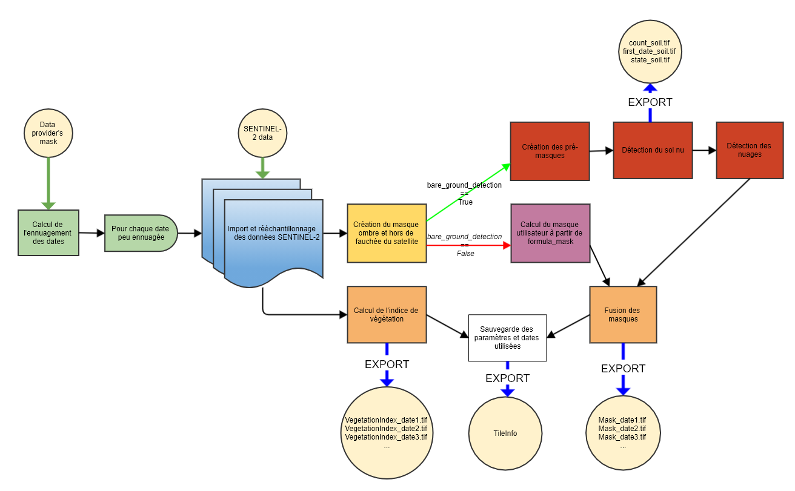

# ÉTAPE 1 : Calcul des indices de végétation et des masques pour chaque date SENTINEL-2

#### ENTRÉES
Les paramètres en entrée sont :

- **input_directory** : le chemin du dossier correspondant à une tuile ou une zone contenant un dossier par date SENTINEL contenant les différentes bandes. Les dossiers doivent contenir la date correspondante dans leur nom sous un des formats suivants : YYYY-MM-DD, YYYY_MM_DD, YYYYMMDD, DD-MM-YYYY, DD_MM_YYYY ou DDMMYYYY. Les fichiers des bandes doivent contenir le nom de la bande correspondante (B2 ou B02, B3 ou B03, etc...).
- **data_directory** : Le chemin du dossier de sortie, dans lequel seront écrit les indices de végétations et masques
- **lim_perc_cloud** : Le pourcentage maximum de nuages. Si le pourcentage de nuage de la date SENTINEL, calculé à partir de la classification du fournisseur, est supérieur à ce seuil, la date est ignorée. Si défini comme -1, l'ensemble des dates sont utilisées quel que soit leur ennuagement, et le masque du fournisseur n'est pas nécessaire.
- **interpolation_order** : Ordre d'interpolation pour le passage des bandes de 20m de résolution à 10m. 0 : plus proche voisin, 1 : linéaire, 2 : bilinéaire, 3 : cubique
- **sentinel_source** : Source des données parmi 'THEIA' et 'Scihub' et 'PEPS'
- **apply_source_mask** : Si True, le masque du fournisseur est également utilisé pour masquer les données
- **soil_detection** : Si True, le sol nu est détecté et utilisé comme masque, mais le processus peut ne pas être adapté à des situations autre qu'en utilisant les données THEIA sur des forêts résineuses de France métropolitaine. Si False, le masque de formula_mask est appliqué.
- **formula_mask** : formule dont le résultat est binaire, format décrit [ici](https://fordead.gitlab.io/fordead_package/reference/fordead/masking_vi/#compute_vegetation_index). N'est utilisé que si soil_detection vaut False.
- **vi** : Indice de végétation utilisé, peut être un des indices prévus dans le package (CRSWIR, NDVI, NDWI), ou n'importe quel indice spectral déterminé par l'utilisateur à partir du paramètre path_dict_vi
- **ignored_period** : Période de l'année dont les dates Sentinel sont ignorées (liste de deux dates au format "MM-DD" (ex : ["11-01","05-01"]).
- **extent_shape_path** : Chemin d'un shapefile contenant un polygone utilisé pour restreindre les calculs à une zone. Si non renseigné, le calcul est appliqué à l'ensemble de la tuile
- **path_dict_vi** : Chemin d'un fichier texte permettant d'ajouter des indices de végétations utilisables. Si non renseigné, uniquement les indices prévus dans le package sont utilisable (CRSWIR, NDVI, NDWI). Le fichier examples/ex_dict_vi.txt donne l'exemple du formattage de ce fichier. Il s'agit de renseigner son nom, sa formule, et "+" ou "-" selon si l'indice augmente en cas de déperissement, ou si il diminue.

Note : **input_directory** et **data_directory** n'ont pas de valeur par défaut et doivent absolument être renseignés. **sentinel_source** doit correspondre au fournisseur de vos données. Le package a presque exclusivement été testé à partir des données THEIA.

#### SORTIES
Les sorties de cette première étape, dans le dossier data_directory, sont :
- Un fichier TileInfo qui contient les informations relatives à la zone étudiée, dates utilisées, chemins des rasters... Il est importé par les étapes suivantes pour réutilisation de ces informations.
- Dans le dossier **VegetationIndex**, un raster pour chaque date où l'indice de végétation est calculé pour chaque pixel
- Dans le dossier **Mask**, un raster binaire pour chaque date où les pixels masqués valent 1, et les pixels valides 0.
Si soil_detection vaut True :
- Dans le dossier **DataSoil**, trois rasters :
    - **count_soil** : le nombre de dates successives avec des anomalies de sol
    - **first_date_soil** : L'index de la première date avec une anomalie de sol de la dernière série d'anomalies de sol
    - **state_soil** : Un raster binaire qui vaut 1 si le pixel est détecté comme sol (Au moins trois anomalies de sol successives)
A partir de state_soil et first_date_soil, il est donc possible de savoir quels pixels sont détectés comme sol nu/coupe, et à partir de quelle date. count_soil permet de mettre à jour ces données en ajoutant de nouvelles dates SENTINEL.

## Utilisation
### A partir d'un script

```bash
from fordead.steps.step1_compute_masked_vegetationindex import compute_masked_vegetationindex
compute_masked_vegetationindex(input_directory = <input_directory>, data_directory = <data_directory>)
```

### A partir de la ligne de commande

```bash
fordead masked_vi [OPTIONS]
```

Voir documentation détaillée sur le [site](https://fordead.gitlab.io/fordead_package/docs/cli/#fordead-masked_vi)

## Détail du fonctionnement



### Imports des résultats précédents, suppression des résultats obsolètes 
Les informations relatives aux traitements précédents sont importés (paramètres, chemins des données, dates utilisées...). Si les paramètres utilisés ont été modifiés, l'ensemble des résultats à partir de cette étape sont supprimés. Ainsi, à moins que les paramètres aient été modifiés, uniquement les calculs suivants sont uniquement réalisés sur les nouvelles dates SENTINEL.
> **_Fonctions utilisées :_** [TileInfo()](https://fordead.gitlab.io/fordead_package/reference/fordead/import_data/#tileinfo), méthodes de la classe TileInfo [import_info()](https://fordead.gitlab.io/fordead_package/reference/fordead/import_data/#import_info), [add_parameters()](https://fordead.gitlab.io/fordead_package/reference/fordead/import_data/#add_parameters), [delete_dirs()](https://fordead.gitlab.io/fordead_package/reference/fordead/import_data/#delete_dirs)

### Filtre des dates trop ennuagées
L'ennuagement de chaque date SENTINEL est calculé à partir du masque fournisseur.
> **_Fonctions utilisées :_** [get_cloudiness()](https://fordead.gitlab.io/fordead_package/reference/fordead/import_data/#get_cloudiness), [get_date_cloudiness_perc()](https://fordead.gitlab.io/fordead_package/reference/fordead/import_data/#get_date_cloudiness_perc)

On utilise ensuite uniquement les nouvelles dates dans le dossier **input_directory** dont l'ennuagement est inférieur à **lim_perc_cloud**.

### Import et ré-échantillonage des données SENTINEL
 - Les bandes d'intérêts de ces dates sont importées et ré-échantillonnées à 10m 
> **_Fonctions utilisées :_** [import_resampled_sen_stack()](https://fordead.gitlab.io/fordead_package/reference/fordead/import_data/#import_resampled_sen_stack)

### Calcul de l'indice de végétation
L'indice de végétation choisi est calculé à partir des indices et formules déjà prévues dans le package, ou ajoutées à partir d'un fichier texte au chemin indiqué par le paramètre **path_dict_vi** (voir [get_dict_vi](https://fordead.gitlab.io/fordead_package/reference/fordead/masking_vi/#get_dict_vi).
 > **_Fonctions utilisées :_** [compute_vegetation_index()](https://fordead.gitlab.io/fordead_package/reference/fordead/masking_vi/#compute_vegetation_index)
Les valeurs invalides (division par zero...) sont mises à 0.

### Création du masque 

#### Calcul des masques par défaut
Les masques suivants sont calculés :

- Détection des ombres :  0 dans n'importe laquelle des bandes
- Détection des zones hors de la fauchée du satellite : Valeur inférieure à 0 dans une des bandes (vaut normalement -10000 pour les données THEIA)
- Les données invalides dans l'indice de végétation sont également masquées

- Si **apply_source_mask** vaut True, le masque fournisseur est également appliqué.
 > **_Fonctions utilisées :_** [get_source_mask()](https://fordead.gitlab.io/fordead_package/reference/fordead/masking_vi/#get_source_mask)
 
Le reste du processus est différent selon le mode de calcul de masque choisi, soit soil_detection vaut True, auquel cas le masque inclu une détection du sol nu qui peut ne pas être adaptée selon les situations et la source de données Sentinel-2.
#### Si soil_detection vaut True
Le masque pour chaque date est complété selon trois étapes :
 > **_Fonctions utilisées :_** [compute_masks()](https://fordead.gitlab.io/fordead_package/reference/fordead/masking_vi/#compute_masks)

##### Création de pré-masques
Détection d'anomalies de sol : (B11 > 1250) ET (B2 < 600) ET ((B3 + B4) > 800)
Invalides : aggregation des ombres, hors fauchée et nuages très marqués (B2 >= 600)
 > **_Fonctions utilisées :_** [get_pre_masks()](https://fordead.gitlab.io/fordead_package/reference/fordead/masking_vi/#get_pre_masks)

##### Détection du sol nu
Trois dates consécutives avec anomalies de sol (soil_anomaly vaut True) sans compter dates invalides (invalid vaut True)
 > **_Fonctions utilisées :_** [detect_soil()](https://fordead.gitlab.io/fordead_package/reference/fordead/masking_vi/#detect_soil)

##### Détection des nuages
Pour détecter les nuages, on prend l'ensemble des nuages bien marqués (B2 > 700)
On ajoute les voiles nuages plus fins $`\frac{B3}{B8A+B4+B3} >0.15`$ ET $`B2 >400`$ en retirant les pixels détectés comme sol nu ou anomalie de sol avec lesquels il peut y avoir confusion. Puis on opére une dilation de trois pixels pour récupérer les bords des nuages.
 > **_Fonctions utilisées :_** [detect_clouds()](https://fordead.gitlab.io/fordead_package/reference/fordead/masking_vi/#detect_clouds)

##### Aggrégation des masques
Aggrégation des ombres, des nuages, des pixels hors de la fauchée, du sol nu, des anomalies de sol nu.

#### Si soil_detection vaut False
Le masque défini par l'utilisateur par le paramètre **formula_mask** est alors ajouté aux masques par défaut. 
Cette formule doit être une opération logique impliquant les bandes Sentinel-2 (ex : `"B2 > 600"`). Elle peut également prendre en compte des opérateurs logiques OU (`|`), ET (`&`) et NON (`~`) (ex : `"(B2 > 600) & (B11 > 1000) | ~(B3 <= 500)"`)
 > **_Fonctions utilisées :_** [compute_user_mask()](https://fordead.gitlab.io/fordead_package/reference/fordead/masking_vi/#compute_user_mask), [compute_vegetation_index()](https://fordead.gitlab.io/fordead_package/reference/fordead/masking_vi/#compute_vegetation_index)

### Ecriture des résultats
Les indices de végétations, masques et données de détection du sol sont écrits. L'ensemble des paramètres, chemins des données et dates utilisées sont aussi sauvegardés.
 > **_Fonctions utilisées :_** [write_tif()](https://fordead.gitlab.io/fordead_package/reference/fordead/writing_data/#write_tif), méthode TileInfo [save_info()](https://fordead.gitlab.io/fordead_package/reference/fordead/import_data/#save_info)
