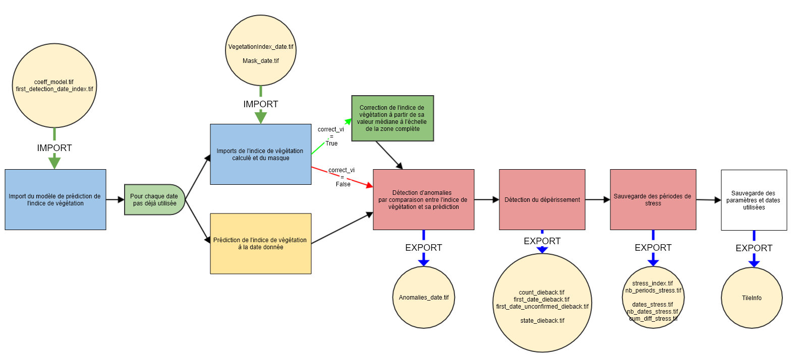

## ÉTAPE 3 : Détection du dépérissement par comparaison entre l'indice de végétation prédit par le modèle et l'indice de végétation réel
Cette étape permet la détection du déperissement. Pour chaque date SENTINEL non utilisée pour l'apprentissage, l'indice de végétation réel est comparé à l'indice de végétation prédit à partir des modèles calculés dans l'étape précèdente. Si la différence dépasse un seuil, une anomalie est détectée. Si trois anomalies successives sont détectées, le pixel est considéré comme dépérissant. Si après avoir été détecté comme déperissant, le pixel a trois dates successives sans anomalies, il n'est plus considéré comme dépérissant.

#### ENTRÉES
Les paramètres en entrée sont :
- **data_directory** : Le chemin du dossier de sortie dans lequel sera écrit les résultats de la détection.
- **threshold_anomaly** : Seuil à partir duquel la différence entre l'indice de végétation réel et prédit est considéré comme une anomalie
- **vi** : Indice de végétation utilisé, il est inutile de le renseigner si l'étape [_compute_masked_vegetationindex_](https://fordead.gitlab.io/fordead_package/docs/user_guides/01_compute_masked_vegetationindex/) a été utilisée.
- **path_dict_vi** : Chemin d'un fichier texte permettant d'ajouter des indices de végétations utilisables. Si non renseigné, uniquement les indices prévus dans le package sont utilisable (CRSWIR, NDVI, NDWI). Le fichier [examples/ex_dict_vi.txt](/examples/ex_dict_vi.txt) donne l'exemple du formattage de ce fichier. Il s'agit de renseigner son nom, sa formule, et "+" ou "-" selon si l'indice augmente en cas de déperissement, ou si il diminue. Il est également inutile de le renseigner si cela a été fait lors de l'étape [_compute_masked_vegetationindex_](https://fordead.gitlab.io/fordead_package/docs/user_guides/01_compute_masked_vegetationindex/).


#### SORTIES
Les sorties de cette troisième étape, dans le dossier data_directory, sont :
- Dans le dossier **DataDieback**, trois rasters :
    - **count_dieback** : le nombre de dates successives avec des anomalies
    - **first_date_dieback** : L'index de la première date avec une anomalie de la dernière série d'anomalies
    - **state_dieback** : Un raster binaire qui vaut 1 si le pixel est détecté comme déperissant (Au moins trois anomalies successives)
- Dans le dossier **DataAnomalies**, un raster pour chaque date **Anomalies_YYYY-MM-JJ.tif** qui vaut True là où sont détectées les anomalies.
## Utilisation
### A partir d'un script

```bash
from fordead.steps.step3_dieback_detection import dieback_detection
dieback_detection(data_directory = <data_directory>)
```

### A partir de la ligne de commande
```bash
fordead dieback_detection [OPTIONS]
```
Voir documentation détaillée sur le [site](https://fordead.gitlab.io/fordead_package/docs/cli/#fordead-dieback_detection)

## Détail du fonctionnement



### Imports des informations sur les traitements précédents et suppression des résultats obsolètes si existants
Les informations relatives aux traitements précédents sont importés (paramètres, chemins des données, dates utilisées...). Si les paramètres utilisés ont été modifiés, l'ensemble des résultats à partir de cette étape sont supprimés. Ainsi, à moins que les paramètres aient été modifiés ou que ce soit la première fois que ce traitement est réalisé, la détection du dépérissement est mise à jour uniquement avec les nouvelles dates SENTINEL.
> **_Fonctions utilisées :_** [TileInfo()](https://fordead.gitlab.io/fordead_package/reference/fordead/import_data/#tileinfo), méthodes de la classe TileInfo [import_info()](https://fordead.gitlab.io/fordead_package/reference/fordead/import_data/#import_info), [add_parameters()](https://fordead.gitlab.io/fordead_package/reference/fordead/import_data/#add_parameters), [delete_dirs()](https://fordead.gitlab.io/fordead_package/reference/fordead/import_data/#delete_dirs)

### Imports des résultats des étapes précédentes
Les coefficients du modèle de prédiction de l'indice de végétation sont importés, ainsi que l'array contenant l'index de la première date utilisée pour la détection. Les arrays contenant les informations liées à la détection de déperissement (État des pixels, nombre d'anomalies successives, index de la date de première anomalie) sont initialisés si l'étape est utilisée pour la première fois, ou importés si il s'agit d'une mise à jour de la détection.
> **_Fonctions utilisées :_** [import_coeff_model()](https://fordead.gitlab.io/fordead_package/reference/fordead/import_data/#import_coeff_model), [import_first_detection_date_index()](https://fordead.gitlab.io/fordead_package/reference/fordead/import_data/#import_first_detection_date_index), [initialize_dieback_data()](https://fordead.gitlab.io/fordead_package/reference/fordead/import_data/#initialize_dieback_data), [import_dieback_data()](https://fordead.gitlab.io/fordead_package/reference/fordead/import_data/#import_dieback_data)

### Pour chaque date non déjà utilisée pour la détection du dépérissement :

#### Imports de l'indice de végétation calculé et du masque
> **_Fonctions utilisées :_** [import_masked_vi()](https://fordead.gitlab.io/fordead_package/reference/fordead/import_data/#import_masked_vi)

### (OPTIONNEL - si **correct_vi** vaut True lors de [l'étape précédente de calcul du modèle](https://fordead.gitlab.io/fordead_package/docs/user_guides/03_train_model/) Correction de l'indice de végétation à partir de l'indice de végétation médian des pixels d'intérêts non masqués à l'échelle de la zone complète
- Masquage des pixels n'appartenant pas à la zone d'intérêt, ou masqués
- Calcul de la médiane de l'indice de végétation de l'ensemble de la zone
- Calcul d'un terme de correction, par différence entre la médiane calculée et la prédiction du modèle calculé lors de l'étape précédente à partir de la médiane calculée pour l'ensemble des dates
- Application du terme de correction en l'ajoutant à la valeur de l'indice de végétation de l'ensemble des pixels
> **_Fonctions utilisées :_** [correct_vi_date()](https://fordead.gitlab.io/fordead_package/reference/fordead/model_vegetation_index/#correct_vi_date)

#### Prédiction de l'indice de végétation à la date donnée.
L'indice de végétation est prédit à partir des coefficients du modèle.
> **_Fonctions utilisées :_** [prediction_vegetation_index()](https://fordead.gitlab.io/fordead_package/reference/fordead/dieback_detection/#prediction_vegetation_index)

#### Détection d'anomalies
Les anomalies sont détectées en comparant l'indice de végétation avec sa prédiction. Sachant si l'indice de végétation est supposé augmenter ou diminuer en cas de déperissement, les anomalies sont détectées là où la différence entre l'indice et sa prédiction est superieure à **threshold_anomaly** dans la direction du changement attendu en cas de déperissement.
> **_Fonctions utilisées :_** [detection_anomalies()](https://fordead.gitlab.io/fordead_package/reference/fordead/dieback_detection/#detection_anomalies)

#### Détection du dépérissement
Les anomalies successives sont comptées, à partir de trois anomalies successives, le pixel est considéré dépérissant. Si le pixel est considéré dépérissant, les dates successives sans anomalies sont comptées et à partir de trois dates sans anomalies, le pixel n'est plus considéré dépérissant.
> **_Fonctions utilisées :_** [detection_dieback()](https://fordead.gitlab.io/fordead_package/reference/fordead/dieback_detection/#detection_dieback)

 ### Ecriture des résultats
Les informations liées à la détection du dépérissement sont écrites. L'ensemble des paramètres, chemins des données et dates utilisées sont aussi sauvegardés.
 > **_Fonctions utilisées :_** [write_tif()](https://fordead.gitlab.io/fordead_package/reference/fordead/writing_data/#write_tif), méthode TileInfo [save_info()](https://fordead.gitlab.io/fordead_package/reference/fordead/import_data/#save_info)

