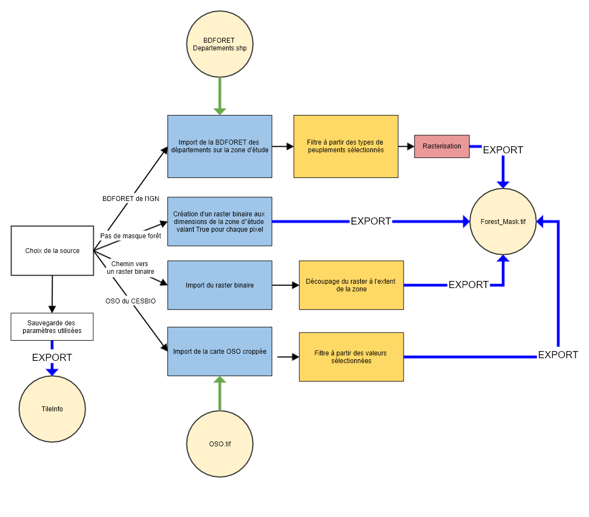

## ÉTAPE 4 : Création du masque forêt, qui définit les zones d'intérêt
Cette étape permet de calculer le masque forêt et ainsi définir les zones d'intérêt.

#### ENTRÉES
Les paramètres en entrée sont :
- **data_directory** : Le chemin du dossier de sortie dans lequel sera écrit le masque forêt
- **forest_mask_source** : Source du masque forêt, peut être "vector" pour utiliser un vecteur contenant des polygones au chemin **vector_path**, ou le chemin vers un raster binaire de résolution 10m valant 1 sur les pixels d'intérêt, "BDFORET" pour utiliser la BD Forêt de l'IGN,  "OSO" pour utiliser la carte d'occupation des sols du CESBIO, ou None pour ne pas utiliser de masque forêt et étendre la zone d'intérêt à l'ensemble des pixels
- **dep_path** : Chemin d'un shapefile des départements français contenant le code insee dans un champ code_insee, seulement utile si forest_mask_source vaut "BDFORET"
- **bdforet_dirpath** : Chemin du dossier contenant la BD Forêt de l'IGN avec un dossier par département. Seulement utile si forest_mask_source vaut "BDFORET"
- **list_forest_type** : Liste des types de peuplements à garder dans le masque forêt, correspond au CODE_TFV de la BD Forêt. Seulement utile si forest_mask_source vaut "BDFORET"
- **path_oso** : Chemin du raster d'occupation des sols du CESBIO. Seulement utile si forest_mask_source vaut "OSO".
- **list_code_oso** : Liste des valeurs du raster OSO à conserver dans le masque forêt. Seulement utile si forest_mask_source vaut "OSO".
- **vector_path** : Chemin du fichier vectoriel dont les polygones seront rasterisés en un raster binaire avec la résolution, l'extent et le système de projection du raster path_example_raster. Utilisé uniquement si forest_mask_source = 'vector'.
- **path_example_raster** : Chemin d'un raster "example" utilisé pour connaître l'extent, le système de projection, etc... Seulement utile s'il n'y a pas dans le data_directory un fichier TileInfo crée par les étapes précèdentes d'où peuvent être extraites ces informations.

#### SORTIES
Les sorties de cette quatrième étape, dans le dossier data_directory, sont :
- Dans le dossier **ForestMask**, le raster binaire Forest_Mask.tif qui vaut 1 sur les pixels de forêt à étudier et 0 ailleurs.

## Utilisation
### A partir d'un script

#### Depuis un vecteur, par exemple un shapefile
```bash
from fordead.steps.step4_compute_forest_mask import compute_forest_mask
compute_forest_mask(data_directory, 
                    forest_mask_source = "vector", 
                    vector_path = <vector_path>)
```
#### Depuis un raster binaire
```bash
from fordead.steps.step4_compute_forest_mask import compute_forest_mask
compute_forest_mask(data_directory, 
                    forest_mask_source = <path of binary raster>)
```

#### Depuis la BDFORET de l'IGN
```bash
from fordead.steps.step4_compute_forest_mask import compute_forest_mask
compute_forest_mask(data_directory, 
                    forest_mask_source = "BDFORET", 
                    dep_path = <dep_path>,
                    bdforet_dirpath = <bdforet_dirpath>)
```
#### Depuis la carte OSO du CESBIO
```bash
from fordead.steps.step4_compute_forest_mask import compute_forest_mask
compute_forest_mask(data_directory, 
                    forest_mask_source = "OSO", 
                    path_oso = <path_oso>,
                    list_code_oso = [17])
```
#### Sans utilisation de masque
```bash
from fordead.steps.step4_compute_forest_mask import compute_forest_mask
compute_forest_mask(data_directory)
```

### A partir de la ligne de commande

```bash
fordead forest_mask [OPTIONS]
```

Voir documentation détaillée sur le [site](https://fordead.gitlab.io/fordead_package/docs/cli/#fordead-forest_mask)

## Détail du fonctionnement



### Imports des informations sur les traitements précédents et suppression des résultats obsolètes si existants
Les informations relatives aux traitements précédents sont importés (paramètres, chemins des données, dates utilisées...). Si les paramètres utilisés ont été modifiés, l'ensemble des résultats à partir de cette étape sont supprimés. Cette étape peut également être réalisée indépendamment du reste de la chaîne de traitement, en renseignant le paramètre **path_example_raster**, afin d'obtenir un masque forêt binaire. Sinon, le paramètre **path_example_raster** est automatiquement déterminé à partir des résultats des étapes précédentes afin que le masque forêt corresponde à la zone étudiée.
> **_Fonctions utilisées :_** [TileInfo()](https://fordead.gitlab.io/fordead_package/reference/fordead/import_data/#tileinfo), méthodes de la classe TileInfo [import_info()](https://fordead.gitlab.io/fordead_package/reference/fordead/import_data/#import_info), [add_parameters()](https://fordead.gitlab.io/fordead_package/reference/fordead/import_data/#add_parameters), [delete_dirs()](https://fordead.gitlab.io/fordead_package/reference/fordead/import_data/#delete_dirs)

### Depuis un vecteur
- Import d'un vecteur, par exemple un shapefile contenant des polygones
- Reprojection du vecteur dans le système de projection des données Sentinel-2
- L'ensemble des polygones sont rasterisés en un raster binaire à la résolution, l'extent et le système de projection de la zone d'étude. Le raster prend la valeur 1 là où les pixels sont à l'intérieur des polygones.
> **_Fonctions utilisées:_** [rasterize_vector()](https://fordead.gitlab.io/fordead_package/reference/fordead/masking_vi/#rasterize_vector)

### A partir d'un raster binaire
Cette option est donnée pour les utilisateurs voulant créer leur propre masque par d'autres moyens et l'utiliser dans la chaîne de traitement. Il sera ré-écrit dans le dossier data_directory.
 - Si forest_mask_source est un chemin vers un fichier existant, ce fichier est importé. Ce fichier doit être un raster binaire avec la valeur 1 là où sont les pixels d'intérêt.
 - Le fichier est découpé à l'extent de la zone d'étude, ou du fichier au chemin path_example_raster
 > **_Fonctions utilisées :_** [import_forest_mask()](https://fordead.gitlab.io/fordead_package/reference/fordead/import_data/#import_forest_mask), [clip_xarray()](https://fordead.gitlab.io/fordead_package/reference/fordead/import_data/#clip_xarray)


### A partir de la BDFORET de l'IGN
- Importation de la BDFORET des départements intersectant la zone d'étude
- Filtre à partir des types de peuplements séléctionnés
- Rasterisation en un masque binaire
 > **_Fonctions utilisées :_** [rasterize_bdforet()](https://fordead.gitlab.io/fordead_package/reference/fordead/masking_vi/#rasterize_bdforet), [rasterize_polygons_binary()](https://fordead.gitlab.io/fordead_package/reference/fordead/masking_vi/#rasterize_polygons_binary), [bdforet_paths_in_zone()](https://fordead.gitlab.io/fordead_package/reference/fordead/masking_vi/#bdforet_paths_in_zone)

### A partir de carte OSO du CESBIO
 - Importation de la [carte oso](http://osr-cesbio.ups-tlse.fr/~oso/) et cropping à partir du raster au chemin **path_example_raster**
 - Filtre à partir de la liste **list_code_oso** pour obtenir un raster valant True sur les pixels dont la valeur dans la carte OSO est dans la liste **list_code_oso**
 > **_Fonctions utilisées :_** [clip_oso()](https://fordead.gitlab.io/fordead_package/reference/fordead/masking_vi/#clip_oso)


### Pas d'utilisation de masque
 Si il est choisi de ne pas utiliser de masque, le masque forêt crée est rempli entièrement avec la valeur True et correspond à la dimension, résolutione et système de projection du raster au chemin **path_example_raster**
 > **_Fonctions utilisées :_** [raster_full()](https://fordead.gitlab.io/fordead_package/reference/fordead/masking_vi/#raster_full)

### Ecriture des résultats
Le masque forêt est écrit, et son chemin sauvegardé dans l'object TileInfo.
 > **_Fonctions utilisées :_** [write_tif()](https://fordead.gitlab.io/fordead_package/reference/fordead/writing_data/#write_tif), méthode TileInfo [save_info()](https://fordead.gitlab.io/fordead_package/reference/fordead/import_data/#save_info)


