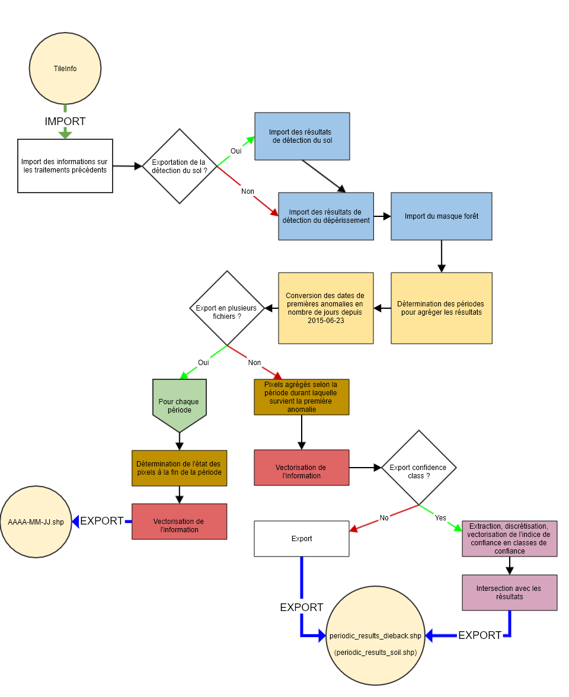

## ÉTAPE 5 : Export de sorties
Cette étape permet de sortir les résultats sous la forme désirée par l'utilisateur, pour la période et fréquence souhaitée. 
Un indice de confiance correspondant à l'indice de stress actuel des pixels détectés comme souffrant de dépérissement, et au sein du masque de forêt et du masque de zone valide peut être extrait des résultats de l'indice de stress de l'étape 3 et exporté.
Les pixels sont alors également classifiés sur la base de la discrétisation de cet indice de confiance en utilisant une liste de seuils. Les pixels présentant seulement trois anomalies sont classés dans la classe la plus basse, car 3 anomalies ne sont pas considérées comme suffisantes pour calculer un indice significatif.

#### ENTRÉES
Les paramètres en entrée sont :
- **data_directory** : Le chemin du dossier de sortie dans lequel sera écrit les résultats
- **start_date** : Date de début, au format AAAA-MM-JJ
- **end_date** : Date de fin, au format AAAA-MM-JJ
- **frequency** : Fréquence utilisée pour agréger les résultats. Peut être "sentinel", auquel cas les périodes utilisées pour agréger les résultats correspondent au temps entre les dates SENTINEL disponibles, peut également être une fréquence telle qu'acceptée par la fonction pandas.date_range (ex : 'M' (tous les mois), '3M' (tous les trois mois), '15D' (tous les 15 jours)")
- **export_soil** : Si True, les résultats relatifs à la détection de sol nu/coupes sont exportés également.
- **multiple_files** : Si True, un shapefile sera exporté par période, où chaque polygone correspond à l'état de la zone à la fin de la période. Sinon, un seul shapefile est exporté et les polygones contiennent la période à laquelle la première anomalie a été détecté.
- **conf_threshold_list** : Liste des seuils utilisés pour discrétiser l'indice de confiance en plusieurs classes, stress_index_mode ne doit pas être None dans [step 3](https://fordead.gitlab.io/fordead_package/docs/user_guides/french/03_dieback_detection/).
- **conf_classes_list** : Liste des noms des classes, si conf_threshold_list a n valeurs, conf_classes_list doit avoir n+1 valeurs, stress_index_mode ne doit pas être None dans [step 3](https://fordead.gitlab.io/fordead_package/docs/user_guides/french/03_dieback_detection/).

#### SORTIES
Les sorties de cette cinquième étape, dans le dossier data_directory/Results, sont :
- si **multiple_files** vaut False :
    - le shapefile periodic_results_dieback, dont les polygones contiennent la période à laquelle la première anomalie a été détecté pour les zones dépérissantes. Si **conf_threshold_list** and **conf_classes_list** sont renseignés, les polygones contiennent également la classe d'intensité d'anomalie telle que calculée lors de l'étape [05_compute_confidence](https://fordead.gitlab.io/fordead_package/docs/user_guides/french/05_compute_confidence/). Cette classe contient donc l'état "final", calculé à la dernière date Sentinel-2 disponible. Si le sol nu est détecté, l'indice de confiance n'est pas calculé et cet état final devient donc "Bare ground". Les zones atteintes avant start_date ou après end_date ne sont pas représentées.
    - si soil_detection valait True lors de la [première étape](https://fordead.gitlab.io/fordead_package/docs/user_guides/french/01_compute_masked_vegetationindex/), le shapefile periodic_results_soil dont les polygones contiennent la période à laquelle la première anomalie de sol a été détecté pour les zones détectées comme sol nu/coupe. Les zones à nu avant start_date ou après end_date ne sont pas représentées.
	- Un raster confidence_index, contenant la valeur continue de l'indice de confiance
- si **multiple_files** vaut True :
    - Un shapefile par période dont le nom est la date de fin de la période (par exemple, avec start_date = 2018-01-01, end_date = 2018-04-01 et frequency = "M", on aura les fichiers suivants : 2018-01-30.shp, 2018-02-28.shp et 2018-03-31.shp. Chaque shapefile contient des polygones correspondant à l'état du peuplement à la fin de la période, même si les premières anomalies ont lieu avant start_date. L'état peut être 'Anomaly', "Bare ground" et 'Bare ground after anomaly' si si soil_detection valait True lors de la première étape, ou simplement "Anomaly" sinon.

## Utilisation
### A partir d'un script

```bash
from fordead.steps.step6_export_results import export_results
export_results(
    data_directory = <data_directory>,
    start_date = <start_date>,
    end_date = <end_date>,
    frequency= <frequency>,
    export_soil = <export_soil>,
    multiple_files = <multiple_files>,
	intersection_confidence_class = <intersection_confidence_class>
    )
```

### A partir de la ligne de commande

```bash
fordead export_results [OPTIONS]
```

Voir documentation détaillée sur le [site](https://fordead.gitlab.io/fordead_package/docs/cli/#fordead-export_results)

## Détail du fonctionnement



### Imports des informations sur les traitements précédents et suppression des résultats obsolètes si existants
Les informations relatives aux traitements précédents sont importés (paramètres, chemins des données, dates utilisées...) afin de pouvoir importer l'ensemble des résultats.
> **_Fonctions utilisées :_** [TileInfo()](https://fordead.gitlab.io/fordead_package/reference/fordead/import_data/#tileinfo), méthodes de la classe TileInfo [import_info()](https://fordead.gitlab.io/fordead_package/reference/fordead/import_data/#import_info)

### Import des résultats de la détection 
Les résultats des étapes précedentes sont importées.
> **_Fonctions utilisées :_** [import_soil_data()](https://fordead.gitlab.io/fordead_package/reference/fordead/import_data/#import_soil_data), [import_dieback_data()](https://fordead.gitlab.io/fordead_package/reference/fordead/import_data/#import_dieback_data), [import_forest_mask()](https://fordead.gitlab.io/fordead_package/reference/fordead/import_data/#import_forest_mask)

### Détermination des périodes pour aggréger les résultats
Les résultats seront donné par aggrégation selon la période à laquelle surviennent les premières anomalies à la fois pour la détection de sol et de déperissement. Ces périodes sont déterminées à partir de la fréquence indiquée par le paramètre **frequency**, la date de début **start_date** et la date de fin **end_date**. Les périodes avant la première date SENTINEL utilisée, ou après la dernière, si elles existent, sont retirées puisqu'elles ne peuvent correspondre à aucun résultat.
> **_Fonctions utilisées :_** [get_bins()](https://fordead.gitlab.io/fordead_package/reference/fordead/writing_data/#get_bins)

### Conversion des dates de premières anomalies en nombre de jours depuis 2015-01-01
Les dates de premières anomalies, stockées sous forme d'index parmi les dates utilisées, sont converties en nombre de jours depuis un jour de référence "2015-01-01" correspondant au lancement du premier satellite SENTINEL-2. Ainsi ces dates peuvent être comparées avec les limites des périodes déterminées précedemment.
> **_Fonctions utilisées :_** [convert_dateindex_to_datenumber()](https://fordead.gitlab.io/fordead_package/reference/fordead/writing_data/#convert_dateindex_to_datenumber)

### Si export en plusieurs fichiers :
- Pour chaque période, il est vérifié si le pixel a sa première anomalie avant la fin de la période. On obtient ainsi l'information pour chaque pixel "Sain", ou "Atteint" si **export_soil** vaut False, ou "Sain", "Atteint", "Coupe", Coupe sanitaire" sinon. 
- Cette information est vectorisée en utilisant uniquement la zone étudiée (au sein du masque forêt et disposant d'assez de dates valides pour modéliser l'indice de végétation). Les pixels sains sont également ignorés.
> **_Fonctions utilisées :_** [get_state_at_date()](https://fordead.gitlab.io/fordead_package/reference/fordead/writing_data/#get_state_at_date)
- Ce vecteur est écrit pour chacune des périodes en utilisant comme nom de fichier la date limite de la fin de la période.

## Si export en un seul fichier :
- Les pixels sont aggrégés selon la période durant laquelle survient la première anomalie. 
- Le résultat est vectorisé, en ignorant les pixels en dehors des périodes déterminées et les pixels en dehors de la zone étudiée (au sein du masque forêt et disposant d'assez de dates valides pour modéliser l'indice de végétation).
- Si **conf_threshold_list** and **conf_classes_list** sont renseignés, l'indice de stress des pixels actuellement détectés dépérissants est extrait de du raster multi-bandes stress_index, puis dicretisé et vectorisé en utilisant les paramètres **conf_threshold_list** et **conf_classes_list**.
- Les résultats périodiques sont intersectés par union avec le vecteur ainsi obtenu. Les polygones détectés comme anomalies confirmées sans classe de confiance ne peuvent provenir que de la détection de sol nu si celle-ci est activée, ces polygones prennent donc la classe "Sol nu".
- Le vecteur résultant est écrit dans un fichier vectoriel unique où les polygones contiennent la période à laquelle la première anomalie a été détectée, et éventuellement la classe de confiance.
- S'il est calculé, l'indice de confiance est également écrit dans un fichier raster.
> **_Fonctions utilisées :_** [get_periodic_results_as_shapefile()](https://fordead.gitlab.io/fordead_package/reference/fordead/writing_data/#get_periodic_results_as_shapefile), [union_confidence_class()](https://fordead.gitlab.io/fordead_package/reference/fordead/writing_data/#union_confidence_class), [vectorizing_confidence_class](https://fordead.gitlab.io/fordead_package/reference/fordead/writing_data/#vectorizing_confidence_class)

Si **export_soil** vaut True, la même opération est réalisée en utilisant les résultats de la détection de sol nu et les résultats sont écrits dans un second fichier vectoriel.


